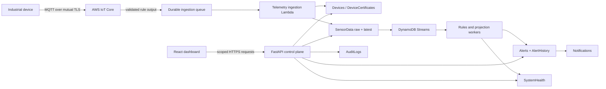
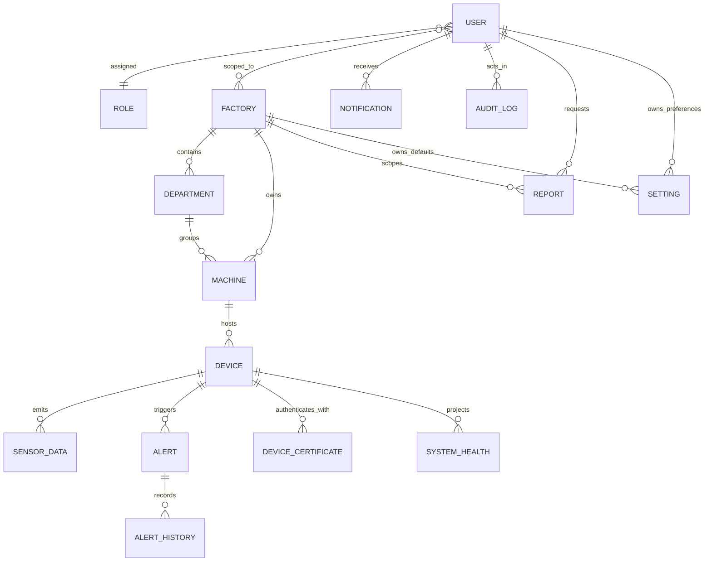

# ForgeSight Enterprise Database Design Document

| Document metadata | Value |
|---|---|
| Document type | Enterprise Database Design Document (DBDD) |
| Version | 1.0.0 |
| Status | Proposed database baseline — approval required before implementation |
| Date | 2026-08-06 |
| Platform | Industrial IoT Device Management and Predictive Monitoring Platform on AWS |
| Primary database | Amazon DynamoDB |

---

## 1. Executive summary and governance

This document defines the production-grade DynamoDB design for ForgeSight. It covers the complete operational data estate: human identity, organization structure, machines and devices, high-volume sensor data, alerts, evidence, notifications, reports, configuration, certificates, health projections, and diagnostic logs.

The design is access-pattern-first and NoSQL-native. It does not recreate a relational schema inside DynamoDB. Relationships are materialized through immutable identifiers, denormalized authorization fields, sparse indexes, and controlled projection updates. Every synchronous request must use `GetItem`, `BatchGetItem`, `Query`, or a bounded transaction; an unbounded `Scan` is prohibited in an application request.

### 1.1 Decision relative to the approved SAD

The approved Software Architecture Document described four consolidated physical tables. The database-architect prompt subsequently mandates 17 named tables and an explicit per-table design. This DBDD therefore proposes **17 physical bounded-context tables**. Approval of this document is the architecture decision that supersedes only the SAD's four-table physical mapping; the approved logical entities, API behavior, security boundaries, data flows, performance targets, and retention rules remain unchanged.

This separation increases infrastructure objects and cross-table transaction discipline, but provides independent capacity, encryption, backup, retention, alarms, ownership, and blast-radius controls for very different workloads. No database implementation, migration, infrastructure, backend, or API code is authorized by this document.

### 1.2 Scope and scale assumptions

| Dimension | Initial production-like target | Evolution target used for key design |
|---|---:|---:|
| Factories | 2–20 | 1,000 |
| Departments | 10–200 | 10,000 |
| Machines | Hundreds | 100,000 |
| Devices | Thousands | 10,000 active without key redesign; higher through additional shards |
| Telemetry cadence | One event per device every 5 seconds | Device-profile-specific sub-second bursts |
| Raw telemetry | Millions of records | Billions across retention/archive tiers |
| API list page | 25 default | 100 maximum |
| Cached/read API latency | p95 ≤ 500 ms | p99 ≤ 1 second |
| Live-data visibility | ≤ 5 seconds after accepted ingestion | Same under normal load |
| Configuration/audit RPO | 5 minutes | 5 minutes |
| Derived-data RPO | 15 minutes | 15 minutes |
| Recovery time objective | 4 hours | 4 hours |

### 1.3 Why DynamoDB

DynamoDB fits the workload because device telemetry is write-heavy, horizontally partitionable, append-oriented, and queried through known device/factory/time access patterns. Operational entities require predictable keyed latency, optimistic concurrency, conditional writes, bounded transactions, TTL, Streams, and managed multi-AZ durability. The serverless scaling and on-demand capacity model also match Lambda-based compute and a workload that can be quiet between bursts.

| Technology | Strengths for this platform | Material limitations and decision |
|---|---|---|
| Amazon DynamoDB | Managed multi-AZ service; keyed low-latency access; horizontal scale; conditional writes; transactions; TTL; Streams; PITR; Global Tables | Requires access-pattern-first denormalization, bounded queries, explicit projections, and disciplined key evolution. **Selected.** |
| Amazon Aurora/MySQL | Mature SQL, joins, transactions, broad reporting ecosystem | Connection/capacity management, vertical pressure from telemetry, join-heavy temptation, and less natural burst scaling. Better for relational ERP/CMMS integration, not the primary IoT store. |
| Amazon Aurora/PostgreSQL | Strong SQL, JSON, extensions, analytical flexibility | Same operational scaling concerns; partition/vacuum/index management for time series; serverless still requires relational access design. Appropriate only if future ad-hoc relational requirements dominate. |
| MongoDB/DocumentDB | Flexible documents and familiar secondary indexing | Shard-key governance and operational/cost complexity; DocumentDB compatibility differences; weaker fit with the project's AWS serverless and DynamoDB requirement. Not selected. |

### 1.4 AWS Well-Architected alignment

- **Operational excellence:** infrastructure as code, schema/index registry, ownership tags, runbooks, restore rehearsals, and per-table alarms.
- **Security:** customer-managed KMS keys by classification, TLS, least-privilege IAM, no direct browser/device access, sensitive-field minimization, and immutable evidence archives.
- **Reliability:** multi-AZ managed storage, PITR, AWS Backup, conditional state transitions, idempotent ingestion, DLQs, reconciliation, and restore-to-new-table procedures.
- **Performance efficiency:** high-cardinality partition keys, bounded sort-key queries, daily time buckets, deterministic write shards, sparse GSIs, projections, and on-demand capacity initially.
- **Cost optimization:** TTL, S3 archive, Standard-IA evaluation for cold tables, selective index projection, no default DAX, and capacity-mode review from measured traffic.
- **Sustainability:** retain only operationally useful hot data, aggregate before long-range reads, archive compactly to S3, and eliminate repeated raw-table scans.

---

## 2. Physical architecture

### 2.1 Table inventory

Physical names follow `forgesight-{environment}-{logical-name}`. Environments are isolated AWS accounts where possible and never share a table.

| # | Logical table | Primary workload | Initial capacity | Streams | Baseline protection/retention |
|---:|---|---|---|---|---|
| 1 | Users | Identity, assignments, sessions, reset tokens | On-demand | New/old image | KMS, PITR, AWS Backup; profile lifetime; sessions TTL |
| 2 | Roles | Versioned role/permission catalog | On-demand | New/old image | KMS, PITR; retain all approved versions |
| 3 | Factories | Factory identity and lifecycle | On-demand | New/old image | KMS, PITR, AWS Backup; archive, never hard-delete with history |
| 4 | Departments | Factory organization hierarchy | On-demand | New/old image | KMS, PITR; resource lifetime |
| 5 | Machines | Physical machine registry/history | On-demand | New/old image | KMS, PITR; archive plus history |
| 6 | Devices | Device registry/current connectivity/config locks | On-demand | New/old image | KMS, PITR; archive plus lifecycle |
| 7 | SensorData | Raw telemetry, latest state, bounded rollups | On-demand | New image | KMS; raw TTL 30 days; rollups 13 months; S3 archive |
| 8 | Alerts | Current alert state and deduplication | On-demand | New/old image | KMS, PITR; alert lifetime plus policy |
| 9 | AlertHistory | Immutable alert lifecycle | On-demand | New image | KMS, PITR; hot 13 months, archive 7 years |
| 10 | Notifications | In-app and delivery attempt state | On-demand | New/old image | KMS, PITR; 90 days hot by default |
| 11 | AuditLogs | Immutable business/security/auth evidence | On-demand | New image | Separate KMS, PITR; 90 days hot, immutable archive 7 years |
| 12 | DeviceLogs | Device lifecycle, rejection, quality diagnostics | On-demand | New image | KMS; 90 days hot, optional archive |
| 13 | Reports | Report jobs/schedules and safe S3 metadata | On-demand | New/old image | KMS, PITR; jobs metadata retained, files 30 days |
| 14 | Settings | Versioned platform/factory/user settings | On-demand | New/old image | KMS, PITR, AWS Backup; all versions retained by policy |
| 15 | DeviceCertificates | Certificate metadata and lifecycle | On-demand | New/old image | Separate KMS, PITR; metadata lifetime plus 7-year evidence |
| 16 | SystemHealth | Current and historical device/factory/platform projections | On-demand | New/old image | KMS, PITR; current indefinite, history 13 months |
| 17 | ApplicationLogs | Curated searchable application diagnostic events | On-demand | Optional | KMS; 90-day TTL; CloudWatch Logs remains full-log source |

### 2.2 Data flow and storage operations



1. A device authenticates to IoT Core with its unique X.509 certificate; DynamoDB never receives a certificate private key.
2. IoT policy validates client/topic authority. The accepted MQTT envelope is durably queued so downstream throttling cannot silently drop data.
3. The ingestion worker reads `Devices` and `DeviceCertificates` by exact key or a bounded cache to validate status, factory/machine association, certificate posture, schema version, and topic/payload identity.
4. It validates types, ranges, timestamp, sequence, event ID, and payload hash. Rejections create bounded `DeviceLogs` and security evidence without storing unsafe payloads.
5. It conditionally writes the immutable raw `SensorData` item. Duplicate device/event pairs with the same payload become a no-op; reuse with a different hash is rejected.
6. It conditionally advances the `SensorData` `LATEST` projection only when sequence/event-time rules permit. Late data remains historical but cannot overwrite current state.
7. Streams invoke rules/aggregation workers. A qualifying condition transactionally changes `Alerts`, appends `AlertHistory`, and creates deterministic `Notifications` records; retries are idempotent.
8. Projection workers update `SystemHealth` device, factory, and platform summaries plus hourly/daily rollups. Reconciliation can rebuild projections from retained raw data.
9. FastAPI derives role/factory scope from the authenticated server-side session and uses only keyed, bounded reads. It writes privileged change evidence to `AuditLogs`.
10. React never connects to DynamoDB. It receives authorized API projections and short-lived live-change signals, then re-fetches canonical state.

### 2.3 Logical relationships



These are logical relationships, not foreign-key constraints. Every write validates referenced IDs through authoritative reads or a bounded transaction. Historical records denormalize stable IDs and display snapshots so later renaming or archival does not destroy evidence.

---

## 3. Naming, data, and key standards

### 3.1 Keys and identifiers

- Physical table: `forgesight-{environment}-{logical-name}` using lowercase kebab case.
- Primary attributes: `pk` and `sk`, both DynamoDB String (`S`).
- Key components: uppercase type prefix, `#` delimiter, normalized fixed-width time/version components; for example `DEVICE#dev_01...#DAY#20260806`.
- IDs: server-generated UUIDv7/ULID-style values with type prefixes (`usr_`, `fac_`, `dep_`, `mch_`, `dev_`, `alt_`). Mutable names, email addresses, serial numbers, and locations are never canonical primary identifiers.
- Time sort keys: UTC ISO 8601 with fixed millisecond precision, followed by a unique ID to prevent collision.
- Reverse chronological reads use `ScanIndexForward=false`; reverse timestamps are used only where an index must naturally order newest first across mixed prefixes.
- Write shard: deterministic hash of stable high-cardinality input modulo the configured shard count. Readers query known shards in parallel and merge bounded pages.

### 3.2 DynamoDB and JSON data types

| Business type | DynamoDB type | JSON representation | Rule |
|---|---|---|---|
| Identifier, enum, text, timestamp | `S` | string | UTF-8, normalized, bounded length; timestamps are UTC ISO 8601 |
| Decimal measurement | `N` | number | Adapter uses decimal arithmetic; never binary floating-point |
| Count/version/sequence | `N` | integer number | Non-negative unless explicitly defined otherwise |
| Boolean | `BOOL` | boolean | Never encoded as `"true"`/`"false"` |
| Object/document | `M` | object | Bounded schema; no arbitrary unvalidated maps |
| Ordered values | `L` | array | Bounded item count and item size |
| Unique tags/scopes | `SS` | array of strings in JSON | Normalized; no empty set |
| Expiry | `N` | integer epoch seconds | Attribute name `expiresAtEpoch`; TTL is not an exact scheduler |
| Hash/digest | `S` | string | One-way keyed digest; plaintext credential never stored |

Every item carries `entityType`, `schemaVersion`, `createdAt`, and `updatedAt` where mutable. Mutable records carry monotonic `version`. Authorization-relevant items denormalize `factoryId`. No item may approach DynamoDB's 400 KB maximum; the design target is less than 100 KB, and telemetry/log items target less than 4 KB.

### 3.3 Common lifecycle and consistency rules

- Create uses `attribute_not_exists(pk)`/`attribute_not_exists(sk)` or an equivalent transaction condition.
- Update compares `version`; success increments it. Conflicts do not silently overwrite.
- Operational resources use status transitions and `archivedAt`; referenced resources are not physically deleted.
- Strong reads are reserved for immediate security/session, uniqueness, and critical state-transition checks on base tables. GSI reads are always treated as eventually consistent.
- A GSI is created only for a declared access pattern. `INCLUDE` projection contains the exact list-view fields; full records are retrieved from the base table when needed.
- No LSI is used in this design. LSIs must be declared at table creation, cannot be removed independently, share base capacity, and impose a 10 GB item-collection limit. The required alternate access paths use GSIs or primary sort-key ranges without that constraint.
- TTL removes cost-sensitive expired items asynchronously, typically within days. Reads exclude logically expired items immediately using `expiresAtEpoch > now`; TTL is never relied on for authorization or exact workflow timing.

---

## 4. Access-pattern catalog

| ID | Access pattern | Expected frequency | Table/index and operation |
|---|---|---|---|
| AP-01 | Authenticate by normalized email | High, burst-sensitive | Users `EmailLookup`, `Query limit 1` |
| AP-02 | Load user profile by ID | High | Users base `GetItem` |
| AP-03 | Load active session/refresh digest | Very high | Users base session key / `RefreshLookup` |
| AP-04 | List users in a factory by role/status/name | Medium | Users `FactoryUsers`, bounded `Query` |
| AP-05 | Resolve active role definition | Very high, cacheable | Roles base `GetItem` |
| AP-06 | List factories by status/name | Medium | Factories `FactoryCatalog` |
| AP-07 | List departments in a factory | Medium | Departments base partition `Query` |
| AP-08 | Get machine details/history | Medium | Machines base `GetItem`/sort range |
| AP-09 | List machines by factory/department/status | Medium-high | Machines `FactoryMachines`/`DepartmentMachines` |
| AP-10 | Get device details | High | Devices base `GetItem` |
| AP-11 | List all authorized devices | High | Devices sharded `Inventory` or factory index fan-out |
| AP-12 | List online/offline/critical devices by factory | High | Devices `FactoryConnection`/`FactoryDevices` |
| AP-13 | List devices attached to a machine | Medium | Devices `MachineDevices` |
| AP-14 | Get latest sensor values | Very high | SensorData base `GetItem` on `LATEST` |
| AP-15 | Get device historical telemetry | High | SensorData daily partition `Query` by time |
| AP-16 | Get machine telemetry history | Medium | SensorData sharded `MachineTime` bounded fan-out |
| AP-17 | Export bounded factory telemetry | Low/high-volume job | SensorData sharded `FactoryTime` fan-out |
| AP-18 | List alerts by factory/severity/status/time | High | Alerts `FactoryAlerts` |
| AP-19 | List alerts for a device | High | Alerts `DeviceAlerts` |
| AP-20 | Load complete alert timeline | Medium | AlertHistory base partition `Query` |
| AP-21 | Query audit by factory/time | Medium, investigation bursts | AuditLogs base month/shard fan-out |
| AP-22 | Query audit by actor/resource/correlation | Low-medium | AuditLogs GSIs |
| AP-23 | List user's unread notifications | High | Notifications base partition and `UnreadNotifications` |
| AP-24 | Trace notification delivery state | Medium | Notifications `DeliveryStatus` |
| AP-25 | Query device diagnostic logs | Medium, incident bursts | DeviceLogs base day partitions |
| AP-26 | List reports by requester/factory/status | Medium | Reports GSIs |
| AP-27 | Load effective platform/factory/user settings | High, cacheable | Settings exact base keys / bounded scope query |
| AP-28 | Find certificates expiring/revoked by factory | Daily and security bursts | DeviceCertificates `ExpiryStatus`/`FactoryCertificates` |
| AP-29 | Read factory/device/platform summary | Very high | SystemHealth exact `CURRENT` items |
| AP-30 | Read historical health/KPI trend | High | SystemHealth scope/time range |
| AP-31 | Query application errors by service/severity/time | Medium, incident bursts | ApplicationLogs base/`SeverityTime` |
| AP-32 | Correlate logs/evidence by correlation ID | Low-medium | ApplicationLogs/AuditLogs correlation GSIs |

All list operations enforce deterministic ordering, `limit` 1–100, an opaque cursor containing the evaluated key, and a server-derived factory set. Platform-wide fan-out is limited to a configured shard list and allowed only for Super Administrator or asynchronous jobs.

---

## 5. Detailed table designs

The index key attributes named below (`gsi*pk`, `gsi*sk`) are populated only on items that must appear in that index. This deliberate sparsity keeps indexes small and prevents unrelated item types from entering query results. Unless a projection is stated as `KEYS_ONLY`, it is `INCLUDE`; no index uses `ALL` by default.

### 5.1 Users

**Purpose and business description.** Stores identities, factory memberships, login sessions, password-reset challenges, and transactional uniqueness locks. It is the authoritative authentication profile, but authorization is calculated from active memberships plus the referenced role version; a client-supplied factory or role is never trusted.

**Primary key and item model**

| Item | `pk` | `sk` | Notes |
|---|---|---|---|
| User profile | `USER#{userId}` | `PROFILE` | Name, normalized email, password digest, status, MFA state |
| Factory membership | `USER#{userId}` | `FACTORY#{factoryId}` | Role, scope, membership status |
| Session | `USER#{userId}` | `SESSION#{sessionId}` | Refresh digest/family, device context, expiry |
| Reset challenge | `USER#{userId}` | `RESET#{challengeId}` | One-use digest, attempts, short TTL |
| Email lock | `UNIQUE#EMAIL#{normalizedEmail}` | `LOCK` | Claims an email transactionally for one user |

**Indexes.** `EmailLookup(gsi1pk=EMAIL#{normalizedEmail}, gsi1sk=USER#{userId})` projects `userId,status`; the password digest is retrieved by a strong base read. `FactoryUsers(gsi2pk=FACTORY#{factoryId}, gsi2sk=STATUS#{status}#ROLE#{roleId}#NAME#{normalizedName}#USER#{userId})` projects list fields. Sparse `RefreshLookup(gsi3pk=REFRESH#{refreshDigest}, gsi3sk=SESSION#{sessionId})` projects `userId,sessionId,expiresAtEpoch,revokedAt,tokenFamilyId`. There is no LSI.

**Relationships.** Memberships reference Factories and Roles. Sessions and audit actor IDs reference the user without requiring a cross-table join; display names are snapshots where historical fidelity matters.

**Important attributes.** `userId:S`, `displayName:S`, `email:S`, `normalizedEmail:S`, `passwordDigest:S`, `status:S`, `mfa:M`, `factoryId:S`, `roleId:S`, `roleVersion:N`, `refreshDigest:S`, `tokenFamilyId:S`, `failedLoginCount:N`, `lastLoginAt:S`, `expiresAtEpoch:N`, `version:N`. Email is trimmed and Unicode-normalized, then domain-lowercased and case-folded according to the product identity policy; the original is retained for display. Passwords and tokens are never stored in plaintext.

**Sample JSON (profile item).**

```json
{
  "pk": "USER#usr_01J4A6RFQ8Y4TQ9FMM2B8K1S3X",
  "sk": "PROFILE",
  "entityType": "User",
  "schemaVersion": 1,
  "userId": "usr_01J4A6RFQ8Y4TQ9FMM2B8K1S3X",
  "displayName": "Asha Menon",
  "email": "asha.menon@example.com",
  "normalizedEmail": "asha.menon@example.com",
  "passwordDigest": "$argon2id$v=19$m=65536,t=3,p=1$REDACTED",
  "status": "ACTIVE",
  "mfa": {"enabled": true, "method": "TOTP"},
  "gsi1pk": "EMAIL#asha.menon@example.com",
  "gsi1sk": "USER#usr_01J4A6RFQ8Y4TQ9FMM2B8K1S3X",
  "createdAt": "2026-08-06T09:15:00.000Z",
  "updatedAt": "2026-08-06T09:15:00.000Z",
  "version": 1
}
```

**Access, frequency, and retention.** Exact profile/session reads and email authentication are high to very high; factory user lists are medium. Profile and membership records remain for the account lifetime and are archived rather than deleted. Revoked/expired sessions remain through active lifetime plus 30 days; reset challenges expire after 15 minutes and may be retained as redacted audit evidence. Authentication audit evidence is exported for seven years.

### 5.2 Roles

**Purpose and business description.** Stores immutable, versioned role definitions and permission sets. A stable active pointer permits fast authorization while historical assignments retain the version that governed a decision.

**Primary key and item model.** Role metadata uses `pk=ROLE#{roleId}, sk=PROFILE`; immutable definitions use `sk=VERSION#{version:010d}`; the current pointer uses `sk=ACTIVE`. The active pointer contains the current version and a bounded permission snapshot. Create/update is a transaction that writes the new immutable version, advances `ACTIVE` conditionally, and records an audit event.

**Indexes.** Sparse `RoleCatalog(gsi1pk=STATUS#{status}, gsi1sk=NAME#{normalizedName}#ROLE#{roleId})` projects `name,description,currentVersion,isSystem`. No LSI.

**Relationships.** User membership items reference `roleId` and `roleVersion`. Deactivation is rejected while an active assignment exists unless a replacement migration is supplied.

**Important attributes.** `roleId:S`, `name:S`, `normalizedName:S`, `description:S`, `permissions:SS`, `dataScopes:SS`, `isSystem:BOOL`, `status:S`, `roleVersion:N`, `createdBy:S`, `changeReason:S`, `version:N`.

```json
{
  "pk": "ROLE#role_factory_manager",
  "sk": "VERSION#0000000003",
  "entityType": "RoleVersion",
  "schemaVersion": 1,
  "roleId": "role_factory_manager",
  "name": "Factory Manager",
  "roleVersion": 3,
  "permissions": ["device:read", "machine:read", "alert:read", "alert:acknowledge", "report:create"],
  "dataScopes": ["ASSIGNED_FACTORIES"],
  "isSystem": true,
  "createdBy": "usr_01J4A6RFQ8Y4TQ9FMM2B8K1S3X",
  "changeReason": "Permit report generation",
  "createdAt": "2026-08-06T09:20:00.000Z",
  "updatedAt": "2026-08-06T09:20:00.000Z"
}
```

**Access, frequency, and retention.** Active role reads are very high but cacheable with short invalidation-aware TTLs; catalog administration is low. All versions are retained for at least seven years because permissions explain historical audit events. Role records are archived, never reused or hard-deleted.

### 5.3 Factories

**Purpose and business description.** Authoritative tenant/operational boundary containing location, timezone, status, contacts, and policy references. Factory IDs are the principal data-isolation scope throughout the platform.

**Primary key and item model.** Profile: `pk=FACTORY#{factoryId}, sk=PROFILE`. Historical metadata snapshots: `sk=HISTORY#{changedAt}#{eventId}`.

**Indexes.** `FactoryCatalog(gsi1pk=STATUS#{status}, gsi1sk=NAME#{normalizedName}#FACTORY#{factoryId})` projects catalog fields. `RegionFactories(gsi2pk=COUNTRY#{countryCode}#REGION#{regionCode}, gsi2sk=NAME#{normalizedName}#FACTORY#{factoryId})` supports regional operations. No LSI.

**Relationships.** Parent of Departments, Machines, Devices, telemetry, alerts, scoped settings, reports, health, and most logs. Deactivation is a controlled workflow that first disables ingestion and active memberships; it never cascades a hard delete.

**Important attributes.** `factoryId:S`, `factoryCode:S`, `name:S`, `normalizedName:S`, `status:S`, `timezone:S` (IANA), `location:M`, `countryCode:S`, `regionCode:S`, `contacts:L`, `dataResidencyRegion:S`, `tags:SS`, `version:N`.

```json
{
  "pk": "FACTORY#fac_01J4A70P5E3N6V7Z8X9C0B2M4Q",
  "sk": "PROFILE",
  "entityType": "Factory",
  "schemaVersion": 1,
  "factoryId": "fac_01J4A70P5E3N6V7Z8X9C0B2M4Q",
  "factoryCode": "BLR-01",
  "name": "Bengaluru Assembly Plant",
  "normalizedName": "bengaluru assembly plant",
  "status": "ACTIVE",
  "timezone": "Asia/Kolkata",
  "location": {"city": "Bengaluru", "state": "Karnataka", "countryCode": "IN"},
  "countryCode": "IN",
  "regionCode": "KA",
  "dataResidencyRegion": "ap-south-1",
  "gsi1pk": "STATUS#ACTIVE",
  "gsi1sk": "NAME#bengaluru assembly plant#FACTORY#fac_01J4A70P5E3N6V7Z8X9C0B2M4Q",
  "createdAt": "2026-08-06T09:30:00.000Z",
  "updatedAt": "2026-08-06T09:30:00.000Z",
  "version": 1
}
```

**Access, frequency, and retention.** Exact factory reads are high and catalog/region lists medium. Profiles live for the tenant lifetime; metadata history remains seven years. Archived factory IDs are never reassigned.

### 5.4 Departments

**Purpose and business description.** Represents factory subdivisions used for machine organization, operational ownership, and authorization filters.

**Primary key.** Department profile: `pk=FACTORY#{factoryId}, sk=DEPARTMENT#{departmentId}`. This makes the main factory department list a single bounded query.

**Indexes.** `DepartmentLookup(gsi1pk=DEPARTMENT#{departmentId}, gsi1sk=PROFILE)` provides an exact globally addressable lookup. Sparse `DepartmentStatus(gsi2pk=FACTORY#{factoryId}#STATUS#{status}, gsi2sk=NAME#{normalizedName}#DEPARTMENT#{departmentId})` supports filtered lists. Both project `departmentId,factoryId,name,status,managerUserId`. No LSI.

**Relationships.** Belongs to one Factory and owns zero or more Machines. `managerUserId` must have an active membership in the same factory. A department with active machines cannot be archived without a reassignment plan.

**Important attributes.** `departmentId:S`, `factoryId:S`, `name:S`, `normalizedName:S`, `description:S`, `status:S`, `managerUserId:S`, `costCenter:S`, `tags:SS`, `version:N`.

```json
{
  "pk": "FACTORY#fac_01J4A70P5E3N6V7Z8X9C0B2M4Q",
  "sk": "DEPARTMENT#dep_01J4A76C7Q4K3M2Z1P8N9V5T6R",
  "entityType": "Department",
  "schemaVersion": 1,
  "departmentId": "dep_01J4A76C7Q4K3M2Z1P8N9V5T6R",
  "factoryId": "fac_01J4A70P5E3N6V7Z8X9C0B2M4Q",
  "name": "Final Assembly",
  "normalizedName": "final assembly",
  "status": "ACTIVE",
  "managerUserId": "usr_01J4A6RFQ8Y4TQ9FMM2B8K1S3X",
  "gsi1pk": "DEPARTMENT#dep_01J4A76C7Q4K3M2Z1P8N9V5T6R",
  "gsi1sk": "PROFILE",
  "createdAt": "2026-08-06T09:35:00.000Z",
  "updatedAt": "2026-08-06T09:35:00.000Z",
  "version": 1
}
```

**Access, frequency, and retention.** Factory department queries are medium and exact lookups medium-high. Records remain for the factory lifetime, then are archived; change evidence remains seven years.

### 5.5 Machines

**Purpose and business description.** Authoritative record for industrial assets to which devices attach. It carries operational status, ownership, manufacturer data, maintenance context, and a stable asset code.

**Primary key and item model.** Profile: `pk=MACHINE#{machineId}, sk=PROFILE`. Immutable state/configuration history: `sk=HISTORY#{changedAt}#{eventId}`. A uniqueness item `pk=UNIQUE#FACTORY#{factoryId}#MACHINECODE#{normalizedMachineCode}, sk=LOCK` is claimed transactionally.

**Indexes.** `FactoryMachines(gsi1pk=FACTORY#{factoryId}, gsi1sk=STATUS#{status}#NAME#{normalizedName}#MACHINE#{machineId})`; `DepartmentMachines(gsi2pk=DEPARTMENT#{departmentId}, gsi2sk=STATUS#{status}#NAME#{normalizedName}#MACHINE#{machineId})`; `MachineCodeLookup(gsi3pk=FACTORY#{factoryId}#CODE#{normalizedMachineCode}, gsi3sk=MACHINE#{machineId})`. List indexes include bounded card fields; no LSI.

**Relationships.** Belongs to exactly one Factory and Department; parent of Devices and a scope for telemetry, alerts, health, and reports. A device assignment change is version-checked and audited. Parent moves validate that both departments belong to the same factory or use an explicit cross-factory migration workflow.

**Important attributes.** `machineId:S`, `factoryId:S`, `departmentId:S`, `machineCode:S`, `normalizedMachineCode:S`, `name:S`, `type:S`, `manufacturer:S`, `model:S`, `serialNumber:S`, `commissionedAt:S`, `status:S`, `criticality:S`, `maintenance:M`, `tags:SS`, `version:N`.

```json
{
  "pk": "MACHINE#mch_01J4A7C9Y2K8W6P3R5N0Q1V4TZ",
  "sk": "PROFILE",
  "entityType": "Machine",
  "schemaVersion": 1,
  "machineId": "mch_01J4A7C9Y2K8W6P3R5N0Q1V4TZ",
  "factoryId": "fac_01J4A70P5E3N6V7Z8X9C0B2M4Q",
  "departmentId": "dep_01J4A76C7Q4K3M2Z1P8N9V5T6R",
  "machineCode": "ASM-RBT-014",
  "normalizedMachineCode": "asm-rbt-014",
  "name": "Assembly Robot 14",
  "type": "SIX_AXIS_ROBOT",
  "manufacturer": "Example Robotics",
  "model": "XR-600",
  "status": "RUNNING",
  "criticality": "HIGH",
  "gsi1pk": "FACTORY#fac_01J4A70P5E3N6V7Z8X9C0B2M4Q",
  "gsi1sk": "STATUS#RUNNING#NAME#assembly robot 14#MACHINE#mch_01J4A7C9Y2K8W6P3R5N0Q1V4TZ",
  "createdAt": "2026-08-06T09:40:00.000Z",
  "updatedAt": "2026-08-06T09:40:00.000Z",
  "version": 1
}
```

**Access, frequency, and retention.** Detail/list reads are medium-high; updates are low. Profiles and histories remain for asset life plus seven years after retirement to preserve telemetry and incident meaning.

### 5.6 Devices

**Purpose and business description.** Stores the authoritative IoT device registry, machine attachment, current connection projection, firmware/configuration metadata, and versioned desired/reported configuration references. Secrets and private certificate material are excluded.

**Primary key and item model.** Profile: `pk=DEVICE#{deviceId}, sk=PROFILE`; desired configuration: `sk=CONFIG#DESIRED#VERSION#{version:010d}`; reported configuration: `sk=CONFIG#REPORTED#{reportedAt}`; lifecycle events: `sk=HISTORY#{occurredAt}#{eventId}`. Serial uniqueness uses `pk=UNIQUE#SERIAL#{serialNumberHash}, sk=LOCK` in the same registration transaction.

**Indexes.** `FactoryDevices(gsi1pk=FACTORY#{factoryId}, gsi1sk=STATUS#{status}#NAME#{normalizedName}#DEVICE#{deviceId})`; `MachineDevices(gsi2pk=MACHINE#{machineId}, gsi2sk=STATUS#{status}#DEVICE#{deviceId})`; `FactoryConnection(gsi3pk=FACTORY#{factoryId}#CONNECTION#{connectionStatus}, gsi3sk=LASTSEEN#{lastSeenAt}#DEVICE#{deviceId})`; sparse `SerialLookup(gsi4pk=SERIAL#{serialNumberHash}, gsi4sk=DEVICE#{deviceId})`; sharded `Inventory(gsi5pk=INVENTORY#SHARD#{00..31}, gsi5sk=FACTORY#{factoryId}#NAME#{normalizedName}#DEVICE#{deviceId})`. No LSI. A future shard-count change is dual-written during migration.

**Relationships.** Belongs to one Factory and normally one Machine. The machine must belong to the same factory. DeviceCertificates, SensorData, Alerts, DeviceLogs, and SystemHealth reference it. Reassignment is an audited, optimistic-concurrency update.

**Important attributes.** `deviceId:S`, `factoryId:S`, `machineId:S`, `name:S`, `deviceType:S`, `serialNumberHash:S`, `manufacturer:S`, `model:S`, `firmwareVersion:S`, `protocol:S`, `status:S`, `connectionStatus:S`, `lastSeenAt:S`, `desiredConfigVersion:N`, `reportedConfigVersion:N`, `capabilities:SS`, `tags:SS`, `version:N`.

```json
{
  "pk": "DEVICE#dev_01J4A7KX9T6M3Q2W8R5N0V1C4B",
  "sk": "PROFILE",
  "entityType": "Device",
  "schemaVersion": 1,
  "deviceId": "dev_01J4A7KX9T6M3Q2W8R5N0V1C4B",
  "factoryId": "fac_01J4A70P5E3N6V7Z8X9C0B2M4Q",
  "machineId": "mch_01J4A7C9Y2K8W6P3R5N0Q1V4TZ",
  "name": "Robot 14 Power Monitor",
  "normalizedName": "robot 14 power monitor",
  "deviceType": "MULTI_SENSOR_GATEWAY",
  "serialNumberHash": "sha256:5950c52d...",
  "firmwareVersion": "3.8.1",
  "protocol": "MQTT_TLS",
  "status": "ACTIVE",
  "connectionStatus": "ONLINE",
  "lastSeenAt": "2026-08-06T09:45:03.210Z",
  "desiredConfigVersion": 7,
  "reportedConfigVersion": 7,
  "gsi1pk": "FACTORY#fac_01J4A70P5E3N6V7Z8X9C0B2M4Q",
  "gsi1sk": "STATUS#ACTIVE#NAME#robot 14 power monitor#DEVICE#dev_01J4A7KX9T6M3Q2W8R5N0V1C4B",
  "createdAt": "2026-08-06T09:42:00.000Z",
  "updatedAt": "2026-08-06T09:45:03.210Z",
  "version": 12
}
```

**Access, frequency, and retention.** Exact/current status reads and connection lists are high; registry writes are low and heartbeat projection writes are bounded/coalesced. Device profiles and lifecycle history remain for service life plus seven years. Configuration reports can expire after 90 days once a stable current projection and audit record exist.

### 5.7 SensorData

**Purpose and business description.** High-volume time-series measurements and deliberately materialized latest/aggregate projections. This table is optimized around device-time ingestion and bounded time-range reads; it is not a general data lake or an unbounded analytics store.

**Primary key and item model**

| Item | `pk` | `sk` | Lifecycle |
|---|---|---|---|
| Raw measurement | `DEVICE#{deviceId}#DAY#{yyyyMMdd}` | `TS#{eventTime}#EVENT#{eventId}` | 30-day TTL; stream to S3 |
| Latest projection | `DEVICE#{deviceId}` | `LATEST` | No TTL; conditional monotonic replacement |
| Hour aggregate | `DEVICE#{deviceId}` | `HOUR#{yyyyMMddHH}` | 13 months |
| Day aggregate | `DEVICE#{deviceId}` | `DAY#{yyyyMMdd}` | 13 months |

Daily device buckets are the initial partition strategy. If a single device can exceed the tested safe per-partition rate, configuration switches that device class to hourly buckets and deterministic `SHARD#{n}` suffixes. Readers learn the active bucket strategy from the device profile; migration uses dual-read/dual-write for a bounded period.

**Indexes.** Raw items populate sharded `FactoryTime(gsi1pk=FACTORY#{factoryId}#DAY#{yyyyMMdd}#SHARD#{00..N-1}, gsi1sk=TS#{eventTime}#DEVICE#{deviceId}#EVENT#{eventId})` and `MachineTime(gsi2pk=MACHINE#{machineId}#DAY#{yyyyMMdd}#SHARD#{00..N-1}, gsi2sk=TS#{eventTime}#DEVICE#{deviceId}#EVENT#{eventId})`. These indexes project only identifiers, measurements required for bounded export/plots, quality, and event time. Latest and aggregate items are sparse and do not enter raw indexes. No LSI.

**Relationships.** Each event references an active Device, its Machine, and its Factory as validated server-side from the registry. These IDs are immutable snapshots for tenant isolation and historical truth. Device reassignment affects later events only.

**Important attributes.** Required and operational fields are `eventId:S`, `deviceId:S`, `factoryId:S`, `machineId:S`, `temperatureC:N`, `humidityPct:N`, `pressureKpa:N`, `voltageV:N`, `currentA:N`, `powerConsumptionKw:N`, `rpm:N`, `machineHealthPct:N`, `eventTime:S`, `ingestedAt:S`, `connectionStatus:S`, `vibrationMmPerSec:N`, `sequenceNumber:N`, `payloadHash:S`, `quality:M`, `schemaVersion:N`, and `expiresAtEpoch:N`. Absent optional measurements are omitted, not encoded as zero or `null`.

**Validation and time-series correctness.** The following are platform-wide physical safety bounds; a device type may define a stricter plausible range. Values outside the absolute range are rejected and recorded in DeviceLogs. Plausibility failures inside the absolute range are accepted with `quality.status=QUESTIONABLE`, enabling transparent diagnostics rather than data loss.

| Measurement | Absolute accepted range | Unit/rule |
|---|---:|---|
| Temperature | -50 to 250 | degrees Celsius |
| Humidity | 0 to 100 | percent RH |
| Pressure | 0 to 10,000 | kPa |
| Voltage | 0 to 1,000 | volts |
| Current | 0 to 2,000 | amperes |
| Power consumption | 0 to 2,000 | kW; cross-check against voltage/current when applicable |
| RPM | 0 to 100,000 | revolutions/minute, integral unless device specifies decimal |
| Machine health | 0 to 100 | percent |
| Vibration | 0 to 100 | mm/s RMS |

`connectionStatus` is `ONLINE`, `OFFLINE`, `DEGRADED`, or `UNKNOWN`. Timestamps must be valid UTC ISO 8601. Events more than five minutes in the future are rejected; excessive past skew is accepted only with a `CLOCK_SKEW` quality flag according to device policy. Both `eventTime` and trusted `ingestedAt` are retained. `eventId` plus the base key is the idempotency identity; a conditional put rejects a duplicate, while a different payload with the same ID becomes a security/quality event. `LATEST` advances only when `eventTime` is newer, with `ingestedAt` and sequence as deterministic tie-breakers.

```json
{
  "pk": "DEVICE#dev_01J4A7KX9T6M3Q2W8R5N0V1C4B#DAY#20260806",
  "sk": "TS#2026-08-06T09:45:03.210Z#EVENT#evt_01J4A7R0AM7H2V9Q3N8K5C6P1W",
  "entityType": "SensorReading",
  "schemaVersion": 1,
  "eventId": "evt_01J4A7R0AM7H2V9Q3N8K5C6P1W",
  "deviceId": "dev_01J4A7KX9T6M3Q2W8R5N0V1C4B",
  "factoryId": "fac_01J4A70P5E3N6V7Z8X9C0B2M4Q",
  "machineId": "mch_01J4A7C9Y2K8W6P3R5N0Q1V4TZ",
  "temperatureC": 61.35,
  "humidityPct": 44.2,
  "pressureKpa": 101.4,
  "voltageV": 415.1,
  "currentA": 18.6,
  "powerConsumptionKw": 12.84,
  "rpm": 1488,
  "machineHealthPct": 92.5,
  "vibrationMmPerSec": 2.7,
  "connectionStatus": "ONLINE",
  "eventTime": "2026-08-06T09:45:03.210Z",
  "ingestedAt": "2026-08-06T09:45:03.381Z",
  "sequenceNumber": 80421,
  "payloadHash": "sha256:7a229c8e...",
  "quality": {"status": "VALID", "flags": []},
  "gsi1pk": "FACTORY#fac_01J4A70P5E3N6V7Z8X9C0B2M4Q#DAY#20260806#SHARD#03",
  "gsi1sk": "TS#2026-08-06T09:45:03.210Z#DEVICE#dev_01J4A7KX9T6M3Q2W8R5N0V1C4B#EVENT#evt_01J4A7R0AM7H2V9Q3N8K5C6P1W",
  "expiresAtEpoch": 1788601503,
  "createdAt": "2026-08-06T09:45:03.381Z",
  "updatedAt": "2026-08-06T09:45:03.381Z"
}
```

**Access, frequency, and retention.** Raw writes and latest reads are very high; device histories are high; machine/factory fan-out is medium and bounded by time/shards. Raw data is hot for 30 days and exported through Streams/Firehose to encrypted, partitioned S3 Parquet before TTL. Hour/day aggregates remain 13 months. Latest remains until device disposal plus the historical retention window. TTL lag is expected, so every query enforces the logical expiry.

### 5.8 Alerts

**Purpose and business description.** Stores the current authoritative lifecycle state of a detected operational condition, including severity, ownership, acknowledgement, and resolution. Timeline history is separated into AlertHistory to keep the current read small.

**Primary key and item model.** Alert profile: `pk=ALERT#{alertId}, sk=PROFILE`. Active deduplication lock: `pk=DEDUPE#ALERT#{dedupeKeyHash}, sk=ACTIVE`, containing `alertId` and a bounded lease/expiry. State transition writes update the profile conditionally, append AlertHistory, update/delete the dedupe lock as appropriate, and emit an audit record in one small transaction.

**Indexes.** `FactoryAlerts(gsi1pk=FACTORY#{factoryId}#STATUS#{status}, gsi1sk=SEVERITY#{severityRank}#OPENED#{openedAt}#ALERT#{alertId})`; `DeviceAlerts(gsi2pk=DEVICE#{deviceId}, gsi2sk=OPENED#{openedAt}#ALERT#{alertId})`; sparse `AssigneeAlerts(gsi3pk=ASSIGNEE#{assignedUserId}#STATUS#{status}, gsi3sk=SEVERITY#{severityRank}#OPENED#{openedAt}#ALERT#{alertId})`; sparse `ActiveDedupe(gsi4pk=DEDUPE#{dedupeKeyHash}, gsi4sk=ALERT#{alertId})`. No LSI.

**Relationships.** References Factory, Machine, Device, the threshold/rule snapshot, assigned User, and actors recorded in AlertHistory. A referenced device may be retired, but the alert remains meaningful due to denormalized asset names and IDs.

**Important attributes.** `alertId:S`, `factoryId:S`, `machineId:S`, `deviceId:S`, `type:S`, `title:S`, `description:S`, `severity:S`, `severityRank:S`, `status:S`, `source:S`, `ruleSnapshot:M`, `observedValue:N`, `threshold:M`, `openedAt:S`, `lastObservedAt:S`, `acknowledgedAt:S`, `acknowledgedBy:S`, `resolvedAt:S`, `resolvedBy:S`, `assignedUserId:S`, `dedupeKeyHash:S`, `version:N`.

```json
{
  "pk": "ALERT#alt_01J4A7W3KH8Q5T9M2N6R0V1C7P",
  "sk": "PROFILE",
  "entityType": "Alert",
  "schemaVersion": 1,
  "alertId": "alt_01J4A7W3KH8Q5T9M2N6R0V1C7P",
  "factoryId": "fac_01J4A70P5E3N6V7Z8X9C0B2M4Q",
  "machineId": "mch_01J4A7C9Y2K8W6P3R5N0Q1V4TZ",
  "deviceId": "dev_01J4A7KX9T6M3Q2W8R5N0V1C4B",
  "type": "HIGH_TEMPERATURE",
  "title": "Robot controller temperature high",
  "severity": "CRITICAL",
  "severityRank": "01",
  "status": "OPEN",
  "source": "RULE_ENGINE",
  "observedValue": 91.2,
  "threshold": {"operator": "GT", "value": 85, "unit": "C", "durationSeconds": 60},
  "openedAt": "2026-08-06T09:46:10.000Z",
  "lastObservedAt": "2026-08-06T09:46:10.000Z",
  "dedupeKeyHash": "sha256:92d1c174...",
  "gsi1pk": "FACTORY#fac_01J4A70P5E3N6V7Z8X9C0B2M4Q#STATUS#OPEN",
  "gsi1sk": "SEVERITY#01#OPENED#2026-08-06T09:46:10.000Z#ALERT#alt_01J4A7W3KH8Q5T9M2N6R0V1C7P",
  "createdAt": "2026-08-06T09:46:10.000Z",
  "updatedAt": "2026-08-06T09:46:10.000Z",
  "version": 1
}
```

**Access, frequency, and retention.** Factory and device alert queues are high; mutations are event-driven. Current alert profiles remain 13 months in DynamoDB after resolution, then are exported for seven-year incident/audit retention. Open alerts and dedupe locks never use TTL as a closure mechanism.

### 5.9 AlertHistory

**Purpose and business description.** Immutable, ordered alert timeline: detected, escalated, assigned, acknowledged, commented, suppressed, resolved, reopened, and system correlation events.

**Primary key.** `pk=ALERT#{alertId}`, `sk=EVENT#{occurredAt}#{eventId}`. Append requires nonexistence; prior events are never updated.

**Indexes.** `FactoryAlertHistory(gsi1pk=FACTORY#{factoryId}#MONTH#{yyyyMM}#SHARD#{n}, gsi1sk=TS#{occurredAt}#ALERT#{alertId}#EVENT#{eventId})`; `DeviceAlertHistory(gsi2pk=DEVICE#{deviceId}, gsi2sk=TS#{occurredAt}#ALERT#{alertId})`; sparse `ActorAlertHistory(gsi3pk=ACTOR#{actorId}#MONTH#{yyyyMM}, gsi3sk=TS#{occurredAt}#ALERT#{alertId})`. Index projections exclude long comments; full evidence is a base read. No LSI.

**Relationships.** Child of Alerts; references actor User or a named system principal, Factory, Machine, and Device. `fromStatus` must match the alert version being transitioned.

**Important attributes.** `eventId:S`, `alertId:S`, `factoryId:S`, `machineId:S`, `deviceId:S`, `eventType:S`, `fromStatus:S`, `toStatus:S`, `actorId:S`, `actorType:S`, `comment:S`, `reasonCode:S`, `correlationId:S`, `alertVersion:N`, `occurredAt:S`.

```json
{
  "pk": "ALERT#alt_01J4A7W3KH8Q5T9M2N6R0V1C7P",
  "sk": "EVENT#2026-08-06T09:49:22.004Z#evh_01J4A82F2T5R7N9K1M3Q6V8C0W",
  "entityType": "AlertHistoryEvent",
  "schemaVersion": 1,
  "eventId": "evh_01J4A82F2T5R7N9K1M3Q6V8C0W",
  "alertId": "alt_01J4A7W3KH8Q5T9M2N6R0V1C7P",
  "factoryId": "fac_01J4A70P5E3N6V7Z8X9C0B2M4Q",
  "deviceId": "dev_01J4A7KX9T6M3Q2W8R5N0V1C4B",
  "eventType": "ACKNOWLEDGED",
  "fromStatus": "OPEN",
  "toStatus": "ACKNOWLEDGED",
  "actorId": "usr_01J4A6RFQ8Y4TQ9FMM2B8K1S3X",
  "actorType": "USER",
  "reasonCode": "OPERATOR_CONFIRMED",
  "correlationId": "cor_01J4A82D0E9K6R3P1V7M5T2N8Q",
  "alertVersion": 2,
  "occurredAt": "2026-08-06T09:49:22.004Z",
  "createdAt": "2026-08-06T09:49:22.004Z",
  "updatedAt": "2026-08-06T09:49:22.004Z"
}
```

**Access, frequency, and retention.** Per-alert timelines are medium; investigation indexes are low to medium with bursts. History is hot for 13 months, streamed to immutable S3, and retained at least seven years. TTL applies only after verified archival.

### 5.10 Notifications

**Purpose and business description.** Stores in-product notification state and channel delivery tracking for a recipient. It supports a fast personal inbox, unread counts/lists, retry workers, and correlation back to the originating alert or security event.

**Primary key and item model.** Notification: `pk=USER#{userId}`, `sk=NOTIFICATION#{createdAt}#{notificationId}`. Delivery attempts use the same partition with `sk=DELIVERY#{notificationId}#{attempt:04d}`. A conditional create on `notificationId`/idempotency key prevents duplicate fan-out.

**Indexes.** Sparse `UnreadNotifications(gsi1pk=USER#{userId}#UNREAD, gsi1sk=CREATED#{createdAt}#NOTIFICATION#{notificationId})` is removed when read. Sharded `DeliveryStatus(gsi2pk=STATUS#{deliveryStatus}#DAY#{yyyyMMdd}#SHARD#{n}, gsi2sk=NEXT#{nextAttemptAt}#NOTIFICATION#{notificationId})` drives bounded retry polling. `SourceNotifications(gsi3pk=SOURCE#{sourceType}#{sourceId}, gsi3sk=CREATED#{createdAt}#USER#{userId})` supports traceability. No LSI.

**Relationships.** Belongs to a User and may reference an Alert, Report, Device, Factory, or security/audit event. The recipient's active membership is revalidated before presenting a resource link.

**Important attributes.** `notificationId:S`, `userId:S`, `factoryId:S`, `type:S`, `title:S`, `body:S`, `priority:S`, `channel:S`, `deliveryStatus:S`, `readAt:S`, `sourceType:S`, `sourceId:S`, `idempotencyKey:S`, `attemptCount:N`, `nextAttemptAt:S`, `lastFailureCode:S`, `expiresAtEpoch:N`.

```json
{
  "pk": "USER#usr_01J4A6RFQ8Y4TQ9FMM2B8K1S3X",
  "sk": "NOTIFICATION#2026-08-06T09:46:11.125Z#ntf_01J4A7W4P6C2R8M5N9T0V3K1QZ",
  "entityType": "Notification",
  "schemaVersion": 1,
  "notificationId": "ntf_01J4A7W4P6C2R8M5N9T0V3K1QZ",
  "userId": "usr_01J4A6RFQ8Y4TQ9FMM2B8K1S3X",
  "factoryId": "fac_01J4A70P5E3N6V7Z8X9C0B2M4Q",
  "type": "CRITICAL_ALERT_OPENED",
  "title": "Critical temperature alert",
  "body": "Assembly Robot 14 exceeded its temperature threshold.",
  "priority": "URGENT",
  "channel": "IN_APP",
  "deliveryStatus": "DELIVERED",
  "sourceType": "ALERT",
  "sourceId": "alt_01J4A7W3KH8Q5T9M2N6R0V1C7P",
  "idempotencyKey": "alert-opened:alt_01J4A7W3KH8Q5T9M2N6R0V1C7P:usr_01J4A6RFQ8Y4TQ9FMM2B8K1S3X",
  "gsi1pk": "USER#usr_01J4A6RFQ8Y4TQ9FMM2B8K1S3X#UNREAD",
  "gsi1sk": "CREATED#2026-08-06T09:46:11.125Z#NOTIFICATION#ntf_01J4A7W4P6C2R8M5N9T0V3K1QZ",
  "expiresAtEpoch": 1793785571,
  "createdAt": "2026-08-06T09:46:11.125Z",
  "updatedAt": "2026-08-06T09:46:11.125Z"
}
```

**Access, frequency, and retention.** Inbox/unread reads are high, writes follow alert/event volume, and retry queries are medium. Normal notifications expire after 90 days. Security notifications requiring evidentiary retention are represented in AuditLogs before notification expiry.

### 5.11 AuditLogs

**Purpose and business description.** Append-only security and business audit evidence: authentication, authorization denial, administration, configuration, data export, certificate, alert, and privileged actions. It answers who did what, to which resource, when, from where, and with what outcome.

**Primary key.** `pk=SCOPE#{factoryId|PLATFORM}#MONTH#{yyyyMM}#SHARD#{00..15}`, `sk=TS#{occurredAt}#AUDIT#{auditId}`. The shard is a deterministic hash of actor/correlation ID. Platform investigations query the known shard set in parallel and merge bounded results.

**Indexes.** `ActorTime(gsi1pk=ACTOR#{actorId}#MONTH#{yyyyMM}, gsi1sk=TS#{occurredAt}#AUDIT#{auditId})`; `ResourceTime(gsi2pk=RESOURCE#{resourceType}#{resourceId}, gsi2sk=TS#{occurredAt}#AUDIT#{auditId})`; sparse `CorrelationLookup(gsi3pk=CORRELATION#{correlationId}, gsi3sk=TS#{occurredAt}#AUDIT#{auditId})`. Projections exclude potentially sensitive before/after details. No LSI.

**Relationships.** References a User or system/service principal and a typed resource in any domain table. Resource and actor display snapshots preserve comprehension if names later change.

**Important attributes.** `auditId:S`, `factoryId:S`, `actorId:S`, `actorType:S`, `actorDisplaySnapshot:S`, `action:S`, `resourceType:S`, `resourceId:S`, `resourceDisplaySnapshot:S`, `outcome:S`, `reasonCode:S`, `occurredAt:S`, `ingestedAt:S`, `sourceIpHash:S`, `userAgentClass:S`, `correlationId:S`, `requestId:S`, `changeSummary:M`, `integrityHash:S`, `previousHash:S`. Passwords, tokens, certificate secrets, raw telemetry payloads, and unrestricted request bodies are forbidden.

```json
{
  "pk": "SCOPE#fac_01J4A70P5E3N6V7Z8X9C0B2M4Q#MONTH#202608#SHARD#07",
  "sk": "TS#2026-08-06T09:49:22.010Z#AUDIT#aud_01J4A82F5R8M1V6Q3N9K2T0C7P",
  "entityType": "AuditEvent",
  "schemaVersion": 1,
  "auditId": "aud_01J4A82F5R8M1V6Q3N9K2T0C7P",
  "factoryId": "fac_01J4A70P5E3N6V7Z8X9C0B2M4Q",
  "actorId": "usr_01J4A6RFQ8Y4TQ9FMM2B8K1S3X",
  "actorType": "USER",
  "action": "ALERT_ACKNOWLEDGE",
  "resourceType": "ALERT",
  "resourceId": "alt_01J4A7W3KH8Q5T9M2N6R0V1C7P",
  "outcome": "SUCCESS",
  "reasonCode": "OPERATOR_CONFIRMED",
  "occurredAt": "2026-08-06T09:49:22.010Z",
  "ingestedAt": "2026-08-06T09:49:22.014Z",
  "sourceIpHash": "hmac-sha256:68b775...",
  "userAgentClass": "WEB_DESKTOP",
  "correlationId": "cor_01J4A82D0E9K6R3P1V7M5T2N8Q",
  "requestId": "req_01J4A82E6C0P9T5M2V7N3R8K1Q",
  "changeSummary": {"status": {"from": "OPEN", "to": "ACKNOWLEDGED"}},
  "integrityHash": "sha256:f09bd3...",
  "createdAt": "2026-08-06T09:49:22.014Z",
  "updatedAt": "2026-08-06T09:49:22.014Z"
}
```

**Access, frequency, and retention.** Writes occur for every sensitive mutation and denial; reads are usually low but burst during investigations. Records are immutable, encrypted under a dedicated KMS key, streamed to an S3 Object Lock/WORM archive, retained hot for 90 days and in archive for at least seven years. TTL is enabled only after archive verification; legal hold overrides deletion.

### 5.12 DeviceLogs

**Purpose and business description.** Stores bounded, structured device lifecycle and diagnostic events: connect/disconnect, registration rejection, payload validation failure, firmware result, certificate error, and protocol anomaly. It does not duplicate raw measurements or ingest arbitrary device text.

**Primary key.** `pk=DEVICE#{deviceId}#DAY#{yyyyMMdd}`, `sk=TS#{occurredAt}#LOG#{logId}`.

**Indexes.** Sharded `FactoryDeviceLogs(gsi1pk=FACTORY#{factoryId}#DAY#{yyyyMMdd}#SHARD#{n}, gsi1sk=TS#{occurredAt}#DEVICE#{deviceId}#LOG#{logId})`; sparse `EventClassTime(gsi2pk=EVENTCLASS#{eventClass}#DAY#{yyyyMMdd}#SHARD#{n}, gsi2sk=TS#{occurredAt}#DEVICE#{deviceId})`; sparse `CorrelationLookup(gsi3pk=CORRELATION#{correlationId}, gsi3sk=TS#{occurredAt}#LOG#{logId})`. No LSI.

**Relationships.** References Device, Machine, Factory, certificate ID, firmware job, or rejected event ID. Denormalized scope is validated from the registry at ingestion.

**Important attributes.** `logId:S`, `deviceId:S`, `factoryId:S`, `machineId:S`, `eventClass:S`, `severity:S`, `messageTemplate:S`, `details:M`, `firmwareVersion:S`, `certificateId:S`, `correlationId:S`, `occurredAt:S`, `ingestedAt:S`, `expiresAtEpoch:N`. `details` is schema-allowlisted and size-limited; secrets and raw payloads are prohibited.

```json
{
  "pk": "DEVICE#dev_01J4A7KX9T6M3Q2W8R5N0V1C4B#DAY#20260806",
  "sk": "TS#2026-08-06T09:51:02.001Z#LOG#dlg_01J4A85K7Q2N8V1M5T9R0C3P6W",
  "entityType": "DeviceLog",
  "schemaVersion": 1,
  "logId": "dlg_01J4A85K7Q2N8V1M5T9R0C3P6W",
  "deviceId": "dev_01J4A7KX9T6M3Q2W8R5N0V1C4B",
  "factoryId": "fac_01J4A70P5E3N6V7Z8X9C0B2M4Q",
  "machineId": "mch_01J4A7C9Y2K8W6P3R5N0Q1V4TZ",
  "eventClass": "PAYLOAD_VALIDATION_FAILED",
  "severity": "WARNING",
  "messageTemplate": "measurement_out_of_absolute_range",
  "details": {"field": "humidityPct", "reason": "ABOVE_MAX", "valueDigest": "sha256:a871..."},
  "correlationId": "cor_01J4A85J1V8T3M9Q2N5R7C0P6K",
  "occurredAt": "2026-08-06T09:51:02.001Z",
  "ingestedAt": "2026-08-06T09:51:02.008Z",
  "expiresAtEpoch": 1793785862,
  "createdAt": "2026-08-06T09:51:02.008Z",
  "updatedAt": "2026-08-06T09:51:02.008Z"
}
```

**Access, frequency, and retention.** Writes are medium-high and may burst during outages; reads are incident-driven. Entries remain 90 days and may be exported for longer incident evidence. Queries are always bounded by device/factory, date, and page limit.

### 5.13 Reports

**Purpose and business description.** Stores report job/schedule metadata and encrypted object references. Generated report files live in S3, not DynamoDB, and users receive short-lived authorized downloads rather than object keys.

**Primary key and item model.** Report job: `pk=REPORT#{reportId}, sk=PROFILE`; immutable transitions: `sk=EVENT#{occurredAt}#{eventId}`. Schedule: `pk=SCHEDULE#{scheduleId}, sk=PROFILE`; schedule run: `sk=RUN#{scheduledFor}#{reportId}`.

**Indexes.** `RequesterReports(gsi1pk=REQUESTER#{requestedBy}, gsi1sk=CREATED#{createdAt}#REPORT#{reportId})`; `FactoryReports(gsi2pk=FACTORY#{factoryId}, gsi2sk=CREATED#{createdAt}#REPORT#{reportId})`; sparse sharded `StatusQueue(gsi3pk=STATUS#{status}#SHARD#{n}, gsi3sk=NEXT#{nextAttemptAt}#REPORT#{reportId})`; sparse `ScheduleDue(gsi4pk=SCHEDULE_DUE#{yyyyMMddHH}, gsi4sk=AT#{nextRunAt}#SCHEDULE#{scheduleId})`. No LSI.

**Relationships.** References requester User, Factory, optional Machine/Device/Alert, and a validated filter snapshot. Completion references an encrypted S3 object and digest; deletion of the object transitions metadata to `EXPIRED`.

**Important attributes.** `reportId:S`, `factoryId:S`, `requestedBy:S`, `reportType:S`, `format:S`, `filters:M`, `status:S`, `progressPct:N`, `attemptCount:N`, `nextAttemptAt:S`, `objectBucketAlias:S`, `objectKeyCiphertext:S`, `objectVersionId:S`, `contentDigest:S`, `sizeBytes:N`, `failureCode:S`, `completedAt:S`, `expiresAtEpoch:N`, `version:N`.

```json
{
  "pk": "REPORT#rpt_01J4A89N3K7M2Q5V8T1R0C6P9W",
  "sk": "PROFILE",
  "entityType": "Report",
  "schemaVersion": 1,
  "reportId": "rpt_01J4A89N3K7M2Q5V8T1R0C6P9W",
  "factoryId": "fac_01J4A70P5E3N6V7Z8X9C0B2M4Q",
  "requestedBy": "usr_01J4A6RFQ8Y4TQ9FMM2B8K1S3X",
  "reportType": "MACHINE_HEALTH_SUMMARY",
  "format": "PDF",
  "filters": {"from": "2026-08-01T00:00:00.000Z", "to": "2026-08-06T00:00:00.000Z"},
  "status": "COMPLETED",
  "progressPct": 100,
  "objectBucketAlias": "REPORTS_PRIVATE",
  "objectKeyCiphertext": "kms:v1:REDACTED",
  "objectVersionId": "3HL4kq...",
  "contentDigest": "sha256:20c2fa...",
  "sizeBytes": 284130,
  "completedAt": "2026-08-06T09:54:51.822Z",
  "expiresAtEpoch": 1788602091,
  "createdAt": "2026-08-06T09:53:04.001Z",
  "updatedAt": "2026-08-06T09:54:51.822Z",
  "version": 4
}
```

**Access, frequency, and retention.** User/factory lists are medium and worker queues burst with schedules. Report objects expire after 30 days by default. Job metadata remains 13 months; security/data-export audit evidence remains seven years in AuditLogs. Failed queue entries move to a dead-letter state after bounded retries.

### 5.14 Settings

**Purpose and business description.** Versioned, hierarchical configuration for platform, factory, and user scopes. Effective value precedence is user over factory over platform, but only allowlisted keys may be overridden at each scope. Secrets are references to Secrets Manager/Parameter Store, never values.

**Primary key and item model.** Immutable version: `pk=SCOPE#{PLATFORM|FACTORY#{factoryId}|USER#{userId}}, sk=SETTING#{settingName}#VERSION#{version:010d}`. Current pointer: same `pk`, `sk=SETTING#{settingName}#ACTIVE`. The pointer is advanced with a version condition and an audit write.

**Indexes.** Sparse `SettingNameScopes(gsi1pk=SETTING#{settingName}, gsi1sk=SCOPE#{scopeType}#{scopeId})` projects current non-secret metadata. `UpdatedByTime(gsi2pk=UPDATEDBY#{updatedBy}#MONTH#{yyyyMM}, gsi2sk=TS#{updatedAt}#SETTING#{settingName})` is limited to version items and supports administration. No LSI.

**Relationships.** Scope references Factory or User. A setting definition registry validates type, range, override level, classification, and restart behavior before writing.

**Important attributes.** `scopeType:S`, `scopeId:S`, `settingName:S`, `valueType:S`, `value:S|N|BOOL|M`, `secretReference:S`, `classification:S`, `settingVersion:N`, `validationSchemaVersion:N`, `updatedBy:S`, `changeReason:S`, `effectiveFrom:S`, `version:N`.

```json
{
  "pk": "SCOPE#FACTORY#fac_01J4A70P5E3N6V7Z8X9C0B2M4Q",
  "sk": "SETTING#telemetry.rawRetentionDays#VERSION#0000000002",
  "entityType": "SettingVersion",
  "schemaVersion": 1,
  "scopeType": "FACTORY",
  "scopeId": "fac_01J4A70P5E3N6V7Z8X9C0B2M4Q",
  "settingName": "telemetry.rawRetentionDays",
  "valueType": "NUMBER",
  "value": 30,
  "classification": "INTERNAL",
  "settingVersion": 2,
  "validationSchemaVersion": 1,
  "updatedBy": "usr_01J4A6RFQ8Y4TQ9FMM2B8K1S3X",
  "changeReason": "Align with approved retention policy",
  "effectiveFrom": "2026-08-07T00:00:00.000Z",
  "createdAt": "2026-08-06T10:00:00.000Z",
  "updatedAt": "2026-08-06T10:00:00.000Z",
  "version": 1
}
```

**Access, frequency, and retention.** Effective settings are high-read, low-write, and cacheable by active pointer/version. Exact base reads avoid GSI staleness for critical configuration. All versions remain at least seven years; a setting is retired with a tombstone version, not deletion.

### 5.15 DeviceCertificates

**Purpose and business description.** Stores public certificate identity, lifecycle, issuer, rotation, and revocation metadata used for mutual TLS device trust. Private keys and reusable secret material never enter DynamoDB.

**Primary key.** `pk=DEVICE#{deviceId}`, `sk=CERT#{issuedAt}#{certificateId}`. One certificate may be `ACTIVE`; activation/revocation uses a conditional transaction with a Device history event and AuditLogs record.

**Indexes.** Exact `CertificateLookup(gsi1pk=CERTIFICATE#{certificateId}, gsi1sk=DEVICE#{deviceId})`; sharded `ExpiryStatus(gsi2pk=EXPIRY#{yyyyMM}#STATUS#{status}#SHARD#{n}, gsi2sk=NOTAFTER#{notAfter}#CERT#{certificateId})`; `FactoryCertificates(gsi3pk=FACTORY#{factoryId}#STATUS#{status}, gsi3sk=NOTAFTER#{notAfter}#DEVICE#{deviceId}#CERT#{certificateId})`. No LSI.

**Relationships.** Belongs to Device and denormalizes Factory. Rotation records `replacesCertificateId`; revocation references the actor/system principal and evidence event.

**Important attributes.** `certificateId:S`, `deviceId:S`, `factoryId:S`, `issuer:S`, `subjectDnHash:S`, `serialNumberHash:S`, `publicKeyFingerprint:S`, `status:S`, `issuedAt:S`, `notBefore:S`, `notAfter:S`, `revokedAt:S`, `revocationReason:S`, `replacesCertificateId:S`, `keyAlgorithm:S`, `signatureAlgorithm:S`, `version:N`.

```json
{
  "pk": "DEVICE#dev_01J4A7KX9T6M3Q2W8R5N0V1C4B",
  "sk": "CERT#2026-07-01T00:00:00.000Z#crt_01J1RA8T3Q6V9N2K5M0C7P4W8X",
  "entityType": "DeviceCertificate",
  "schemaVersion": 1,
  "certificateId": "crt_01J1RA8T3Q6V9N2K5M0C7P4W8X",
  "deviceId": "dev_01J4A7KX9T6M3Q2W8R5N0V1C4B",
  "factoryId": "fac_01J4A70P5E3N6V7Z8X9C0B2M4Q",
  "issuer": "ForgeSight Device CA 01",
  "subjectDnHash": "sha256:6b1df4...",
  "serialNumberHash": "sha256:c8519a...",
  "publicKeyFingerprint": "sha256:35:78:11:...",
  "status": "ACTIVE",
  "issuedAt": "2026-07-01T00:00:00.000Z",
  "notBefore": "2026-07-01T00:00:00.000Z",
  "notAfter": "2027-07-01T00:00:00.000Z",
  "keyAlgorithm": "ECDSA_P256",
  "signatureAlgorithm": "SHA256_WITH_ECDSA",
  "createdAt": "2026-07-01T00:00:00.000Z",
  "updatedAt": "2026-07-01T00:00:00.000Z",
  "version": 1
}
```

**Access, frequency, and retention.** Certificate identity validation is high but normally cached by the device authentication layer; expiry/revocation review is daily and incident-sensitive. Metadata and revocation evidence remain for certificate life plus seven years. Expired/revoked IDs are never reused.

### 5.16 SystemHealth

**Purpose and business description.** Materialized device, machine, factory, and platform health summaries and bounded historical KPI rollups. It makes dashboards predictable without scanning SensorData and records operational incidents distinct from domain alerts.

**Primary key and item model.** `pk=SCOPE#{DEVICE#{id}|MACHINE#{id}|FACTORY#{id}|PLATFORM}`, with `sk=CURRENT`, `HOUR#{yyyyMMddHH}`, `DAY#{yyyyMMdd}`, or `INCIDENT#{openedAt}#{incidentId}`. Current updates are monotonic on `calculatedAt` and version.

**Indexes.** Sparse `HealthState(gsi1pk=FACTORY#{factoryId}#HEALTH#{healthBand}, gsi1sk=SCORE#{invertedScore}#SCOPE#{scopeType}#{scopeId})` supports worst-first lists. Sparse `IncidentStatus(gsi2pk=INCIDENT_STATUS#{status}#SHARD#{n}, gsi2sk=SEVERITY#{rank}#OPENED#{openedAt}#INCIDENT#{incidentId})` drives operations. No LSI.

**Relationships.** Scope references a Device, Machine, Factory, or platform. Summaries derive from SensorData, Devices connection status, Alerts, and application metrics; `inputWatermark` identifies the latest consumed source time.

**Important attributes.** `scopeType:S`, `scopeId:S`, `factoryId:S`, `healthScore:N`, `healthBand:S`, `connectionSummary:M`, `alertSummary:M`, `telemetrySummary:M`, `calculatedAt:S`, `inputWatermark:S`, `algorithmVersion:N`, `status:S`, `severity:S`, `expiresAtEpoch:N`, `version:N`.

```json
{
  "pk": "SCOPE#FACTORY#fac_01J4A70P5E3N6V7Z8X9C0B2M4Q",
  "sk": "CURRENT",
  "entityType": "SystemHealthSummary",
  "schemaVersion": 1,
  "scopeType": "FACTORY",
  "scopeId": "fac_01J4A70P5E3N6V7Z8X9C0B2M4Q",
  "factoryId": "fac_01J4A70P5E3N6V7Z8X9C0B2M4Q",
  "healthScore": 94.2,
  "healthBand": "HEALTHY",
  "connectionSummary": {"online": 19, "offline": 1, "degraded": 0},
  "alertSummary": {"criticalOpen": 1, "warningOpen": 2},
  "telemetrySummary": {"eventsPerMinute": 239.4, "invalidPct": 0.02},
  "calculatedAt": "2026-08-06T10:01:00.000Z",
  "inputWatermark": "2026-08-06T10:00:59.500Z",
  "algorithmVersion": 2,
  "createdAt": "2026-08-06T10:01:00.000Z",
  "updatedAt": "2026-08-06T10:01:00.000Z",
  "version": 18421
}
```

**Access, frequency, and retention.** Current summaries are very high-read; rollup writes are scheduled and incident writes are low. `CURRENT` has no TTL. Hour/day history remains 13 months. Resolved incident evidence is archived for seven years.

### 5.17 ApplicationLogs

**Purpose and business description.** A curated, structured index of security- and operation-relevant application events for bounded cross-service search. CloudWatch Logs remains the primary full-text application log store; DynamoDB does not become an unrestricted log sink.

**Primary key.** `pk=SERVICE#{serviceName}#DAY#{yyyyMMdd}#SHARD#{00..N-1}`, `sk=TS#{occurredAt}#LOG#{logId}`.

**Indexes.** Sharded `SeverityTime(gsi1pk=SEVERITY#{severity}#DAY#{yyyyMMdd}#SHARD#{n}, gsi1sk=TS#{occurredAt}#SERVICE#{serviceName}#LOG#{logId})`; sparse `CorrelationLookup(gsi2pk=CORRELATION#{correlationId}, gsi2sk=TS#{occurredAt}#SERVICE#{serviceName})`; sparse `ErrorCodeTime(gsi3pk=ERROR#{errorCode}#DAY#{yyyyMMdd}, gsi3sk=TS#{occurredAt}#SERVICE#{serviceName})`. No LSI.

**Relationships.** References service/deployment identity and, where authorized, correlation/request IDs, Factory, User, Device, or resource identifiers. Identifiers are pseudonymized where raw values are unnecessary.

**Important attributes.** `logId:S`, `serviceName:S`, `environment:S`, `deploymentVersion:S`, `severity:S`, `eventName:S`, `messageTemplate:S`, `errorCode:S`, `details:M`, `factoryId:S`, `correlationId:S`, `requestId:S`, `traceId:S`, `occurredAt:S`, `ingestedAt:S`, `expiresAtEpoch:N`. No passwords, tokens, cookies, private keys, authorization headers, raw request bodies, or unrestricted stack locals.

```json
{
  "pk": "SERVICE#telemetry-ingestion#DAY#20260806#SHARD#05",
  "sk": "TS#2026-08-06T10:02:13.442Z#LOG#apl_01J4A9B1R8K3V5M2N7T0Q6C9PW",
  "entityType": "ApplicationLog",
  "schemaVersion": 1,
  "logId": "apl_01J4A9B1R8K3V5M2N7T0Q6C9PW",
  "serviceName": "telemetry-ingestion",
  "environment": "production",
  "deploymentVersion": "2026.08.06.1",
  "severity": "ERROR",
  "eventName": "DYNAMODB_WRITE_THROTTLED",
  "messageTemplate": "telemetry_write_retry_scheduled",
  "errorCode": "DDB_THROTTLED",
  "details": {"retryAttempt": 2, "backoffMs": 184},
  "factoryId": "fac_01J4A70P5E3N6V7Z8X9C0B2M4Q",
  "correlationId": "cor_01J4A9AZ6T2M8V5Q3N1R7C0P4K",
  "requestId": "req_01J4A9B03Q8N5V2T6M7R1C4P0W",
  "traceId": "1-68948125-3a8f...",
  "occurredAt": "2026-08-06T10:02:13.442Z",
  "ingestedAt": "2026-08-06T10:02:13.459Z",
  "expiresAtEpoch": 1793786533,
  "createdAt": "2026-08-06T10:02:13.459Z",
  "updatedAt": "2026-08-06T10:02:13.459Z"
}
```

**Access, frequency, and retention.** Writes are medium-high with incident bursts; indexed reads are medium during support events. Entries remain 90 days. CloudWatch retention and S3 export follow the same or stricter environment policy; critical security evidence is separately captured in AuditLogs.

### 5.18 Consolidated attribute dictionary

This dictionary is normative. Attributes marked optional are omitted when unknown or inapplicable. It explains the storage purpose of every domain attribute named in the table designs; additional attributes require a schema-version change and DBDD review.

**Common technical attributes**

| Attribute | Type | Why it exists |
|---|---|---|
| `pk`, `sk` | `S`, `S` | Canonical composite primary key that selects the entity/item collection and deterministic item order/type. |
| `gsi1pk`…`gsi5pk`, `gsi1sk`…`gsi5sk` | `S` | Sparse materialized alternate keys. A field exists only on item types intentionally included in the named GSI. |
| `entityType` | `S` | Lets mixed item collections deserialize and validate against the correct schema without inferring from mutable data. |
| `schemaVersion` | `N` | Selects the compatible reader/transform during additive or dual-version migrations. |
| `createdAt`, `updatedAt` | `S`, `S` | Trusted UTC creation/change evidence; equal for immutable items. |
| `version` | `N` | Optimistic-concurrency token that prevents lost updates to mutable items. |
| `expiresAtEpoch` | `N` | Server-derived logical expiry and DynamoDB TTL input; optional only on expiring item classes. |

**Users**

| Attribute(s) | Type(s) | Why stored |
|---|---|---|
| `userId`, `sessionId`, `challengeId` | `S` | Stable identity for the user and bounded authentication artifacts. |
| `displayName`, `email`, `normalizedEmail` | `S` | User presentation/contact and deterministic case-normalized authentication/uniqueness lookup. |
| `passwordDigest` | `S` | One-way password verification material; plaintext is never stored. |
| `status`, `failedLoginCount`, `lastLoginAt` | `S`, `N`, `S` | Account control, abuse response, and support/security context. |
| `mfa` | `M` | Bounded MFA enrollment/method state; underlying secret is encrypted or referenced outside ordinary projections. |
| `factoryId`, `roleId`, `roleVersion` | `S`, `S`, `N` | Server-authoritative tenant membership and exact permission definition. |
| `refreshDigest`, `tokenFamilyId`, `revokedAt` | `S`, `S`, `S` | Safe refresh-token resolution, replay-family revocation, and revocation evidence. |

**Roles**

| Attribute(s) | Type(s) | Why stored |
|---|---|---|
| `roleId`, `roleVersion` | `S`, `N` | Stable role identity and immutable permission revision. |
| `name`, `normalizedName`, `description` | `S` | Administration display/search and human-readable intent. |
| `permissions`, `dataScopes` | `SS`, `SS` | Exact action grants and allowable scope semantics used by authorization. |
| `isSystem`, `status` | `BOOL`, `S` | Protects built-in roles and controls assignment availability. |
| `createdBy`, `changeReason` | `S`, `S` | Actor and business justification for permission changes. |

**Factories**

| Attribute(s) | Type(s) | Why stored |
|---|---|---|
| `factoryId`, `factoryCode` | `S`, `S` | Stable tenant ID and recognizable operational code. |
| `name`, `normalizedName`, `status` | `S` | Display/search and lifecycle enforcement. |
| `timezone` | `S` | Converts local shifts/report boundaries without treating local time as event truth. |
| `location`, `countryCode`, `regionCode` | `M`, `S`, `S` | Bounded address/region operations and residency decisions. |
| `contacts` | `L` | Allowlisted operational escalation contacts. |
| `dataResidencyRegion` | `S` | Enforces approved storage/processing Region. |
| `tags` | `SS` | Bounded classification and operations grouping. |

**Departments**

| Attribute(s) | Type(s) | Why stored |
|---|---|---|
| `departmentId`, `factoryId` | `S`, `S` | Stable subdivision identity and its tenant parent. |
| `name`, `normalizedName`, `description` | `S` | Display, prefix ordering/search, and business meaning. |
| `status`, `managerUserId`, `costCenter` | `S`, `S`, `S` | Lifecycle, accountable owner, and optional enterprise cost mapping. |
| `tags` | `SS` | Bounded grouping/filter metadata. |

**Machines**

| Attribute(s) | Type(s) | Why stored |
|---|---|---|
| `machineId`, `factoryId`, `departmentId` | `S` | Stable asset and authoritative organization parents. |
| `machineCode`, `normalizedMachineCode` | `S` | Human asset label and factory-scoped unique lookup. |
| `name`, `type`, `manufacturer`, `model`, `serialNumber` | `S` | Asset display, compatibility, support, and maintenance identity. Serial visibility is access-restricted. |
| `commissionedAt`, `status`, `criticality` | `S` | Lifecycle/age, current operational state, and priority/risk calculation. |
| `maintenance` | `M` | Bounded service interval/last-next service summary needed on asset views. |
| `tags` | `SS` | Bounded operational grouping. |

**Devices**

| Attribute(s) | Type(s) | Why stored |
|---|---|---|
| `deviceId`, `factoryId`, `machineId` | `S` | Stable device and trusted tenant/asset association. |
| `name`, `normalizedName`, `deviceType` | `S` | Display/search and capability/schema selection. |
| `serialNumberHash` | `S` | Privacy-minimized global uniqueness and lookup. |
| `manufacturer`, `model`, `firmwareVersion`, `protocol` | `S` | Compatibility, update, security posture, and connectivity handling. |
| `status`, `connectionStatus`, `lastSeenAt` | `S` | Administrative lifecycle and current connectivity projection. |
| `desiredConfigVersion`, `reportedConfigVersion` | `N` | Detects device configuration convergence without loading every version. |
| `capabilities`, `tags` | `SS`, `SS` | Bounded measurement/features and operational grouping. |

**SensorData**

| Attribute(s) | Type(s) | Why stored |
|---|---|---|
| `eventId`, `deviceId`, `factoryId`, `machineId` | `S` | Idempotency identity and immutable trusted asset/tenant context. |
| `temperatureC`, `humidityPct`, `pressureKpa` | `N` | Environmental/process measurements in canonical units for rules and trend analysis. |
| `voltageV`, `currentA`, `powerConsumptionKw` | `N` | Electrical health, load, energy, and cross-validation measurements. |
| `rpm`, `machineHealthPct`, `vibrationMmPerSec` | `N` | Motion/condition metrics and the device/algorithm health score. |
| `eventTime`, `ingestedAt` | `S` | Source occurrence time and trusted platform receipt time for ordering, skew, and latency. |
| `connectionStatus` | `S` | Connection state accompanying the observation for timeline interpretation. |
| `sequenceNumber`, `payloadHash` | `N`, `S` | Ordering/gap detection and duplicate-versus-conflict determination. |
| `quality` | `M` | Validation status and allowlisted quality flags without discarding plausible anomalous data. |

**Alerts**

| Attribute(s) | Type(s) | Why stored |
|---|---|---|
| `alertId`, `factoryId`, `machineId`, `deviceId` | `S` | Stable alert identity and scoped affected assets. |
| `type`, `title`, `description`, `source` | `S` | Machine-readable classification, operator context, and origin. |
| `severity`, `severityRank`, `status` | `S` | Business severity, sortable severity representation, and lifecycle state. |
| `ruleSnapshot`, `observedValue`, `threshold` | `M`, `N`, `M` | Reproducible evidence for why the alert opened even if rules later change. |
| `openedAt`, `lastObservedAt` | `S` | Queue ordering, duration, and continuing-condition tracking. |
| `acknowledgedAt`, `acknowledgedBy`, `resolvedAt`, `resolvedBy` | `S` | Accountability and transition timing; optional until transition occurs. |
| `assignedUserId`, `dedupeKeyHash` | `S`, `S` | Current owner and safe suppression/correlation of a still-active condition. |

**AlertHistory**

| Attribute(s) | Type(s) | Why stored |
|---|---|---|
| `eventId`, `alertId`, `factoryId`, `machineId`, `deviceId` | `S` | Immutable event identity and its alert/asset scope. |
| `eventType`, `fromStatus`, `toStatus` | `S` | Exact transition semantics and state-machine verification. |
| `actorId`, `actorType` | `S` | Identifies human or system principal responsible. |
| `comment`, `reasonCode` | `S` | Optional bounded explanation and consistent analytical reason. |
| `correlationId`, `alertVersion`, `occurredAt` | `S`, `N`, `S` | Distributed trace, transition concurrency version, and chronological ordering. |

**Notifications**

| Attribute(s) | Type(s) | Why stored |
|---|---|---|
| `notificationId`, `userId`, `factoryId` | `S` | Stable message/recipient and tenant presentation scope. |
| `type`, `title`, `body`, `priority`, `channel` | `S` | Template category, bounded content, urgency, and delivery route. |
| `deliveryStatus`, `readAt` | `S` | Delivery worker state and sparse unread removal. |
| `sourceType`, `sourceId` | `S` | Safe navigation/correlation to the originating resource. |
| `idempotencyKey`, `attemptCount`, `nextAttemptAt`, `lastFailureCode` | `S`, `N`, `S`, `S` | Duplicate prevention and bounded retry scheduling/diagnostics. |

**AuditLogs**

| Attribute(s) | Type(s) | Why stored |
|---|---|---|
| `auditId`, `factoryId` | `S` | Immutable evidence ID and tenant/platform scope. |
| `actorId`, `actorType`, `actorDisplaySnapshot` | `S` | Responsible principal and historically readable label. |
| `action`, `resourceType`, `resourceId`, `resourceDisplaySnapshot` | `S` | Exact operation/target and historically readable resource label. |
| `outcome`, `reasonCode` | `S` | Success/denial/failure and stable audit/analytics explanation. |
| `occurredAt`, `ingestedAt` | `S` | Action time and trusted evidence-receipt time. |
| `sourceIpHash`, `userAgentClass` | `S` | Privacy-minimized request origin and client class for investigation. |
| `correlationId`, `requestId` | `S` | Distributed workflow and individual request traceability. |
| `changeSummary` | `M` | Allowlisted before/after business fields without unsafe full bodies. |
| `integrityHash`, `previousHash` | `S` | Tamper-evident digest and optional scoped hash-chain linkage. |

**DeviceLogs**

| Attribute(s) | Type(s) | Why stored |
|---|---|---|
| `logId`, `deviceId`, `factoryId`, `machineId` | `S` | Diagnostic identity and trusted scope. |
| `eventClass`, `severity`, `messageTemplate` | `S` | Searchable category, urgency, and controlled non-secret message. |
| `details` | `M` | Allowlisted bounded diagnostic values needed for remediation. |
| `firmwareVersion`, `certificateId` | `S` | Optional software/trust context for lifecycle failures. |
| `correlationId`, `occurredAt`, `ingestedAt` | `S` | Trace and device/platform timing. |

**Reports**

| Attribute(s) | Type(s) | Why stored |
|---|---|---|
| `reportId`, `factoryId`, `requestedBy` | `S` | Stable job, authorization scope, and accountable requester. |
| `reportType`, `format`, `filters` | `S`, `S`, `M` | Selects generator/output and preserves the bounded validated request. |
| `status`, `progressPct`, `attemptCount`, `nextAttemptAt`, `failureCode` | `S`, `N`, `N`, `S`, `S` | Worker state, user progress, retry control, and safe failure diagnosis. |
| `objectBucketAlias`, `objectKeyCiphertext`, `objectVersionId` | `S` | Non-client storage locator and immutable object version without exposing a raw key. |
| `contentDigest`, `sizeBytes`, `completedAt` | `S`, `N`, `S` | Download integrity, quota/display, and lifecycle timing. |

**Settings**

| Attribute(s) | Type(s) | Why stored |
|---|---|---|
| `scopeType`, `scopeId`, `settingName` | `S` | Defines precedence owner and stable allowlisted configuration key. |
| `valueType`, `value` | `S`, typed scalar/`M` | Selects validation/deserialization and stores the non-secret value. |
| `secretReference` | `S` | Optional external secret identifier; prevents secret value persistence. |
| `classification`, `settingVersion`, `validationSchemaVersion` | `S`, `N`, `N` | Redaction/access policy, immutable revision, and definition schema used to validate it. |
| `updatedBy`, `changeReason`, `effectiveFrom` | `S` | Accountable actor, business justification, and scheduled activation time. |

**DeviceCertificates**

| Attribute(s) | Type(s) | Why stored |
|---|---|---|
| `certificateId`, `deviceId`, `factoryId` | `S` | Stable public certificate record and trusted device/tenant association. |
| `issuer`, `subjectDnHash`, `serialNumberHash`, `publicKeyFingerprint` | `S` | Trust chain identity and privacy-minimized exact lookup/fingerprint validation. |
| `status`, `issuedAt`, `notBefore`, `notAfter` | `S` | Lifecycle and validity-window enforcement. |
| `revokedAt`, `revocationReason`, `replacesCertificateId` | `S` | Optional revocation evidence and rotation lineage. |
| `keyAlgorithm`, `signatureAlgorithm` | `S` | Cryptographic-policy compliance and deprecation detection. |

**SystemHealth**

| Attribute(s) | Type(s) | Why stored |
|---|---|---|
| `scopeType`, `scopeId`, `factoryId` | `S` | Identifies projection level and tenant scope. |
| `healthScore`, `healthBand` | `N`, `S` | Comparable health result and indexed operator-friendly classification. |
| `connectionSummary`, `alertSummary`, `telemetrySummary` | `M` | Bounded dashboard aggregates that avoid source scans. |
| `calculatedAt`, `inputWatermark`, `algorithmVersion` | `S`, `S`, `N` | Projection freshness, source completeness, and reproducibility. |
| `status`, `severity` | `S` | Optional operational incident lifecycle and priority. |

**ApplicationLogs**

| Attribute(s) | Type(s) | Why stored |
|---|---|---|
| `logId`, `serviceName`, `environment`, `deploymentVersion` | `S` | Event identity and exact emitting runtime/release. |
| `severity`, `eventName`, `messageTemplate`, `errorCode` | `S` | Indexed urgency/category and controlled safe diagnostic meaning. |
| `details` | `M` | Allowlisted bounded machine-readable diagnostics. |
| `factoryId` | `S` | Optional authorized tenant correlation and isolation. |
| `correlationId`, `requestId`, `traceId` | `S` | Workflow, request, and distributed trace linkage. |
| `occurredAt`, `ingestedAt` | `S` | Event ordering and trusted collection-latency evidence. |

---

## 6. Index strategy and projections

### 6.1 Index inventory

| Table | GSIs | Projection strategy |
|---|---|---|
| Users | EmailLookup, FactoryUsers, RefreshLookup | Minimal authentication/session and list attributes |
| Roles | RoleCatalog | Role catalog fields only |
| Factories | FactoryCatalog, RegionFactories | Catalog/location summaries |
| Departments | DepartmentLookup, DepartmentStatus | Department list card |
| Machines | FactoryMachines, DepartmentMachines, MachineCodeLookup | Machine list card and stable IDs |
| Devices | FactoryDevices, MachineDevices, FactoryConnection, SerialLookup, Inventory | Device list/status card; no config documents |
| SensorData | FactoryTime, MachineTime | Plot/export measurement subset only |
| Alerts | FactoryAlerts, DeviceAlerts, AssigneeAlerts, ActiveDedupe | Queue card; full description by base read |
| AlertHistory | FactoryAlertHistory, DeviceAlertHistory, ActorAlertHistory | Timeline identity/status subset |
| Notifications | UnreadNotifications, DeliveryStatus, SourceNotifications | Inbox/delivery subset |
| AuditLogs | ActorTime, ResourceTime, CorrelationLookup | Evidence locators; full change summary by base read |
| DeviceLogs | FactoryDeviceLogs, EventClassTime, CorrelationLookup | Diagnostic summary |
| Reports | RequesterReports, FactoryReports, StatusQueue, ScheduleDue | Job card/worker attributes |
| Settings | SettingNameScopes, UpdatedByTime | Current non-secret metadata/version locator |
| DeviceCertificates | CertificateLookup, ExpiryStatus, FactoryCertificates | Certificate public metadata |
| SystemHealth | HealthState, IncidentStatus | Health/incident summary |
| ApplicationLogs | SeverityTime, CorrelationLookup, ErrorCodeTime | Structured diagnostic subset |

### 6.2 Index decisions

- Every GSI maps to AP-01 through AP-32 or an explicitly stated administrative/worker query. An index without an observed use case is removed.
- Sparse indexes implement queues, unread state, active assignments, and error views. Removing the relevant GSI key attributes removes the item from the view.
- Index keys are low-sensitivity and non-secret. Email and serial values are normalized or hashed as stated; credentials never appear in keys or projections.
- Projections are sized using sampled items and CloudWatch consumed-capacity metrics. Base fetches are preferred over duplicating large maps or messages.
- All GSI reads tolerate eventual consistency. A write response returns authoritative state; immediate security-critical confirmation reads the base table strongly.
- There are **zero LSIs** across all 17 tables for the lifecycle, item-collection, and capacity reasons in Section 3.3.

---

## 7. Query execution standards

### 7.1 Per-table read, write, and access matrix

| Table | Primary read pattern | Primary write pattern | Access path and expected frequency |
|---|---|---|---|
| Users | Authenticate by email; load profile/session; list factory members | Transactional profile/membership/session creation; conditional login/session rotation | Base, EmailLookup, RefreshLookup very high; FactoryUsers medium |
| Roles | Resolve active version; list role catalog | Append immutable version and conditionally advance active pointer | Base very high/cacheable; RoleCatalog low |
| Factories | Get factory; list by status/region | Conditional profile update plus immutable history | Base high; catalog/region indexes medium |
| Departments | List factory departments; resolve department | Conditional create/update/archive after parent/dependent checks | Factory base query medium; lookup/status indexes medium |
| Machines | Get profile/history; list by factory/department | Transactional registration/code lock; conditional lifecycle/history update | Base and list GSIs medium-high; writes low |
| Devices | Get registry/config; list inventory/connectivity/machine devices | Transactional serial registration; conditional status/config/heartbeat projection | Base/status/list indexes high; registry writes low, coalesced status medium-high |
| SensorData | Latest value; device/machine/factory time range | Conditional immutable event, monotonic latest, async aggregate updates | Raw writes/latest reads very high; history high; cross-scope export medium |
| Alerts | Get current alert; list factory/device/assignee queues | Small conditional transition transaction with dedupe/history/audit | Queue GSIs high; state writes event-driven |
| AlertHistory | Read ordered alert timeline; investigate by scope/actor | Conditional immutable append only | Base timeline medium; investigation GSIs low-medium/bursty |
| Notifications | List inbox/unread; inspect delivery/source | Idempotent notification create; conditional read/delivery/retry updates | Inbox/unread high; retry/source medium |
| AuditLogs | Query by scope, actor, resource, correlation | Immutable append from every sensitive action/denial | Writes high relative to control-plane mutations; reads low-medium/bursty |
| DeviceLogs | Query device/factory/date diagnostics | Immutable structured diagnostic append | Writes medium-high/bursty; incident reads medium |
| Reports | List/get jobs; workers poll status; schedules poll due | Conditional enqueue/claim/progress/complete; immutable events | User/factory reads medium; worker queues scheduled/bursty |
| Settings | Resolve exact active values by precedence; admin history | Append immutable version and conditionally advance active pointer | Effective reads high/cacheable; writes low |
| DeviceCertificates | Resolve certificate; list expiry/revocation | Conditional issue/activate/rotate/revoke transaction | Validation high/cacheable; expiry review daily; writes low |
| SystemHealth | Get current scope summary; read KPI trend/worst state | Conditional current projection; periodic immutable rollups/incidents | Current reads very high; rollup writes scheduled; trends high |
| ApplicationLogs | Query service/severity/error/correlation window | Immutable allowlisted structured event append | Writes medium-high/bursty; investigation reads medium |

### 7.2 Execution rules

The access-pattern catalog in Section 4 is the query contract. It is enforced as follows:

1. Repository methods name one table, one base/index key condition, a maximum page size, and an authorization scope. Production code has no generic table-scan method.
2. Time-series requests require `from`, `to`, and scope. The service enumerates the finite days and configured shards, performs parallel `Query` calls with bounded concurrency, merges by timestamp, and returns an opaque cursor containing each shard's `LastEvaluatedKey`.
3. Platform-wide inventory uses the fixed Device `Inventory` shard set. Ordinary users instead query each server-derived authorized factory. Empty authorization scope returns no data and never falls back to a broader query.
4. Search is prefix/enum filtering on normalized indexed fields. Arbitrary full-text or multi-dimensional analytics is routed to an approved search/analytics projection, not implemented with DynamoDB Scan or FilterExpression over a broad partition.
5. `FilterExpression` is permitted only after a selective key condition and never counted on to reduce read capacity. Response and internal page sizes remain bounded.
6. APIs default to eventually consistent list/read-model queries. Strongly consistent base-table reads are used only for authentication decisions, uniqueness, version checks, and confirmed state transitions.
7. Batch reads handle unprocessed keys with jittered backoff. Batch/transaction sizes stay well below service maxima and are measured by encoded item bytes, not object count alone.

---

## 8. Validation and integrity rules

### 8.1 Common field validation

| Field class | Rule |
|---|---|
| IDs | Required stable server-generated ID; `^[a-z]{3,5}_[0-9A-HJKMNP-TV-Z]{26}$` for new IDs; legacy IDs accepted only through an explicit adapter |
| Names | Trimmed Unicode text, 1-120 characters; normalized search form stored separately; control characters prohibited |
| Descriptions/comments | 0-2,000 characters; sanitized on output; allowlisted content type only |
| Email | Valid address, maximum 254 characters, canonical normalized form; uniqueness lock required |
| Enums | Exact allowlisted uppercase value; unknown input rejected rather than silently coerced |
| Timestamps | UTC ISO 8601 with millisecond precision for business time; trusted server clock for audit/ingest time |
| Epoch TTL | Positive integer seconds; derived server-side from approved retention policy |
| Numbers | Decimal-compatible finite values; NaN/infinity prohibited; documented unit and range required |
| Maps/lists/sets | Explicit schema, maximum members and encoded size; arbitrary user-supplied keys prohibited |
| Tags | Maximum 20, each 1-50 normalized characters; no sensitive data |
| Versions | Positive monotonically increasing integer; every mutable update is conditional |
| Pagination | Limit 1-100; cursor is signed/encrypted and bound to query/scope/user |

### 8.2 Referential and domain validation

- A Department's Factory exists and is active before creation.
- A Machine's Department exists in the same Factory. A Device's Machine exists in the same Factory.
- Telemetry's trusted Factory and Machine are resolved from Device registry state; conflicting client values reject the message and create a DeviceLog event.
- Membership role and factory must exist and be active. The role version is pinned on the membership and checked against the active-role policy.
- Status transitions use explicit state machines. Examples: Alert `OPEN -> ACKNOWLEDGED -> RESOLVED`, with controlled `REOPENED`; certificate `PENDING -> ACTIVE -> EXPIRED|REVOKED`; report `QUEUED -> RUNNING -> COMPLETED|FAILED|EXPIRED`.
- Archive/deactivate operations check dependent active resources. They either fail with a stable reason code or execute an approved migration; no cascading physical deletion occurs.
- Cross-table foreign-key integrity is application-enforced with authoritative base reads and transactional writes where the invariant must be atomic. Scheduled reconciliation detects drift and emits evidence rather than mutating silently.

### 8.3 Sensitive-data validation

An outbound persistence filter rejects credential fields (`password`, `token`, `authorization`, `cookie`, `privateKey`, secret values), raw unrestricted bodies, and prohibited personal data before any log/audit write. Allowed authentication fields are strong one-way digests or encrypted references. Data classification (`PUBLIC`, `INTERNAL`, `CONFIDENTIAL`, `RESTRICTED`) drives field-level redaction, export authorization, and audit coverage.

---

## 9. Transactions, idempotency, and event propagation

### 9.1 Atomic write groups

| Workflow | Transactional operations | Required condition |
|---|---|---|
| User creation/email change | User profile, email uniqueness lock, audit event | New lock absent; old profile version matches |
| Machine/device registration | Profile, stable-code/serial lock, history, audit | Parent active; lock absent |
| Alert transition | Alert conditional update, AlertHistory append, dedupe lock update, audit | Current status/version matches transition |
| Certificate activation/revocation | Certificate update, prior active update if present, Device history, audit | Expected certificate/device version |
| Setting change | Immutable version, active pointer update, audit | Pointer version matches |
| Report enqueue | Report profile and schedule run/idempotency record | Idempotency record absent |

Transactions remain small and under DynamoDB's 100-item and 4 MB request limits. No design uses a large transaction as a substitute for partitioning or workflow orchestration. When a workflow crosses asynchronous boundaries, each consumer is idempotent and records a deterministic event ID.

### 9.2 Stream and duplicate handling

- DynamoDB Streams is enabled with `NEW_AND_OLD_IMAGES` where downstream projection/audit/archive processing needs change context. Lambda/EventBridge consumers assume at-least-once delivery.
- Each event has a deterministic `eventId` or source stream sequence identity. Consumer side effects use a conditional idempotency item colocated in the owning table or the target item's source-version condition; no undeclared generic Outbox table is introduced.
- Sensor ingestion conditional-puts raw data, conditionally advances `LATEST`, and asynchronously calculates aggregates/alerts. A failed derived write is retried; raw truth is never overwritten.
- Stream consumers detect poison records, apply bounded exponential backoff with jitter, then route durable failure context to a dead-letter destination and raise operational health/alerts.
- Cross-region or S3 archive processors persist watermarks and reconcile counts/digests so TTL can never remove the only retained copy.

---

## 10. Performance, scaling, and cost controls

### 10.1 Capacity mode and targets

All tables launch in on-demand mode because early industrial workloads are bursty and uncertain. CloudWatch alarms monitor consumed capacity, throttles, latency, item size, stream iterator age, errors, and per-index contribution. A table moves to provisioned capacity with auto scaling only after at least 30 days of stable evidence shows material savings without breaching the approved service targets.

The design must sustain the current demonstration load (20 devices, one event per five seconds, with 5x burst) and be load-tested toward the 10,000-device evolution path. Acceptance targets inherited from the architecture are p95 read latency at or below 500 ms and p99 at or below 1 second for user-facing bounded queries, excluding intentionally asynchronous report/export completion.

### 10.2 Hot-partition prevention

- High-cardinality device/day keys distribute raw telemetry. Factory, audit, log, application-log, status queue, and inventory indexes use deterministic write shards where a low-cardinality key could concentrate traffic.
- Design review budgets against DynamoDB's per-partition ceilings (up to 3,000 read capacity units and 1,000 write capacity units per second, subject to item size and adaptive behavior). Load testing must identify skew before production.
- Time-based partitions use enough active keys to absorb bursts. A single `DATE` or `STATUS` partition without shards is forbidden for fleet-wide writes.
- Shard count and hash version are explicit configuration recorded with each relevant item or discoverable from its time/device cohort. Changes use a compatibility period, not an instantaneous reader-breaking switch.

### 10.3 Read/write efficiency

- Items remain below the 400 KB DynamoDB limit and the tighter targets in Section 3.2. Large reports, certificates, stack traces, and raw payloads are stored in specialized encrypted services; DynamoDB holds metadata/digests.
- Denormalized list cards and current projections eliminate fan-out reads for dashboards. Updates are driven by authoritative events and reconciled periodically.
- GSIs project the smallest useful field set. Unused indexes are removed after evidence and migration review because each index adds write/storage cost.
- SDK clients use connection reuse, explicit timeouts, standard retry modes with full jitter, and request-level metrics. Throttling is not hidden by unlimited retries.
- DAX is not part of the initial design. It is considered only if measured, highly repetitive eventually consistent reads justify the operational/cost tradeoff; security-critical strong reads never depend on it.
- Standard table class is the default. Standard-IA is evaluated for low-access long-lived tables or restored archive tiers only after request/storage modeling.

### 10.4 Operational load tests

Preproduction tests cover normal, 5x and 10x burst ingestion; one unusually noisy device; many devices in one factory; offline reconnect backlog; GSI backfill; report export; alert storm; retry/DLQ behavior; and restore/replay. Tests assert absence of unbounded scans, bounded cursor memory, tenant isolation, duplicate handling, and archive completeness.

---

## 11. Security and compliance design

### 11.1 Access control and isolation

- Services access DynamoDB through dedicated least-privilege IAM roles. Device, web client, and browser code never receive DynamoDB credentials or direct table access.
- Resource policies and IAM permissions restrict environment/account/Region and the exact tables/indexes/actions required. Production administration uses separate break-glass roles with MFA, approval, time limits, and AuditLogs evidence.
- The authorization layer derives allowed `factoryId` values from the authenticated User membership, then builds key conditions from that scope. User-supplied scope is only a narrowing filter.
- Where IAM leading-key conditions are practical, they provide defense in depth; application authorization remains mandatory because each service role can serve multiple factories.
- AWS CloudTrail data/control-plane events, IAM Access Analyzer, AWS Config, GuardDuty, and Security Hub findings are integrated into security monitoring as appropriate.

### 11.2 Encryption and network protection

- All tables, backups, streams, S3 archives, and report objects are encrypted with customer-managed KMS keys separated by environment and sensitivity domain. AuditLogs and authentication/certificate metadata use dedicated keys and narrowly scoped grants.
- TLS 1.2 or later is required in transit. Certificate/hostname validation cannot be disabled. Private VPC endpoints and restrictive endpoint policies are added when the approved deployment introduces a VPC; public endpoints remain authenticated AWS endpoints with egress controls in the initial architecture.
- KMS rotation is enabled. Key deletion has a long waiting period, multi-party approval, backup/restore analysis, and legal-retention check.

### 11.3 Credential and privacy protection

- User passwords use Argon2id with an approved cost and unique salt; optional pepper resides in Secrets Manager. Refresh/reset values use keyed digests and rotate/revoke as token families.
- DeviceCertificates stores public metadata/fingerprints only. Private device keys are generated/stored in device secure hardware or an approved PKI/HSM workflow.
- Email is confidential PII. Logs use stable pseudonyms/digests unless clear identity is required for authorized audit evidence. IP addresses are HMAC-pseudonymized unless a documented security policy requires encrypted raw retention.
- Export, report generation, role/setting changes, certificate operations, and data access denials are audited. Sensitive fields are redacted before serialization, not after storage.

### 11.4 Table protection controls

Production tables have deletion protection, point-in-time recovery, tags, CloudFormation drift detection, alarms, and change controls. Policies deny unencrypted tables, wildcard production data access, public backups, and disabling recovery/protection outside the controlled deployment role. No production data is copied to lower environments; synthetic/redacted fixtures are used.

---

## 12. Backup, restore, and disaster recovery

### 12.1 Backup policy

- Point-in-time recovery is enabled continuously on all production tables, providing per-second recovery points for up to 35 days.
- AWS Backup creates cross-account, encrypted recovery points: daily retained 35 days, monthly retained 13 months, and annual/configuration/audit recovery points retained seven years where policy requires. Backup Vault Lock is used for immutable regulated copies.
- Sensor raw data, audit evidence, and durable logs are streamed to versioned encrypted S3. Audit archives use Object Lock; telemetry uses lifecycle transitions to cost-appropriate storage classes.
- Backups include infrastructure definitions, table/index configuration, autoscaling/capacity settings, stream consumers, KMS grants, and runbook version. A DynamoDB restore creates a new table, so the runbook reapplies tags, policies, alarms, TTL, streams, and integrations before traffic switch.

### 12.2 Recovery objectives and procedure

| Data class | RPO | RTO | Recovery source |
|---|---:|---:|---|
| Identity, configuration, alert state, audit | 5 minutes | 4 hours | PITR/cross-account backup plus stream/archive reconciliation |
| Derived latest/health/aggregates | 15 minutes | 4 hours | Restore or rebuild from raw/archive events |
| Raw telemetry | 15 minutes | 4 hours hot-service restoration; archive remains durable | PITR plus S3 replay |

The incident commander selects a recovery time before corruption, restores to new suffixed tables, validates item/index counts and sampled integrity hashes, replays archive/stream gaps idempotently, enables required controls, performs read-only application smoke tests, and switches configuration through a controlled deployment. The old tables remain isolated for forensics until approved disposal. Quarterly restore exercises measure actual RPO/RTO and record remediation.

### 12.3 Regional disaster recovery

The approved initial deployment is single-Region with cross-account backup and S3 replication as required. Multi-Region DynamoDB Global Tables (current version 2019.11.21) is an evolution option when business impact justifies the added cost and conflict model. Before adoption, the team chooses multi-Region eventual or strong consistency based on supported topology and validates all features in the selected Regions. Configuration/identity writes use a home-Region policy unless a proven multi-writer conflict design exists; telemetry event IDs remain globally unique and idempotent.

---

## 13. Retention and deletion matrix

| Table/data class | Hot retention | Archive/total retention | Disposal rule |
|---|---|---|---|
| Users profiles/memberships | Account/factory life | 7 years for relevant identity/audit evidence | Archive/tombstone; never reuse ID |
| Users sessions/reset challenges | Active + 30 days / 15 minutes | Security event in AuditLogs, 7 years where required | Logical expiry immediately, TTL later |
| Roles and Settings versions | 7 years minimum | 7 years or legal policy | Immutable version/tombstone |
| Factories/Departments | Tenant life | 7 years after archive | Controlled archive |
| Machines/Devices | Asset life + 7 years | 7 years | Controlled archive; preserve historical identity |
| SensorData raw | 30 days | S3 according to analytics/legal policy | Verified export, then TTL |
| SensorData aggregates | 13 months | Optional S3 long-term aggregate | TTL after archive policy |
| SensorData latest | Device life + history window | Rebuildable | Remove only after source retention permits |
| Alerts current | 13 months after resolution | 7 years for incident evidence | Export then TTL/tombstone |
| AlertHistory | 13 months | 7 years immutable | TTL after verified archive |
| Notifications | 90 days | Audit evidence separately retained | TTL |
| AuditLogs | 90 days | At least 7 years immutable | Legal hold then policy deletion |
| DeviceLogs | 90 days | Incident-specific archive as needed | TTL |
| Reports objects | 30 days | Data-export audit 7 years, not file by default | S3 lifecycle; metadata becomes EXPIRED |
| Reports metadata | 13 months | Audit evidence 7 years | TTL after evidence separation |
| DeviceCertificates | Certificate life + 7 years | 7 years evidence | Policy deletion; never reuse identity |
| SystemHealth current/history | Current / 13 months | Incidents 7 years | Replace current; TTL rollups after archive |
| ApplicationLogs | 90 days | Security events copied to AuditLogs; optional archive policy | TTL/log lifecycle |

TTL is asynchronous and may delete later than the timestamp. Services treat logically expired content as unavailable immediately. Privacy erasure requests follow approved legal/security exceptions, redact or cryptographically erase eligible PII, and preserve minimum pseudonymized evidence required for fraud, safety, and compliance.

---

## 14. Schema evolution and migration governance

- `schemaVersion` is mandatory. Readers accept the current version and explicitly supported older versions; writers emit only the current version.
- Additive optional attributes are preferred. Renames use dual-read followed by dual-write/backfill and a measured retirement window. Breaking meaning changes use a new attribute or item type.
- Backfills use segmented, rate-limited scans only as an approved offline migration—not as an application access path—with checkpoints, capacity caps, dry-run counts, idempotent conditional updates, and pause/rollback controls.
- New GSI deployment verifies attribute types and sparse population, creates the index under monitored capacity, backfills/dual-writes if needed, verifies count and sampled query equivalence, then switches readers. Old indexes are removed only after the rollback window.
- Key-strategy changes use new item prefixes or a new versioned table; production primary keys are never rewritten in place without a dual-running migration.
- Infrastructure as code owns tables, indexes, streams, TTL, KMS keys, alarms, backup, and deletion protection. Console changes are exceptional, audited, and reconciled immediately.
- Migration records include owner, reason, impacted AP IDs, capacity forecast, privacy/security assessment, validation query, rollback trigger, and approval. Production deployment is blocked when the DBDD and deployed schema drift.

---

## 15. Monitoring and operational ownership

Database dashboards and alarms cover request/system errors, read/write throttling, successful-request latency, consumed/on-demand capacity, conditional failures, transaction conflicts, account/table quotas, GSI backfill, stream iterator age, Lambda/DLQ failures, TTL backlog indicators, backup/PITR status, restore-test age, KMS denial, and S3 archive reconciliation lag. Metrics and logs carry table/index and operation names but not raw keys containing PII.

An on-call runbook exists for hot keys, throttling, partial stream outage, GSI lag, accidental writes/corruption, regional outage, KMS failure, archive mismatch, and restore. Capacity or shard changes require an incident/change record and post-change validation. Table owners review unused indexes, retention, access grants, backup success, restore evidence, and cost allocation monthly.

---

## 16. Completeness and acceptance checklist

- [x] All 17 required logical and physical tables are designed: Users, Roles, Factories, Departments, Machines, Devices, SensorData, Alerts, AlertHistory, Notifications, AuditLogs, DeviceLogs, Reports, Settings, DeviceCertificates, SystemHealth, ApplicationLogs.
- [x] Every table states purpose, business meaning, PK, SK, GSIs, LSI decision, relationships, attributes/types, sample JSON, access/read/write frequency, and retention.
- [x] SensorData includes Device ID, Temperature, Humidity, Pressure, Voltage, Current, Power Consumption, RPM, Machine Health, Timestamp, Connection Status, Factory ID, Machine ID, plus device-time partitioning, write sharding, latest/aggregate projections, validation, idempotency, and archival.
- [x] User, factory, department, machine, device, telemetry, alert, notification, certificate, report, health, and log relationships and parent-integrity rules are explicit.
- [x] Access patterns are query-first, page-bounded, server-scoped, and contain no production Scan path.
- [x] Data types, naming, common attributes, validation, status transitions, uniqueness, optimistic concurrency, and sensitive-data controls are explicit.
- [x] Security covers least privilege, factory isolation, encryption, KMS, transport, credential handling, redaction, audit, table protection, and separation of client/service access.
- [x] Performance covers capacity mode, hot partitions, sharding, projections, item sizing, retries, test scenarios, cost, and 10,000-device evolution.
- [x] Backup/DR covers PITR, AWS Backup, immutable archives, restore-to-new-table behavior, RPO/RTO, exercises, and regional evolution.
- [x] Retention and disposal rules identify TTL's asynchronous behavior and archive verification.
- [x] The proposal is documentation only and intentionally contains no FastAPI, React, or database implementation code.

### Approval criteria

Approval confirms all of the following:

1. The 17-table physical DynamoDB model supersedes only the four-table physical mapping in the prior SAD; the approved logical contracts, tenant isolation, API semantics, security controls, SLOs, and retention requirements remain in force.
2. DynamoDB is the system of record for these bounded operational access patterns; S3/CloudWatch and future approved analytics/search projections retain their specialized roles.
3. The SensorData bucket/shard strategy and retention targets are acceptable for the expected load and must still pass preproduction load tests.
4. Implementation may begin only after this DBDD receives explicit stakeholder approval and any resulting architecture decision record is accepted.

---

## 17. Authoritative implementation references

This design applies the following AWS guidance as of 6 August 2026:

- [DynamoDB design and operational best practices](https://docs.aws.amazon.com/amazondynamodb/latest/developerguide/best-practices.html)
- [Partition key design and per-partition throughput](https://docs.aws.amazon.com/amazondynamodb/latest/developerguide/bp-partition-key-design.html)
- [Time-series design patterns](https://docs.aws.amazon.com/amazondynamodb/latest/developerguide/bp-time-series.html)
- [Secondary-index design](https://docs.aws.amazon.com/amazondynamodb/latest/developerguide/bp-indexes-general.html) and [sparse indexes](https://docs.aws.amazon.com/amazondynamodb/latest/developerguide/bp-indexes-general-sparse-indexes.html)
- [DynamoDB item, transaction, and API constraints](https://docs.aws.amazon.com/amazondynamodb/latest/developerguide/Constraints.html)
- [Read consistency](https://docs.aws.amazon.com/amazondynamodb/latest/developerguide/HowItWorks.ReadConsistency.html) and [GSI consistency/behavior](https://docs.aws.amazon.com/amazondynamodb/latest/developerguide/GSI.html)
- [Time to Live behavior](https://docs.aws.amazon.com/amazondynamodb/latest/developerguide/TTL.html)
- [On-demand backup and point-in-time recovery](https://docs.aws.amazon.com/amazondynamodb/latest/developerguide/Backup-and-Restore.html)
- [Preventive security best practices](https://docs.aws.amazon.com/amazondynamodb/latest/developerguide/best-practices-security-preventative.html)
- [Global Tables concepts](https://docs.aws.amazon.com/amazondynamodb/latest/developerguide/GlobalTables.html) and [multi-Region best practices](https://docs.aws.amazon.com/amazondynamodb/latest/developerguide/globaltables-bestpractices.html)
- [Write-ahead logging with DynamoDB](https://docs.aws.amazon.com/amazondynamodb/latest/developerguide/bp-wal.html)

---

## 18. Approval gate

**Status: PROPOSED — AWAITING EXPLICIT DATABASE DESIGN APPROVAL.**

No table, index, migration, seed data, infrastructure, backend, or frontend implementation is authorized by this document alone. After presenting this complete DBDD, the Database Architect stops. The next phase begins only when the stakeholder explicitly approves this design and resolves any recorded exceptions.
