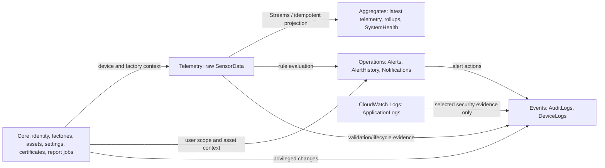
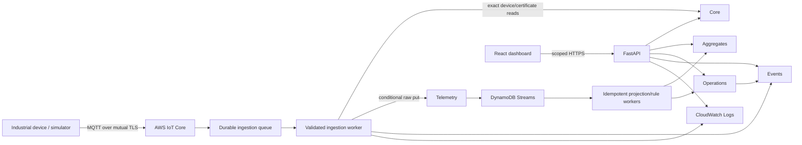

# ForgeSight Enterprise Database Design Document

| Document metadata | Value |
|---|---|
| Document type | Enterprise Database Design Document (DBDD) |
| Version | 2.0.0 |
| Status | Proposed five-table revision — approval required before implementation |
| Date | 2026-08-06 |
| Platform | Industrial IoT Device Management and Predictive Monitoring Platform on AWS |
| Primary database | Amazon DynamoDB |
| Supersedes | DBDD 1.0 proposed 17 physical tables; logical model remains intact |

---

## 1. Executive decision

ForgeSight keeps all 17 required logical entities but stores them in **five physical DynamoDB tables**:

1. `forgesight-{environment}-core`
2. `forgesight-{environment}-telemetry`
3. `forgesight-{environment}-aggregates`
4. `forgesight-{environment}-operations`
5. `forgesight-{environment}-events`

Amazon CloudWatch Logs, not DynamoDB, remains the system of record for application logs. This revision restores the access-pattern-first DynamoDB approach of the approved Software Architecture Document while preserving the database prompt's complete logical data model.

The five-table model is the approved recommendation for the AWS Academy/final-year project because it isolates the workloads that scale or retain differently without creating 17 sets of table permissions, backups, alarms, repositories, transactions, and deployment resources. More physical tables can be introduced later only when measured traffic, separate ownership, a distinct encryption boundary, or a distinct retention policy justifies them.

### 1.1 Approval effect

Approval of this document:

- replaces only the 17-physical-table proposal in DBDD 1.0;
- keeps Users, Roles, Factories, Departments, Machines, Devices, SensorData, Alerts, AlertHistory, Notifications, AuditLogs, DeviceLogs, Reports, Settings, DeviceCertificates, SystemHealth, and ApplicationLogs as named logical entities;
- preserves tenant isolation, validation, security, retention, performance, and API-contract requirements;
- authorizes design only, not AWS resources, models, repositories, migrations, or Backend Phase 3.

### 1.2 Design principles

- Design from real access patterns, beginning with Backend Phases 1–2.
- Use `GetItem`, `BatchGetItem`, `Query`, and small conditional transactions for normal application requests.
- Never use an unbounded DynamoDB `Scan` in an API request.
- Keep raw telemetry separate from operational records and dashboard projections.
- Co-locate data that changes or is read together when its throughput and retention are compatible.
- Use a GSI only for a required reverse lookup, list, queue, or state view.
- Treat GSI reads as eventually consistent; use base-table strong reads for authentication, revocation, uniqueness, and state transitions.
- Store large reports and archives in encrypted Amazon S3; keep only metadata in DynamoDB.
- Store application logs in CloudWatch Logs; copy only durable business/security evidence to Events.

### 1.3 Current implementation boundary

Backend Phases 1–2 currently implement authentication, session management, password reset, current-user access, a safe role catalog, and process liveness. The active repository adapter is in memory. This DBDD defines the future DynamoDB persistence contract without implementing it.

All factory, machine, device, telemetry, alert, notification, report, settings, certificate, health-summary, and device-diagnostic routes are current **project requirements** from the approved API/architecture documents but are not yet implemented backend routes. Multi-Region active-active operation, enterprise-scale cross-factory analytics, configurable custom RBAC, long-running report fleets, and dedicated searchable application-log indexes are **future enterprise scope**.

---

## 2. Logical-to-physical mapping

### 2.1 Complete mapping

| # | Logical entity | Physical storage | Why this placement |
|---:|---|---|---|
| 1 | Users | Core | Identity, memberships, sessions, resets, and configuration are low-volume strongly related control-plane data. |
| 2 | Roles | Core | Roles are read with Users during authorization and are currently code-defined. |
| 3 | Factories | Core | Factory is the authorization and asset ownership boundary. |
| 4 | Departments | Core | Departments are small children of a Factory and organize Machines. |
| 5 | Machines | Core | Machine and Device profiles are read together by asset workflows. |
| 6 | Devices | Core | Device registry/configuration is control-plane data; raw telemetry is separated. |
| 7 | SensorData | Telemetry for raw events; Aggregates for latest and rollups | Immutable writes and current/dashboard reads have different throughput and retention. |
| 8 | Alerts | Operations | Current alert state is read and changed with its timeline and notifications. |
| 9 | AlertHistory | Operations | Alert transitions are atomically appended with alert state changes. |
| 10 | Notifications | Operations | Notifications are produced by operational alerts and queried as a user inbox. |
| 11 | AuditLogs | Events | Immutable security/business evidence has distinct access and retention controls. |
| 12 | DeviceLogs | Events | Device lifecycle/quality events share append-only time-range access and retention behavior. |
| 13 | Reports | Core | Current project report jobs are low-volume control-plane metadata; report files live in S3. |
| 14 | Settings | Core | Platform, factory, and user settings are versioned control-plane records. |
| 15 | DeviceCertificates | Core | Certificate metadata is part of device registration/security posture; private keys are excluded. |
| 16 | SystemHealth | Aggregates | Health and dashboard summaries are derived read models, not source records. |
| 17 | ApplicationLogs | CloudWatch Logs | Full application logs need log search, metrics, alarms, and retention features rather than DynamoDB access patterns. |

### 2.2 Relationship view



### 2.3 What was combined

| DBDD 1.0 physical tables | DBDD 2.0 destination | Reason |
|---|---|---|
| Users, Roles | Core | Authentication and authorization are read together. |
| Factories, Departments, Machines, Devices | Core | These form one factory-scoped asset hierarchy with compatible scale/retention. |
| Settings, DeviceCertificates, Reports | Core | They are low-volume versioned metadata used by control-plane workflows. |
| SensorData raw items | Telemetry | Raw append throughput and 30-day TTL require isolation. |
| SensorData latest/rollups, SystemHealth | Aggregates | All are rebuildable dashboard/read projections. |
| Alerts, AlertHistory, Notifications | Operations | Alert lifecycle and user notification writes are one operational workflow. |
| AuditLogs, DeviceLogs | Events | Both are immutable, time-ordered evidence with bounded queries and archival. |
| ApplicationLogs | CloudWatch Logs | CloudWatch is purpose-built for log ingestion, search, metrics, alarms, and retention. |

### 2.4 Current project versus future enterprise scope

| Capability/entity | Current project requirement | Future enterprise extension |
|---|---|---|
| Users and sessions | Required now by Backend Phase 2 | Federation, enterprise SSO, adaptive risk |
| Roles | Six code-defined roles required now | Tenant-defined/versioned custom roles |
| Factories, Machines, Devices | Required for the capstone workflow | Very large fleets and separate team ownership |
| Departments | Optional organization field for the current demo | Deep organization hierarchy and cost-center integration |
| Raw/latest telemetry | Required for simulator, dashboard, and historical charts | Sub-second fleets, multi-Region ingestion, data lake analytics |
| Alerts and history | Required for warning/critical demo | Complex correlation, escalation, maintenance suppression |
| Notifications | In-app notification is current project scope; external channels follow AWS integration | Multi-channel routing, delivery analytics, regional providers |
| Audit logs | Required for authentication and privileged actions | Regulated legal holds and advanced SIEM integration |
| Device logs | Required when simulator/AWS ingestion begins | Fleet-wide diagnostic analytics |
| Reports | Basic asynchronous reports are current project scope | Large schedule fleets and distributed workers |
| Settings | Basic platform/factory values required | Dynamic schema registry and staged rollout |
| Device certificates | Metadata required when AWS IoT Core provisioning begins | CA hierarchy automation and large-scale rotation campaigns |
| System health | Current dashboard summary requirement | Predictive fleet scoring and multi-factory benchmarking |
| Application logs | CloudWatch structured logs required now | Optional export to OpenSearch/SIEM; no DynamoDB table planned |

---

## 3. Physical table inventory

| Physical table | Logical contents | Initial capacity | Streams | Baseline protection |
|---|---|---|---|---|
| `forgesight-{env}-core` | Users, Roles, Factories, Departments, Machines, Devices, Settings, DeviceCertificates, Reports, authentication support items | On-demand | `NEW_AND_OLD_IMAGES` | Customer-managed KMS key, PITR, AWS Backup, deletion protection |
| `forgesight-{env}-telemetry` | Raw SensorData only | On-demand | `NEW_IMAGE` | KMS, PITR, 30-day TTL, verified S3 export before expiry |
| `forgesight-{env}-aggregates` | Latest telemetry, hourly/daily rollups, SystemHealth/dashboard summaries | On-demand | Optional `NEW_IMAGE` | KMS, PITR; projections rebuildable from retained source/archive |
| `forgesight-{env}-operations` | Alerts, AlertHistory, Notifications | On-demand | `NEW_AND_OLD_IMAGES` | KMS, PITR, backup; resolved/history retention by item type |
| `forgesight-{env}-events` | AuditLogs, DeviceLogs | On-demand | `NEW_IMAGE` | Dedicated KMS key, PITR, immutable S3 archive, deletion protection |

No table or GSI is provisioned by this document. Names are design contracts for a later approved database implementation phase.

---

## 4. Key, type, and index standards

### 4.1 Common key rules

- Every DynamoDB table uses String attributes `pk` and `sk`.
- Keys use uppercase type prefixes and `#` separators, for example `USER#usr_...` and `PROFILE`.
- IDs are stable server-generated UUIDv7/ULID-style identifiers. Names, emails, serial numbers, and locations are never canonical IDs.
- Sortable UTC timestamps use fixed millisecond ISO 8601 form.
- Time-series keys use device/day buckets initially; high-rate device classes may move to device/hour plus a documented deterministic shard.
- Shards use a stable hash modulo a configured count. Readers query a known finite set with bounded concurrency.
- Item type is explicit in `entityType`; readers never guess solely from key text.

### 4.2 Common data attributes

| Attribute | DynamoDB type | Purpose |
|---|---|---|
| `pk`, `sk` | `S` | Composite primary key |
| `entityType` | `S` | Schema/item discriminator |
| `schemaVersion` | `N` | Reader and migration compatibility |
| `createdAt`, `updatedAt` | `S` | Trusted UTC lifecycle times |
| `version` | `N` | Optimistic concurrency on mutable items |
| `factoryId` | `S` | Denormalized server-authoritative authorization scope |
| `expiresAtEpoch` | `N` | Logical expiry and DynamoDB TTL input where applicable |
| `gsi1pk`…`gsi3pk`, `gsi1sk`…`gsi3sk` | `S` | Sparse alternate keys only on items that need an index |

Numbers use DynamoDB `N` with decimal-safe application adapters; binary floating-point values, NaN, and infinity are prohibited. Empty sets are prohibited. Items target less than 100 KB; telemetry/events target less than 4 KB; the DynamoDB 400 KB limit is never approached deliberately.

### 4.3 Necessary GSI inventory

| Table/index | Partition key pattern | Sort key pattern | Required access pattern | Provisioning |
|---|---|---|---|---|
| Core `FactoryEntities` | `FACTORY#{factoryId}` | `ENTITY#{type}#STATUS#{status}#NAME#{normalizedName}#ID#{entityId}` | List authorized users, machines, devices, and factory report jobs across their native partitions | Current project |
| Core `WorkflowQueue` | `WORK#{workType}#STATUS#{status}#SHARD#{n}` | `NEXT#{nextAttemptAt}#ID#{workId}` | Report/import jobs and future certificate work | Add only with async workers |
| Operations `AlertInbox` | `FACTORY#{factoryId}#STATUS#{status}` | `SEVERITY#{rank}#OPENED#{openedAt}#ALERT#{alertId}` | Alert inbox by factory/status/severity/time | Current project |
| Operations `DeviceAlerts` | `DEVICE#{deviceId}` | `OPENED#{openedAt}#ALERT#{alertId}` | Device alert history/list | Current project |
| Operations `UnreadNotifications` | `USER#{userId}#UNREAD` | `CREATED#{createdAt}#NOTIFICATION#{notificationId}` | Unread in-app inbox | Add with notification routes |
| Events `EventLookup` | `EVENT#{eventId}` | `SCOPE#{scope}#TS#{occurredAt}` | Exact audit/security event route | Current project |
| Events `ActorTime` | `ACTOR#{actorId}#MONTH#{yyyyMM}` | `TS#{occurredAt}#EVENT#{eventId}` | User/security investigation timeline | Current project |

The Backend Phase 2 authentication adapter itself requires **zero GSIs** because email, session, refresh, reset, rate-limit, and lockout lookups all use exact Core keys. Each listed GSI is created only in the same approved implementation increment as its owning list/worker route; `WorkflowQueue` remains deferred until an asynchronous worker exists.

There are no LSIs. Alternate sort requirements are served by base-key prefixes or GSIs; avoiding LSIs removes their table-creation constraint and 10 GB item-collection limit. Future indexes in the table above are not provisioned early.

### 4.4 No-Scan and pagination policy

- Normal APIs have no repository `scan_all` operation.
- Lists require an exact partition key plus optional sort-key prefix/range.
- Page `limit` is 1–100, default 25.
- Responses carry an opaque, signed cursor containing the table/index name, normalized request filters, authorization scope, and `LastEvaluatedKey`.
- A cursor cannot be reused by another user, factory scope, index, or filter set.
- Sharded time queries carry one continuation key per shard and merge only a bounded page.
- `FilterExpression` may refine a selective Query but is never used as a substitute for a key condition.
- Administrative backfills may use a rate-limited segmented Scan under a migration runbook; this is not an application access path.

---

## 5. Existing Backend Phase 1–2 route mapping

The current backend uses `InMemoryAuthRepository`; the following is the approved DynamoDB access contract for a later adapter. `/api/v1` is the configured API prefix.

| Existing route | DynamoDB access | Consistency and notes |
|---|---|---|
| `POST /api/v1/auth/login` | Core `GetItem EMAIL#{normalizedEmail}/LOOKUP`; Core strong `GetItem USER#{userId}/PROFILE`; exact lockout/rate items; transaction creates the owned Session, `SESSION#{sessionId}/LOOKUP`, and `REFRESH#{digest}/CREDENTIAL`; Events appends login outcome | Strong identity/session reads; email lookup item avoids an authentication GSI |
| `POST /api/v1/auth/refresh` | Core strong `GetItem REFRESH#{digest}/CREDENTIAL`; transaction consumes old credential, creates replacement, and advances session; Core strong user read; Events append | Conditional write detects reuse and prevents double rotation |
| `POST /api/v1/auth/logout` | Core strong Session-locator read followed by the owned Session; conditional session/credential/locator revocation; Events append | Idempotent revocation |
| `POST /api/v1/auth/logout-all` | Core `Query pk=USER#{userId}, begins_with(sk,'SESSION#')`; bounded conditional transaction chunks revoke Sessions, locators, and credentials; Events append | No Scan; pagination/chunking required for more than one transaction |
| `POST /api/v1/auth/password-reset/request` | Core exact rate item; `GetItem EMAIL#{normalizedEmail}/LOOKUP`; conditional `PutItem RESET#{digest}/TOKEN` with short TTL; Events append accepted outcome | Non-enumerating response; unknown email creates no reset record |
| `POST /api/v1/auth/password-reset/confirm` | Core strong `GetItem RESET#{digest}/TOKEN`; transaction marks token used, updates User password/token version, then revokes bounded session pages; Events append | Token is one-use; retries are idempotent |
| `GET /api/v1/me` | Authentication dependency strongly gets User and owned Session; handler reuses live User projection | Factory scope is server-derived |
| `GET /api/v1/me/sessions` | Authentication dependency; Core `Query pk=USER#{userId}, begins_with(sk,'SESSION#')`, newest first, bounded page | Route currently returns a bounded in-memory list; DynamoDB adapter uses cursor pagination |
| `DELETE /api/v1/me/sessions/{sessionId}` | Authentication dependency; Core strong locator and owned-Session reads; conditional revoke after `userId` ownership comparison | Foreign session IDs remain concealed |
| `GET /api/v1/roles` | No DynamoDB access today; six role definitions are code constants | Future configurable roles use `Query pk=CATALOG#ROLES, begins_with(sk,'ROLE#')` |
| `GET /api/v1/health/live` | No DynamoDB access by design | Liveness must not fail because a dependency is unavailable |

Every protected route first performs the authentication dependency: decode JWT locally, resolve the Session locator when the repository receives only `sessionId`, then strongly read the User and owned Session so disabled users, revoked sessions, password resets, and scope/version changes take effect immediately.

---

## 6. Core table design

### 6.1 Purpose and access patterns

Core is the low-to-medium-volume control-plane table. It stores identity, organization, asset registry, configuration, certificate metadata, and report-job metadata. It does not store raw telemetry, alert timelines, audit/device events, generated files, private certificate keys, or application logs.

| Logical/supporting item | Partition key (`pk`) | Sort key (`sk`) | Main access |
|---|---|---|---|
| User profile | `USER#{userId}` | `PROFILE` | Exact strong identity read |
| User factory membership | `USER#{userId}` | `FACTORY#{factoryId}` | User scope query; sparse FactoryEntities GSI for factory users |
| Email lookup/uniqueness claim | `EMAIL#{normalizedEmail}` | `LOOKUP` | Exact strong login lookup; transactionally owned by one user |
| Session | `USER#{userId}` | `SESSION#{createdAt}#{sessionId}` | User session query in creation-time order; exact access uses the locator's `ownedSk` |
| Session locator | `SESSION#{sessionId}` | `LOOKUP` | Stores `userId` and `ownedSk` for repository methods that receive only `sessionId` |
| Refresh credential | `REFRESH#{refreshDigest}` | `CREDENTIAL` | Exact strong refresh lookup and one-use rotation |
| Password reset | `RESET#{resetDigest}` | `TOKEN` | Exact one-use lookup with TTL |
| Rate-limit window | `RATE#{bucketDigest}` | `WINDOW#{windowStart}` | Exact current-window counter with TTL |
| Login lockout | `LOCKOUT#{identityDigest}` | `STATE` | Exact failure/locked-until state with TTL |
| Role active definition | `CATALOG#ROLES` | `ROLE#{roleId}#ACTIVE` | Query the small safe catalog |
| Role immutable version | `CATALOG#ROLES` | `ROLE#{roleId}#VERSION#{version:010d}` | Authorization history/future custom roles |
| Factory profile | `FACTORY#{factoryId}` | `PROFILE` | Exact factory read |
| Factory catalog projection | `CATALOG#FACTORIES` | `STATUS#{status}#NAME#{normalizedName}#FACTORY#{factoryId}` | Bounded factory list without Scan |
| Department | `FACTORY#{factoryId}` | `DEPARTMENT#{departmentId}` | Departments in one factory |
| Machine profile | `MACHINE#{machineId}` | `PROFILE` | Exact machine read; FactoryEntities GSI for lists |
| Machine history | `MACHINE#{machineId}` | `HISTORY#{occurredAt}#{eventId}` | Machine history time range |
| Device profile | `DEVICE#{deviceId}` | `PROFILE` | Exact device read; FactoryEntities GSI for administrative lists |
| Device configuration | `DEVICE#{deviceId}` | `CONFIG#{kind}#VERSION#{version:010d}` | Desired/reported configuration history |
| Device serial claim | `SERIAL#{serialHash}` | `LOOKUP` | Exact uniqueness lookup |
| Setting active value | `SCOPE#{scopeType}#{scopeId}` | `SETTING#{settingName}#ACTIVE` | Exact effective-value read |
| Setting immutable version | `SCOPE#{scopeType}#{scopeId}` | `SETTING#{settingName}#VERSION#{version:010d}` | Settings history |
| Device certificate | `DEVICE#{deviceId}` | `CERT#{issuedAt}#{certificateId}` | Certificate list/rotation metadata |
| Report job | `USER#{requestedBy}` | `REPORT#{createdAt}#{reportId}` | User report list; FactoryEntities/WorkflowQueue indexes where required |
| Report schedule | `FACTORY#{factoryId}` | `REPORTSCHEDULE#{scheduleId}` | Factory schedule list |

### 6.2 Integrity and transaction rules

- User creation transaction writes the User profile and the email lookup claim. Email change claims the new lookup, updates the profile, and removes the old claim conditionally.
- Machine and Device writes validate that referenced Factory/Department/Machine records are active and in the same factory.
- Device registration transaction writes the profile, serial lookup claim, and later certificate metadata. Serial/email claims use `attribute_not_exists`.
- Core Device connectivity is updated only on a state transition or a coalesced heartbeat interval; per-event latest values and freshness stay in Aggregates so telemetry cannot turn Core into a high-write table.
- Mutable updates compare `version` and increment it. A stale client receives a conflict rather than overwriting newer data.
- Sessions, session locators, refresh credentials, reset tokens, rate windows, and lockout states use exact keys so authentication never depends on an eventually consistent GSI. Session creation/revocation updates the locator and owned Session in one transaction.
- Cross-table business evidence is written to Events asynchronously from a durable change event or synchronously where the security requirement demands it. A failed evidence write raises an operational alert and is reconciled; it is never silently ignored.
- Report files are encrypted S3 objects. Core stores an internal encrypted locator, version ID, digest, size, and expiry—not file bytes or a client-trusted object key.

### 6.3 Example logical entity items

#### Users

```json
{
  "pk": "USER#usr_01J4A6RFQ8Y4TQ9FMM2B8K1S3X",
  "sk": "PROFILE",
  "entityType": "User",
  "schemaVersion": 2,
  "userId": "usr_01J4A6RFQ8Y4TQ9FMM2B8K1S3X",
  "displayName": "Asha Menon",
  "email": "asha.menon@example.com",
  "normalizedEmail": "asha.menon@example.com",
  "passwordHash": "$argon2id$v=19$m=65536,t=3,p=1$REDACTED",
  "roleId": "FACTORY_MANAGER",
  "factoryIds": ["fac_01J4A70P5E3N6V7Z8X9C0B2M4Q"],
  "status": "ACTIVE",
  "tokenVersion": 1,
  "scopeVersion": 1,
  "createdAt": "2026-08-06T09:15:00.000Z",
  "updatedAt": "2026-08-06T09:15:00.000Z",
  "version": 1
}
```

#### Roles

```json
{
  "pk": "CATALOG#ROLES",
  "sk": "ROLE#FACTORY_MANAGER#ACTIVE",
  "entityType": "Role",
  "schemaVersion": 2,
  "roleId": "FACTORY_MANAGER",
  "label": "Factory Manager",
  "permissions": ["factories:read", "devices:read", "telemetry:read", "alerts:read", "alerts:acknowledge", "reports:create"],
  "dataScope": "ASSIGNED_FACTORIES",
  "isSystem": true,
  "status": "ACTIVE",
  "roleVersion": 1,
  "createdAt": "2026-08-06T09:20:00.000Z",
  "updatedAt": "2026-08-06T09:20:00.000Z",
  "version": 1
}
```

The current `/roles` route uses code constants; this item is the future configurable catalog shape and is not required for the Phase 2 runtime.

#### Factories

```json
{
  "pk": "FACTORY#fac_01J4A70P5E3N6V7Z8X9C0B2M4Q",
  "sk": "PROFILE",
  "entityType": "Factory",
  "schemaVersion": 2,
  "factoryId": "fac_01J4A70P5E3N6V7Z8X9C0B2M4Q",
  "factoryCode": "BLR-01",
  "name": "Bengaluru Assembly Plant",
  "normalizedName": "bengaluru assembly plant",
  "status": "ACTIVE",
  "timezone": "Asia/Kolkata",
  "location": {"city": "Bengaluru", "state": "Karnataka", "countryCode": "IN"},
  "createdAt": "2026-08-06T09:30:00.000Z",
  "updatedAt": "2026-08-06T09:30:00.000Z",
  "version": 1
}
```

#### Departments

```json
{
  "pk": "FACTORY#fac_01J4A70P5E3N6V7Z8X9C0B2M4Q",
  "sk": "DEPARTMENT#dep_01J4A76C7Q4K3M2Z1P8N9V5T6R",
  "entityType": "Department",
  "schemaVersion": 2,
  "departmentId": "dep_01J4A76C7Q4K3M2Z1P8N9V5T6R",
  "factoryId": "fac_01J4A70P5E3N6V7Z8X9C0B2M4Q",
  "name": "Final Assembly",
  "normalizedName": "final assembly",
  "status": "ACTIVE",
  "managerUserId": "usr_01J4A6RFQ8Y4TQ9FMM2B8K1S3X",
  "createdAt": "2026-08-06T09:35:00.000Z",
  "updatedAt": "2026-08-06T09:35:00.000Z",
  "version": 1
}
```

#### Machines

```json
{
  "pk": "MACHINE#mch_01J4A7C9Y2K8W6P3R5N0Q1V4TZ",
  "sk": "PROFILE",
  "entityType": "Machine",
  "schemaVersion": 2,
  "machineId": "mch_01J4A7C9Y2K8W6P3R5N0Q1V4TZ",
  "factoryId": "fac_01J4A70P5E3N6V7Z8X9C0B2M4Q",
  "departmentId": "dep_01J4A76C7Q4K3M2Z1P8N9V5T6R",
  "machineCode": "ASM-RBT-014",
  "name": "Assembly Robot 14",
  "type": "SIX_AXIS_ROBOT",
  "status": "RUNNING",
  "criticality": "HIGH",
  "gsi1pk": "FACTORY#fac_01J4A70P5E3N6V7Z8X9C0B2M4Q",
  "gsi1sk": "ENTITY#MACHINE#STATUS#RUNNING#NAME#assembly robot 14#ID#mch_01J4A7C9Y2K8W6P3R5N0Q1V4TZ",
  "createdAt": "2026-08-06T09:40:00.000Z",
  "updatedAt": "2026-08-06T09:40:00.000Z",
  "version": 1
}
```

#### Devices

```json
{
  "pk": "DEVICE#dev_01J4A7KX9T6M3Q2W8R5N0V1C4B",
  "sk": "PROFILE",
  "entityType": "Device",
  "schemaVersion": 2,
  "deviceId": "dev_01J4A7KX9T6M3Q2W8R5N0V1C4B",
  "factoryId": "fac_01J4A70P5E3N6V7Z8X9C0B2M4Q",
  "machineId": "mch_01J4A7C9Y2K8W6P3R5N0Q1V4TZ",
  "name": "Robot 14 Power Monitor",
  "normalizedName": "robot 14 power monitor",
  "deviceType": "MULTI_SENSOR_GATEWAY",
  "serialHash": "sha256:5950c52d...",
  "firmwareVersion": "3.8.1",
  "status": "ACTIVE",
  "connectionStatus": "ONLINE",
  "lastSeenAt": "2026-08-06T09:45:03.210Z",
  "gsi1pk": "FACTORY#fac_01J4A70P5E3N6V7Z8X9C0B2M4Q",
  "gsi1sk": "ENTITY#DEVICE#STATUS#ACTIVE#NAME#robot 14 power monitor#ID#dev_01J4A7KX9T6M3Q2W8R5N0V1C4B",
  "createdAt": "2026-08-06T09:42:00.000Z",
  "updatedAt": "2026-08-06T09:45:03.210Z",
  "version": 12
}
```

#### Settings

```json
{
  "pk": "SCOPE#FACTORY#fac_01J4A70P5E3N6V7Z8X9C0B2M4Q",
  "sk": "SETTING#telemetry.rawRetentionDays#ACTIVE",
  "entityType": "Setting",
  "schemaVersion": 2,
  "scopeType": "FACTORY",
  "scopeId": "fac_01J4A70P5E3N6V7Z8X9C0B2M4Q",
  "settingName": "telemetry.rawRetentionDays",
  "valueType": "NUMBER",
  "value": 30,
  "classification": "INTERNAL",
  "settingVersion": 2,
  "updatedBy": "usr_01J4A6RFQ8Y4TQ9FMM2B8K1S3X",
  "changeReason": "Use approved raw telemetry retention",
  "createdAt": "2026-08-06T10:00:00.000Z",
  "updatedAt": "2026-08-06T10:00:00.000Z",
  "version": 2
}
```

Secrets are referenced by an approved Secrets Manager identifier and never stored as a Setting value.

#### DeviceCertificates

```json
{
  "pk": "DEVICE#dev_01J4A7KX9T6M3Q2W8R5N0V1C4B",
  "sk": "CERT#2026-07-01T00:00:00.000Z#crt_01J1RA8T3Q6V9N2K5M0C7P4W8X",
  "entityType": "DeviceCertificate",
  "schemaVersion": 2,
  "certificateId": "crt_01J1RA8T3Q6V9N2K5M0C7P4W8X",
  "deviceId": "dev_01J4A7KX9T6M3Q2W8R5N0V1C4B",
  "factoryId": "fac_01J4A70P5E3N6V7Z8X9C0B2M4Q",
  "issuer": "ForgeSight Device CA 01",
  "serialHash": "sha256:c8519a...",
  "publicKeyFingerprint": "sha256:35:78:11:...",
  "status": "ACTIVE",
  "issuedAt": "2026-07-01T00:00:00.000Z",
  "notBefore": "2026-07-01T00:00:00.000Z",
  "notAfter": "2027-07-01T00:00:00.000Z",
  "keyAlgorithm": "ECDSA_P256",
  "createdAt": "2026-07-01T00:00:00.000Z",
  "updatedAt": "2026-07-01T00:00:00.000Z",
  "version": 1
}
```

Private device keys and provisioning packages are never stored in DynamoDB.

#### Reports

```json
{
  "pk": "USER#usr_01J4A6RFQ8Y4TQ9FMM2B8K1S3X",
  "sk": "REPORT#2026-08-06T09:53:04.001Z#rpt_01J4A89N3K7M2Q5V8T1R0C6P9W",
  "entityType": "Report",
  "schemaVersion": 2,
  "reportId": "rpt_01J4A89N3K7M2Q5V8T1R0C6P9W",
  "factoryId": "fac_01J4A70P5E3N6V7Z8X9C0B2M4Q",
  "requestedBy": "usr_01J4A6RFQ8Y4TQ9FMM2B8K1S3X",
  "reportType": "MACHINE_HEALTH_SUMMARY",
  "format": "PDF",
  "filters": {"from": "2026-08-01T00:00:00.000Z", "to": "2026-08-06T00:00:00.000Z"},
  "status": "COMPLETED",
  "objectBucketAlias": "REPORTS_PRIVATE",
  "objectKeyCiphertext": "kms:v1:REDACTED",
  "objectVersionId": "3HL4kq...",
  "contentDigest": "sha256:20c2fa...",
  "sizeBytes": 284130,
  "objectExpiresAtEpoch": 1788602091,
  "gsi1pk": "FACTORY#fac_01J4A70P5E3N6V7Z8X9C0B2M4Q",
  "gsi1sk": "ENTITY#REPORT#STATUS#COMPLETED#NAME#machine health summary#ID#rpt_01J4A89N3K7M2Q5V8T1R0C6P9W",
  "createdAt": "2026-08-06T09:53:04.001Z",
  "updatedAt": "2026-08-06T09:54:51.822Z",
  "version": 4
}
```

### 6.4 Core retention

| Item class | Retention |
|---|---|
| User/factory/department/machine/device profiles | Active lifecycle plus seven years where needed for safety/audit meaning; archive instead of hard delete |
| Role and Setting versions | At least seven years; immutable versions |
| Sessions | Active lifetime plus 30 days; logical rejection immediately, TTL cleanup later |
| Refresh credentials | Session lifetime plus 30 days; used/revoked state retained for replay detection |
| Password reset and rate-limit items | Reset 15 minutes; rate window/lockout only as long as security policy requires; TTL |
| Device certificate metadata | Certificate life plus seven years after expiry/revocation |
| Report files | 30 days by default in S3 |
| Report metadata | 13 months; data-export evidence remains in Events/archive |

---

## 7. Telemetry table design

### 7.1 Purpose and key pattern

Telemetry stores **raw validated SensorData only**. Separating it prevents the highest-volume workload and its short TTL from affecting authentication, assets, alerts, or audit evidence.

| Logical item | Partition key (`pk`) | Sort key (`sk`) | Access |
|---|---|---|---|
| Raw SensorData event | `DEVICE#{deviceId}#DAY#{yyyyMMdd}` | `TS#{eventTime}#EVENT#{eventId}` | Device history for a bounded date/time range |

The initial bucket is one device/day. A device class proven by load tests to exceed a safe hot-partition budget changes to `DEVICE#{deviceId}#HOUR#{yyyyMMddHH}#SHARD#{n}` through a versioned migration. The bucket strategy is part of the Device configuration so readers enumerate known buckets rather than guessing.

No Telemetry GSI is provisioned for the current project:

- device telemetry history uses the base partition;
- machine telemetry enumerates the bounded Device list from Core and queries each device/time partition;
- factory dashboards use Aggregates rather than raw data;
- large factory exports read the S3 archive asynchronously rather than performing an expensive fleet-wide DynamoDB query.

A MachineTime or FactoryTime GSI is future enterprise scope only if measured requirements prove that bounded fan-out/S3 cannot satisfy a specific interactive query.

### 7.2 SensorData validation

All measurements use decimal-safe DynamoDB Numbers and canonical units. Device-type profiles may set stricter plausible limits than these absolute ingestion limits.

| Field | Absolute accepted range | Unit/rule |
|---|---:|---|
| `temperatureC` | -50 to 250 | degrees Celsius |
| `humidityPct` | 0 to 100 | percent relative humidity |
| `pressureKpa` | 0 to 10,000 | kilopascals |
| `voltageV` | 0 to 1,000 | volts |
| `currentA` | 0 to 2,000 | amperes |
| `powerConsumptionKw` | 0 to 2,000 | kilowatts |
| `rpm` | 0 to 100,000 | revolutions per minute |
| `machineHealthPct` | 0 to 100 | percent |
| `vibrationMmPerSec` | 0 to 100 | millimetres per second RMS |
| `connectionStatus` | enum | `ONLINE`, `OFFLINE`, `DEGRADED`, `UNKNOWN` |
| `eventTime` | UTC ISO 8601 | reject more than five minutes in the future; flag excessive past clock skew |

An absolute-range violation is rejected and creates a DeviceLog event without storing the unsafe raw payload. A plausible anomaly inside the absolute range is accepted with `quality.status=QUESTIONABLE`. Absent optional measurements are omitted rather than written as zero or `null`.

`eventId` plus the full primary key is the idempotency identity. A conditional Put rejects a duplicate. Reuse of the same ID with a different `payloadHash` is a security/quality event. Trusted `ingestedAt` is stored beside source `eventTime` to measure clock skew and ingestion delay.

### 7.3 SensorData example

```json
{
  "pk": "DEVICE#dev_01J4A7KX9T6M3Q2W8R5N0V1C4B#DAY#20260806",
  "sk": "TS#2026-08-06T09:45:03.210Z#EVENT#evt_01J4A7R0AM7H2V9Q3N8K5C6P1W",
  "entityType": "SensorData",
  "schemaVersion": 2,
  "eventId": "evt_01J4A7R0AM7H2V9Q3N8K5C6P1W",
  "deviceId": "dev_01J4A7KX9T6M3Q2W8R5N0V1C4B",
  "factoryId": "fac_01J4A70P5E3N6V7Z8X9C0B2M4Q",
  "machineId": "mch_01J4A7C9Y2K8W6P3R5N0Q1V4TZ",
  "temperatureC": 61.35,
  "humidityPct": 44.2,
  "pressureKpa": 101.4,
  "voltageV": 415.1,
  "currentA": 18.6,
  "powerConsumptionKw": 12.84,
  "rpm": 1488,
  "machineHealthPct": 92.5,
  "vibrationMmPerSec": 2.7,
  "connectionStatus": "ONLINE",
  "eventTime": "2026-08-06T09:45:03.210Z",
  "ingestedAt": "2026-08-06T09:45:03.381Z",
  "sequenceNumber": 80421,
  "payloadHash": "sha256:7a229c8e...",
  "quality": {"status": "VALID", "flags": []},
  "expiresAtEpoch": 1788601503,
  "createdAt": "2026-08-06T09:45:03.381Z",
  "updatedAt": "2026-08-06T09:45:03.381Z"
}
```

### 7.4 Telemetry retention and archive

- Raw SensorData has a 30-day logical retention and `expiresAtEpoch` TTL.
- DynamoDB Streams delivers accepted events to an encrypted, date/factory/device-partitioned S3 Parquet archive before TTL.
- Archive processors are idempotent and reconcile counts/digests. TTL is not enabled as the only copy-removal mechanism until archive verification exists.
- TTL deletion is asynchronous; API queries exclude logically expired items immediately.
- Long-range analytics and exports run against S3/Athena in future AWS integration, not DynamoDB Scan.

---

## 8. Aggregates table design

### 8.1 Purpose and key patterns

Aggregates stores rebuildable read models: latest telemetry, hourly/daily rollups, device cards for monitoring, and SystemHealth/dashboard summaries. It prevents dashboards from repeatedly querying raw SensorData.

| Projection item | Partition key (`pk`) | Sort key (`sk`) | Access |
|---|---|---|---|
| Latest device telemetry | `DEVICE#{deviceId}` | `LATEST` | Exact latest-reading route |
| Device hourly rollup | `DEVICE#{deviceId}` | `ROLLUP#HOUR#{yyyyMMddHH}` | Device chart/time range |
| Device daily rollup | `DEVICE#{deviceId}` | `ROLLUP#DAY#{yyyyMMdd}` | Long-range device chart |
| Factory device card | `FACTORY#{factoryId}` | `DEVICE#{deviceId}` | Factory monitoring grid by bounded Query |
| Factory connection-state projection | `FACTORY#{factoryId}` | `STATE#CONNECTION#{status}#LASTSEEN#{lastSeenAt}#DEVICE#{deviceId}` | Online/offline/degraded lists by base Query prefix |
| Factory health-state projection | `FACTORY#{factoryId}` | `STATE#HEALTH#{band}#SCORE#{invertedScore}#DEVICE#{deviceId}` | Critical/worst-device lists by base Query prefix |
| Factory current summary | `FACTORY#{factoryId}` | `SUMMARY#CURRENT` | Factory/dashboard summary exact read |
| Factory historical summary | `FACTORY#{factoryId}` | `SUMMARY#HOUR#{yyyyMMddHH}` | KPI trend range |
| Machine current summary | `MACHINE#{machineId}` | `SUMMARY#CURRENT` | Machine details/health exact read |
| Platform current summary | `PLATFORM` | `SUMMARY#CURRENT` | Authorized platform dashboard |

Connection and health state use small materialized items in the same Factory partition, so a base `Query` with a state prefix replaces an extra GSI. A transition transaction removes the old state item, writes the new state item, and updates the device card. `LATEST` advances only when incoming `eventTime`, sequence, and ingestion tie-break rules show the event is newer; late raw events remain historical but cannot overwrite current state.

Projection workers consume Telemetry Streams at least once. Every update carries the source `eventId`/watermark and is idempotent. Reconciliation can rebuild all Aggregates from retained Telemetry/S3 source data.

### 8.2 SystemHealth example

```json
{
  "pk": "FACTORY#fac_01J4A70P5E3N6V7Z8X9C0B2M4Q",
  "sk": "SUMMARY#CURRENT",
  "entityType": "SystemHealth",
  "schemaVersion": 2,
  "scopeType": "FACTORY",
  "scopeId": "fac_01J4A70P5E3N6V7Z8X9C0B2M4Q",
  "factoryId": "fac_01J4A70P5E3N6V7Z8X9C0B2M4Q",
  "healthScore": 94.2,
  "healthBand": "HEALTHY",
  "connectionSummary": {"online": 19, "offline": 1, "degraded": 0},
  "alertSummary": {"criticalOpen": 1, "warningOpen": 2},
  "telemetrySummary": {"eventsPerMinute": 239.4, "invalidPct": 0.02},
  "calculatedAt": "2026-08-06T10:01:00.000Z",
  "inputWatermark": "2026-08-06T10:00:59.500Z",
  "algorithmVersion": 2,
  "createdAt": "2026-08-06T10:01:00.000Z",
  "updatedAt": "2026-08-06T10:01:00.000Z",
  "version": 18421
}
```

### 8.3 Aggregate retention

- `LATEST`, factory device cards, and current summaries have no TTL while their source entity is active.
- Hourly and daily rollups remain 13 months, then expire through TTL after any required S3 export.
- Retired device/factory current projections remain through the approved historical-reference window, then are removed only after source/evidence retention permits.
- Aggregates is recoverable data, but PITR is still enabled to meet the four-hour recovery objective without forcing a full replay during every incident.

---

## 9. Operations table design

### 9.1 Purpose and key patterns

Operations stores alert workflow state, immutable alert history, and in-app notification delivery state. These logical entities are combined because an alert transition commonly creates a history event and one or more notifications in the same small DynamoDB transaction.

| Logical/supporting item | Partition key (`pk`) | Sort key (`sk`) | Main access |
|---|---|---|---|
| Alert current state | `ALERT#{alertId}` | `PROFILE` | Exact alert details/state transition |
| Alert history | `ALERT#{alertId}` | `EVENT#{occurredAt}#{eventId}` | Ordered alert timeline |
| Active alert dedupe lock | `DEDUPE#ALERT#{dedupeHash}` | `ACTIVE` | Exact condition/cooldown lookup |
| Notification | `USER#{userId}` | `NOTIFICATION#{createdAt}#{notificationId}` | User inbox by time |
| Notification delivery attempt | `USER#{userId}` | `DELIVERY#{notificationId}#{attempt:04d}` | Delivery diagnostics/retry history |

AlertInbox supports factory/status/severity/time lists. DeviceAlerts supports device-specific alert lists. UnreadNotifications is sparse: unread items carry its key attributes; marking an item read removes those attributes. Delivery worker indexes are future scope and are not provisioned until an external notification channel needs polling/retry.

### 9.2 Atomic workflow rules

- Alert creation conditionally writes the Alert profile and the dedupe lock, appends an `OPENED` AlertHistory item, and creates deterministic Notifications in one bounded transaction where the recipient count fits.
- Large recipient sets are expanded asynchronously from one durable alert change; notification IDs are deterministic per alert/event/recipient.
- Acknowledge, assign, suppress, resolve, reopen, and comment operations conditionally compare the Alert `version` and append exactly one history event.
- Closing or resolving an alert changes/removes its active dedupe lock in the same transaction.
- AlertHistory is append-only. A correction is another event, never an overwrite.
- A referenced User, Device, Machine, or Factory may later be archived, so operational items retain stable IDs and bounded display snapshots.

### 9.3 Example logical entity items

#### Alerts

```json
{
  "pk": "ALERT#alt_01J4A7W3KH8Q5T9M2N6R0V1C7P",
  "sk": "PROFILE",
  "entityType": "Alert",
  "schemaVersion": 2,
  "alertId": "alt_01J4A7W3KH8Q5T9M2N6R0V1C7P",
  "factoryId": "fac_01J4A70P5E3N6V7Z8X9C0B2M4Q",
  "machineId": "mch_01J4A7C9Y2K8W6P3R5N0Q1V4TZ",
  "deviceId": "dev_01J4A7KX9T6M3Q2W8R5N0V1C4B",
  "type": "HIGH_TEMPERATURE",
  "title": "Robot controller temperature high",
  "severity": "CRITICAL",
  "severityRank": "01",
  "status": "OPEN",
  "observedValue": 91.2,
  "threshold": {"operator": "GT", "value": 85, "unit": "C", "durationSeconds": 60},
  "openedAt": "2026-08-06T09:46:10.000Z",
  "lastObservedAt": "2026-08-06T09:46:10.000Z",
  "dedupeHash": "sha256:92d1c174...",
  "gsi1pk": "FACTORY#fac_01J4A70P5E3N6V7Z8X9C0B2M4Q#STATUS#OPEN",
  "gsi1sk": "SEVERITY#01#OPENED#2026-08-06T09:46:10.000Z#ALERT#alt_01J4A7W3KH8Q5T9M2N6R0V1C7P",
  "gsi2pk": "DEVICE#dev_01J4A7KX9T6M3Q2W8R5N0V1C4B",
  "gsi2sk": "OPENED#2026-08-06T09:46:10.000Z#ALERT#alt_01J4A7W3KH8Q5T9M2N6R0V1C7P",
  "createdAt": "2026-08-06T09:46:10.000Z",
  "updatedAt": "2026-08-06T09:46:10.000Z",
  "version": 1
}
```

#### AlertHistory

```json
{
  "pk": "ALERT#alt_01J4A7W3KH8Q5T9M2N6R0V1C7P",
  "sk": "EVENT#2026-08-06T09:49:22.004Z#evh_01J4A82F2T5R7N9K1M3Q6V8C0W",
  "entityType": "AlertHistory",
  "schemaVersion": 2,
  "eventId": "evh_01J4A82F2T5R7N9K1M3Q6V8C0W",
  "alertId": "alt_01J4A7W3KH8Q5T9M2N6R0V1C7P",
  "factoryId": "fac_01J4A70P5E3N6V7Z8X9C0B2M4Q",
  "deviceId": "dev_01J4A7KX9T6M3Q2W8R5N0V1C4B",
  "eventType": "ACKNOWLEDGED",
  "fromStatus": "OPEN",
  "toStatus": "ACKNOWLEDGED",
  "actorId": "usr_01J4A6RFQ8Y4TQ9FMM2B8K1S3X",
  "actorType": "USER",
  "reasonCode": "OPERATOR_CONFIRMED",
  "correlationId": "cor_01J4A82D0E9K6R3P1V7M5T2N8Q",
  "alertVersion": 2,
  "occurredAt": "2026-08-06T09:49:22.004Z",
  "createdAt": "2026-08-06T09:49:22.004Z",
  "updatedAt": "2026-08-06T09:49:22.004Z"
}
```

#### Notifications

```json
{
  "pk": "USER#usr_01J4A6RFQ8Y4TQ9FMM2B8K1S3X",
  "sk": "NOTIFICATION#2026-08-06T09:46:11.125Z#ntf_01J4A7W4P6C2R8M5N9T0V3K1QZ",
  "entityType": "Notification",
  "schemaVersion": 2,
  "notificationId": "ntf_01J4A7W4P6C2R8M5N9T0V3K1QZ",
  "userId": "usr_01J4A6RFQ8Y4TQ9FMM2B8K1S3X",
  "factoryId": "fac_01J4A70P5E3N6V7Z8X9C0B2M4Q",
  "type": "CRITICAL_ALERT_OPENED",
  "title": "Critical temperature alert",
  "body": "Assembly Robot 14 exceeded its temperature threshold.",
  "priority": "URGENT",
  "channel": "IN_APP",
  "deliveryStatus": "DELIVERED",
  "sourceType": "ALERT",
  "sourceId": "alt_01J4A7W3KH8Q5T9M2N6R0V1C7P",
  "idempotencyKey": "alert-opened:alt_01J4A7W3KH8Q5T9M2N6R0V1C7P:usr_01J4A6RFQ8Y4TQ9FMM2B8K1S3X",
  "gsi3pk": "USER#usr_01J4A6RFQ8Y4TQ9FMM2B8K1S3X#UNREAD",
  "gsi3sk": "CREATED#2026-08-06T09:46:11.125Z#NOTIFICATION#ntf_01J4A7W4P6C2R8M5N9T0V3K1QZ",
  "expiresAtEpoch": 1793785571,
  "createdAt": "2026-08-06T09:46:11.125Z",
  "updatedAt": "2026-08-06T09:46:11.125Z",
  "version": 1
}
```

### 9.4 Operations retention

- Open Alerts and active dedupe locks do not expire automatically.
- Resolved Alert profiles and AlertHistory remain hot for 13 months, then move to the immutable evidence archive when required and expire through TTL.
- In-app Notifications expire after 90 days. Security evidence is separately represented in Events before notification expiry.
- Legal hold applies to archived alert evidence, not ordinary notification inbox data.

---

## 10. Events table design

### 10.1 Purpose and key patterns

Events stores immutable business/security AuditLogs and structured DeviceLogs. The two logical entities share append-only, time-range, correlation, encryption, archive, and incident-investigation behavior.

| Logical item | Partition key (`pk`) | Sort key (`sk`) | Main access |
|---|---|---|---|
| AuditLog | `SCOPE#{scope}#MONTH#{yyyyMM}#SHARD#{n}` | `TS#{occurredAt}#AUDIT#{auditId}` | Scoped/month/time/shard query; `scope` is a Factory ID or `PLATFORM` |
| DeviceLog | `DEVICE#{deviceId}#DAY#{yyyyMMdd}` | `TS#{occurredAt}#DEVICELOG#{logId}` | Device/date/time diagnostic query |

EventLookup provides exact `/audit-events/{eventId}` resolution without Scan. ActorTime supports authentication/security investigations. DeviceLogs need no initial GSI: device/date is their required diagnostic access path; factory-wide diagnostic analytics is future S3/Athena scope.

Audit writes are immutable conditional Puts. A service never updates or deletes an audit event. DeviceLog `details` is allowlisted and size-bounded; raw device payloads, passwords, tokens, cookies, private keys, authorization headers, and unrestricted request bodies are forbidden.

### 10.2 Example logical entity items

#### AuditLogs

```json
{
  "pk": "SCOPE#fac_01J4A70P5E3N6V7Z8X9C0B2M4Q#MONTH#202608#SHARD#07",
  "sk": "TS#2026-08-06T09:49:22.010Z#AUDIT#aud_01J4A82F5R8M1V6Q3N9K2T0C7P",
  "entityType": "AuditLog",
  "schemaVersion": 2,
  "auditId": "aud_01J4A82F5R8M1V6Q3N9K2T0C7P",
  "factoryId": "fac_01J4A70P5E3N6V7Z8X9C0B2M4Q",
  "actorId": "usr_01J4A6RFQ8Y4TQ9FMM2B8K1S3X",
  "actorType": "USER",
  "action": "ALERT_ACKNOWLEDGE",
  "resourceType": "ALERT",
  "resourceId": "alt_01J4A7W3KH8Q5T9M2N6R0V1C7P",
  "outcome": "SUCCESS",
  "reasonCode": "OPERATOR_CONFIRMED",
  "occurredAt": "2026-08-06T09:49:22.010Z",
  "ingestedAt": "2026-08-06T09:49:22.014Z",
  "sourceIpHash": "hmac-sha256:68b775...",
  "correlationId": "cor_01J4A82D0E9K6R3P1V7M5T2N8Q",
  "requestId": "req_01J4A82E6C0P9T5M2V7N3R8K1Q",
  "changeSummary": {"status": {"from": "OPEN", "to": "ACKNOWLEDGED"}},
  "integrityHash": "sha256:f09bd3...",
  "expiresAtEpoch": 1793785762,
  "gsi1pk": "EVENT#aud_01J4A82F5R8M1V6Q3N9K2T0C7P",
  "gsi1sk": "SCOPE#fac_01J4A70P5E3N6V7Z8X9C0B2M4Q#TS#2026-08-06T09:49:22.010Z",
  "gsi2pk": "ACTOR#usr_01J4A6RFQ8Y4TQ9FMM2B8K1S3X#MONTH#202608",
  "gsi2sk": "TS#2026-08-06T09:49:22.010Z#EVENT#aud_01J4A82F5R8M1V6Q3N9K2T0C7P",
  "createdAt": "2026-08-06T09:49:22.014Z",
  "updatedAt": "2026-08-06T09:49:22.014Z"
}
```

#### DeviceLogs

```json
{
  "pk": "DEVICE#dev_01J4A7KX9T6M3Q2W8R5N0V1C4B#DAY#20260806",
  "sk": "TS#2026-08-06T09:51:02.001Z#DEVICELOG#dlg_01J4A85K7Q2N8V1M5T9R0C3P6W",
  "entityType": "DeviceLog",
  "schemaVersion": 2,
  "logId": "dlg_01J4A85K7Q2N8V1M5T9R0C3P6W",
  "deviceId": "dev_01J4A7KX9T6M3Q2W8R5N0V1C4B",
  "factoryId": "fac_01J4A70P5E3N6V7Z8X9C0B2M4Q",
  "machineId": "mch_01J4A7C9Y2K8W6P3R5N0Q1V4TZ",
  "eventClass": "PAYLOAD_VALIDATION_FAILED",
  "severity": "WARNING",
  "messageTemplate": "measurement_out_of_absolute_range",
  "details": {"field": "humidityPct", "reason": "ABOVE_MAX", "valueDigest": "sha256:a871..."},
  "correlationId": "cor_01J4A85J1V8T3M9Q2N5R7C0P6K",
  "occurredAt": "2026-08-06T09:51:02.001Z",
  "ingestedAt": "2026-08-06T09:51:02.008Z",
  "expiresAtEpoch": 1793785862,
  "createdAt": "2026-08-06T09:51:02.008Z",
  "updatedAt": "2026-08-06T09:51:02.008Z"
}
```

### 10.3 Events retention and integrity

- AuditLogs remain hot for 90 days and are streamed to an encrypted S3 Object Lock archive retained for at least seven years where policy requires.
- DeviceLogs remain hot for 90 days. Incident-specific records may be promoted to the immutable archive.
- Events TTL begins only after verified archival where archival is required. Legal hold suppresses archive deletion.
- Events uses a dedicated customer-managed KMS key and narrower IAM roles than general Core access.
- Archive reconciliation compares event IDs/counts and sampled integrity hashes before DynamoDB expiry.

---

## 11. ApplicationLogs in CloudWatch Logs

ApplicationLogs remains a logical entity in the data model but has **no DynamoDB table or item key**. Backend services emit structured JSON to an environment/service CloudWatch log group such as `/forgesight/{environment}/backend`. CloudWatch log streams identify runtime instances; request, correlation, and trace IDs connect events.

```json
{
  "entityType": "ApplicationLog",
  "schemaVersion": 2,
  "timestamp": "2026-08-06T10:02:13.442Z",
  "level": "ERROR",
  "service": "backend-api",
  "environment": "production",
  "deploymentVersion": "2026.08.06.1",
  "eventName": "AUTH_EVENT_SINK_UNAVAILABLE",
  "message": "Authentication evidence delivery will be retried.",
  "errorCode": "EVENTS_WRITE_RETRY",
  "correlationId": "cor_01J4A9AZ6T2M8V5Q3N1R7C0P4K",
  "requestId": "req_01J4A9B03Q8N5V2T6M7R1C4P0W",
  "traceId": "1-68948125-3a8f...",
  "details": {"retryAttempt": 2, "backoffMs": 184}
}
```

CloudWatch controls:

- KMS encryption, least-privilege log writers/readers, environment-separated log groups, and no public access;
- 90-day retention for current project application logs unless a stricter policy applies;
- metric filters and alarms for errors, authentication abuse, event-sink failures, throttling, and DLQ activity;
- subscription/export to S3, OpenSearch, or a SIEM only in future enterprise scope;
- centralized redaction before serialization. Passwords, tokens, cookies, authorization headers, private keys, raw payloads, and sensitive stack locals are never logged.

Durable business/security actions are AuditLogs in Events. ApplicationLogs explain software behavior and are not treated as the authoritative audit trail.

---

## 12. Project access-pattern mapping

Section 5 is authoritative for routes implemented in Backend Phases 1–2. The table below maps the remaining approved project feature groups without implying that those routes or repositories already exist.

| Feature/access pattern | Physical table and keyed operation | Scope status |
|---|---|---|
| List authorized factories | Core `Query CATALOG#FACTORIES`; service intersects results with server-derived factory IDs | Current project, not implemented |
| Get factory details/settings | Core exact `GetItem FACTORY#{id}/PROFILE` and exact scope Setting items | Current project, not implemented |
| Factory summary | Aggregates exact `GetItem FACTORY#{id}/SUMMARY#CURRENT` | Current project, not implemented |
| List factory departments | Core `Query FACTORY#{id}`, `begins_with(sk,'DEPARTMENT#')` | Optional current project organization, not implemented |
| Get machine and history | Core exact Machine profile plus `Query MACHINE#{id}`, history prefix/time range | Current project, not implemented |
| List factory machines/devices | Core FactoryEntities GSI `Query` with `ENTITY#MACHINE` or `ENTITY#DEVICE` prefix | Current project, not implemented |
| Get device details/configuration/certificates | Core exact `GetItem DEVICE#{id}/PROFILE`; bounded Query on `CONFIG#` or `CERT#` prefixes | Current project, not implemented |
| List online/offline devices | Aggregates base `Query FACTORY#{id}` with `STATE#CONNECTION#{status}` prefix | Current project, not implemented |
| Latest device telemetry | Aggregates exact `GetItem DEVICE#{id}/LATEST` | Current project, not implemented |
| Historical device telemetry | Telemetry query each device/day bucket with timestamp range and cursor | Current project, not implemented |
| Factory monitoring grid | Aggregates `Query FACTORY#{id}`, `begins_with(sk,'DEVICE#')` | Current project, not implemented |
| Critical/degraded device view | Aggregates base `Query FACTORY#{id}` with `STATE#HEALTH#{band}` prefix | Current project, not implemented |
| Dashboard/health trend | Aggregates exact current summary or bounded `SUMMARY#HOUR#` range | Current project, not implemented |
| Alert inbox | Operations AlertInbox GSI by factory/status with severity/time order | Current project, not implemented |
| Alert details/timeline | Operations exact Alert profile and base Query `ALERT#{id}` with `EVENT#` prefix | Current project, not implemented |
| Alert transition | Operations conditional transaction updates Alert and appends AlertHistory/Notifications | Current project, not implemented |
| User notification inbox | Operations base Query `USER#{id}`, `NOTIFICATION#` range; unread uses sparse GSI | Current project, not implemented |
| Report list/status | Core base User report Query; factory list via FactoryEntities; worker via deferred WorkflowQueue | Current project, not implemented |
| Audit/security event query | Events base scope/month/shard Query, EventLookup, or ActorTime | Current project, event sink port exists but durable adapter not implemented |
| Device diagnostic history | Events base device/day Query | Begins with simulator/AWS ingestion phases |
| Application troubleshooting | CloudWatch Logs Insights using service/time/correlation fields | Structured CloudWatch logging exists; cloud retention/alarms follow AWS integration |

Authorization occurs before each query. The backend derives factory scope from the authenticated User and never broadens scope from a request parameter. Platform-wide operations are restricted to the Super Administrator or approved asynchronous jobs.

---

## 13. Storage data flow



1. The device authenticates to IoT Core using a device-specific certificate; the private key never enters DynamoDB.
2. IoT policy validates the client/topic relationship and places accepted envelopes on a durable queue.
3. The ingestion worker uses exact Core keys to validate Device status, Factory/Machine assignment, certificate posture, and schema/capabilities.
4. The worker validates type, range, timestamp, sequence, event ID, and payload hash.
5. A rejected payload produces a safe DeviceLog and CloudWatch diagnostic without persisting the unsafe raw body.
6. An accepted event is conditionally written to Telemetry. A duplicate is a no-op; an ID/hash conflict is evidence.
7. Telemetry Streams feed idempotent workers that advance latest/rollup/health projections in Aggregates and evaluate alert rules.
8. A qualifying alert workflow conditionally changes Operations state, appends history, and creates deterministic notifications.
9. Privileged changes and authentication/security outcomes append AuditLogs to Events. Software diagnostics remain in CloudWatch Logs.
10. FastAPI resolves User/Session and factory scope from Core, uses only keyed bounded reads, and returns authorized projections. React never accesses DynamoDB directly.

Cross-table changes cannot be one DynamoDB transaction. The source write is authoritative; Streams plus deterministic event IDs, retry/DLQ handling, watermarks, and reconciliation provide reliable derived writes. A projection delay never changes raw truth.

---

## 14. Validation and consistency standards

### 14.1 Common validation

| Field class | Rule |
|---|---|
| Identifiers | Server-generated stable typed ID; bounded ASCII; never a mutable name/email/serial |
| Names | Trimmed Unicode, 1–120 characters; normalized search form stored separately |
| Email | Valid, maximum 254 characters; normalized case-folded lookup; unique claim required |
| Enums | Exact allowlisted uppercase value; unknown values rejected |
| Timestamps | UTC ISO 8601 milliseconds; trusted server time for audit/ingestion |
| TTL | Positive integer epoch seconds derived server-side from approved policy |
| Maps/lists | Explicit bounded schema and encoded size; arbitrary keys prohibited |
| Tags | Maximum 20, each 1–50 normalized characters; no secrets/PII |
| Version | Positive monotonic integer; mutable update conditionally compares it |
| Pagination | Limit 1–100; cursor signed and bound to user/scope/query |

### 14.2 Referential rules

- Department belongs to an existing active Factory.
- Machine belongs to an active Factory and, when used, a Department in that Factory.
- Device belongs to an active Machine in the same Factory.
- SensorData Factory/Machine identifiers are resolved from Core, not trusted from the device payload.
- User membership references an active Factory and an approved role.
- DeviceCertificate belongs to the Device partition; expired/revoked certificates cannot authenticate.
- Alert and Event records retain stable asset/user IDs and display snapshots so later archival does not erase history.
- Parent archival is rejected while active dependents exist unless an explicit reassignment/archive workflow is approved.

### 14.3 Consistency and idempotency

- Authentication, uniqueness, credential consumption, version checks, and state transitions use strong base reads and conditional writes.
- GSI list views are eventually consistent. An API mutation response returns the authoritative result rather than immediately querying its GSI.
- Every externally retryable mutation accepts or derives an idempotency key and stores a bounded result/expiry item in Core or the owning workflow partition.
- Stream consumers assume at-least-once delivery and condition on source version/event ID.
- Transactions remain small and well below DynamoDB's 100-item/4 MB limits. Large fan-out is asynchronous and resumable.

---

## 15. Security design

### 15.1 Access and tenant isolation

- Backend services use dedicated least-privilege IAM roles. Browsers, React code, and devices never receive DynamoDB credentials.
- Permissions name exact environment tables, indexes, and required actions. Production administration uses time-bound audited break-glass access.
- Factory scope comes from the live User record/session. Client `factoryId` values only narrow an already authorized scope.
- Services reject an empty/unauthorized scope; they never fall back to a platform-wide query.
- CloudTrail, IAM Access Analyzer, AWS Config, GuardDuty, and Security Hub integration is introduced in the approved AWS/DevSecOps phases.

### 15.2 Encryption and sensitive data

- All five production tables, streams, PITR/backups, S3 archives, reports, and CloudWatch log groups are encrypted at rest with customer-managed KMS keys separated by environment. Events uses a more restricted key/grant boundary.
- TLS 1.2 or later is required in transit; certificate validation cannot be disabled.
- Passwords use Argon2id hashes; refresh/reset credentials use keyed digests. Plaintext credentials, cookies, tokens, private keys, and secret Setting values are prohibited.
- DeviceCertificates stores public metadata/fingerprints only. Private keys stay in secure device/PKI handling.
- Email is confidential PII. IP addresses are HMAC-pseudonymized unless an approved policy requires encrypted raw retention.
- Redaction occurs before log/event serialization. Export, role/setting, certificate, alert, and privileged administration actions create AuditLogs.

### 15.3 Table protection

Production tables enable deletion protection, PITR, KMS encryption, ownership/classification tags, alarms, and infrastructure drift controls. Policies deny unencrypted tables, wildcard production data access, public backups, and disabling recovery controls outside an approved deployment role. Synthetic/redacted data is used outside production.

---

## 16. Retention, TTL, and disposal

| Physical table/item class | Hot retention | Archive/total retention | Disposal |
|---|---|---|---|
| Core durable profiles/settings | Resource lifetime | Seven years where audit/safety context requires | Archive/tombstone; never reuse IDs |
| Core sessions/refresh credentials | Active lifetime + 30 days | Security outcome represented in Events | Logical rejection then TTL |
| Core resets/rate limits/lockouts | 15 minutes or configured security window | No long-term secret artifact | TTL |
| Core report files/metadata | S3 file 30 days; metadata 13 months | Export evidence in Events seven years where required | S3 lifecycle and metadata TTL |
| Telemetry raw SensorData | 30 days | S3 according to analytics/legal policy | Verified archive then TTL |
| Aggregates current projections | Active resource lifetime | Rebuildable | Remove after source/history permits |
| Aggregates hourly/daily | 13 months | Optional S3 aggregate archive | TTL |
| Operations open alerts | Until resolved | No TTL while active | Explicit state transition only |
| Operations resolved alerts/history | 13 months | Seven years for required incident evidence | Archive then TTL |
| Operations notifications | 90 days | Durable security evidence separately in Events | TTL |
| Events AuditLogs | 90 days | At least seven years immutable where required | Legal hold, then policy deletion |
| Events DeviceLogs | 90 days | Promote incident evidence when required | TTL |
| CloudWatch ApplicationLogs | 90 days current baseline | Optional approved export | Log-group retention policy |

TTL is asynchronous and may remove an item days after its timestamp. Services treat `expiresAtEpoch <= now` as unavailable immediately. TTL is never an authorization control, session revocation scheduler, alert resolution mechanism, or archive-verification mechanism.

---

## 17. Backup, restore, and disaster recovery

### 17.1 Backup policy

- Enable continuous point-in-time recovery on all five production tables, retaining per-second recovery points for up to 35 days.
- Use AWS Backup for encrypted cross-account recovery points: daily for 35 days, monthly for 13 months, and annual/configuration/evidence copies for seven years where policy requires.
- Use Backup Vault Lock for immutable regulated recovery points.
- Replicate required S3 telemetry/audit/report archives according to the approved disaster-recovery policy.
- Back up infrastructure definitions, KMS grants, table/index/TTL/stream settings, alarms, consumers, and runbook versions—not only item data.

### 17.2 Recovery objectives

| Data class | RPO | RTO | Recovery method |
|---|---:|---:|---|
| Core identity/configuration and Operations alert state | 5 minutes | 4 hours | PITR/cross-account backup plus event reconciliation |
| Events audit evidence | 5 minutes | 4 hours | PITR plus immutable S3 archive reconciliation |
| Telemetry raw | 15 minutes | 4 hours for hot service | PITR plus S3 replay |
| Aggregates | 15 minutes | 4 hours | Restore or rebuild from Telemetry/archive |

A DynamoDB restore creates a new table. The runbook restores to suffixed tables, reapplies tags, policies, TTL, streams, alarms, and integrations, validates counts/digests and authorization, replays idempotent gaps, then switches configuration through a controlled deployment. Quarterly exercises measure actual RPO/RTO.

The current project is single-Region. DynamoDB Global Tables and multi-Region write-conflict policy are future enterprise scope, not part of this implementation baseline.

---

## 18. Performance and cost strategy

- Start all five tables in on-demand mode because the demo and early workloads are bursty and uncertain.
- Test the approved demo load of at least 20 devices, one event per five seconds, with 5x bursts; retain a key path to 10,000 active devices without redesigning logical entities.
- Keep raw writes distributed by device/day and event time. Events uses month/day buckets and deterministic shards where a low-cardinality scope could be hot.
- Maintain current-state/dashboard projections instead of reading raw telemetry repeatedly.
- Project only list-card fields into GSIs. Remove or defer indexes without an implemented access pattern.
- Use SDK connection reuse, explicit timeouts, exponential backoff with jitter, bounded retries, and consumed-capacity metrics.
- Monitor throttles, latency, item size, conditional failures, transaction conflicts, GSI consumption/lag, Streams iterator age, DLQ depth, TTL/archive lag, backup status, KMS denials, and cost by table.
- DAX is not part of the current design. Evaluate it only after measurements show repetitive eventually consistent reads justify the cost/complexity.
- Standard table class is the default; Standard-IA is evaluated only for measured low-access long-lived data.

Preproduction database tests cover duplicate/out-of-order telemetry, one noisy device, many devices in one factory, reconnect backlog, alert storms, session-refresh races, password-reset races, GSI convergence, cursor tampering, factory-scope negatives, stream replay, DLQ recovery, backup restore, and archive completeness.

---

## 19. Schema evolution and implementation boundary

- `schemaVersion` is mandatory. Readers support the current version and explicitly documented older versions; writers emit only the current version.
- Additive optional attributes are preferred. Renames use dual-read/dual-write/backfill and a measured retirement window.
- GSI addition requires an implemented route/access pattern, attribute/type verification, capacity review, monitored creation, query-equivalence validation, and rollback window.
- Primary-key changes use new prefixes or a versioned migration; items are never silently rewritten in place.
- Backfills may use controlled segmented Scan only in an approved offline migration with rate limits, checkpoints, idempotency, dry-run counts, and rollback triggers.
- Infrastructure as code will own tables, GSIs, Streams, TTL, KMS, alarms, backups, and deletion protection in a later explicitly approved phase.

No data migration is currently required because the 17-table proposal was documentation only and no AWS resources were created. The existing Backend Phase 2 in-memory adapter remains unchanged. This PR must not add DynamoDB models, repositories, boto3 calls, infrastructure, seed tools, or Backend Phase 3 behavior.

---

## 20. Completeness checklist

- [x] Exactly five physical DynamoDB tables are proposed.
- [x] All 17 logical entities remain named and mapped.
- [x] ApplicationLogs is mapped to CloudWatch Logs, not DynamoDB.
- [x] Every logical DynamoDB entity has a partition-key and sort-key pattern.
- [x] ApplicationLogs explicitly has no DynamoDB key because CloudWatch is its physical store.
- [x] Only access-pattern-backed GSIs are listed; future indexes are deferred until their routes/workers exist.
- [x] All current Backend Phase 1–2 routes are mapped individually.
- [x] Normal application operations prohibit Scan and require bounded cursor pagination.
- [x] Every one of the 17 logical entities has a valid JSON example.
- [x] Sensor measurements, timestamps, IDs, relationships, concurrency, and sensitive fields have validation rules.
- [x] TTL, retention, encryption, access control, backup, restore, archive, and disaster recovery are documented.
- [x] Current project requirements are separated from future enterprise scope.
- [x] Original 17 physical tables are mapped to combined tables with reasons.
- [x] No AWS resource, model, repository, migration, or backend implementation is included.

---

## 21. Remaining risks and decisions

| Risk | Current response | Approval/load-test decision still required |
|---|---|---|
| Core combines many entity types | Compatible low-volume control-plane workload; typed keys and FactoryEntities GSI | Confirm FactoryEntities key distribution and projection fields with final route contracts |
| Cross-table writes are not atomic | Authoritative source plus Streams, idempotency, retry/DLQ, watermarks, reconciliation | Define exact source event/outbox item during implementation design |
| Telemetry has no factory/machine GSI | Device queries and bounded device fan-out; dashboards use Aggregates; exports use S3 | Add a GSI only if an interactive raw cross-fleet query has a proven SLO |
| GSIs are eventually consistent | Strong base reads for security/transitions; mutation response uses authoritative item | UI must tolerate short list-view convergence |
| Event scope may become hot | Monthly partition plus deterministic shards | Select shard count from authentication/alert load tests |
| Authentication logout-all may exceed one transaction | Query bounded session pages and revoke in resumable batches | Set maximum active sessions/user and idempotent batch semantics |
| Roles are code-defined today | `/roles` avoids database dependency | Decide before custom-role work whether Core catalog becomes authoritative |
| Certificate fleet expiry search is deferred | Per-device certificate access is sufficient for current IoT integration | Add sparse workflow/expiry index only with certificate inventory/rotation route |
| Report queue index is deferred | Low-volume metadata remains queryable by user/factory | Add WorkflowQueue with async report worker |
| TTL depends on archive verification | Watermark/count/digest reconciliation is required | Demonstrate failure/retry and no-data-loss behavior before enabling production TTL |
| CloudWatch can leak or become costly | Central redaction, bounded structured fields, retention, alarms | Verify log volume, sensitive-field tests, and budget alarms |
| Five-table layout is untested at target load | Keys are designed for distribution and on-demand capacity | Database phase must prove normal/5x burst, hot-key, latency, and restore targets |

---

## 22. Authoritative references

- [DynamoDB design and operational best practices](https://docs.aws.amazon.com/amazondynamodb/latest/developerguide/best-practices.html)
- [Partition key design](https://docs.aws.amazon.com/amazondynamodb/latest/developerguide/bp-partition-key-design.html)
- [Time-series design patterns](https://docs.aws.amazon.com/amazondynamodb/latest/developerguide/bp-time-series.html)
- [Secondary-index design](https://docs.aws.amazon.com/amazondynamodb/latest/developerguide/bp-indexes-general.html)
- [Read consistency](https://docs.aws.amazon.com/amazondynamodb/latest/developerguide/HowItWorks.ReadConsistency.html)
- [Time to Live behavior](https://docs.aws.amazon.com/amazondynamodb/latest/developerguide/TTL.html)
- [Backup and restore](https://docs.aws.amazon.com/amazondynamodb/latest/developerguide/Backup-and-Restore.html)
- [Preventive security best practices](https://docs.aws.amazon.com/amazondynamodb/latest/developerguide/best-practices-security-preventative.html)
- [CloudWatch Logs concepts](https://docs.aws.amazon.com/AmazonCloudWatch/latest/logs/WhatIsCloudWatchLogs.html)

---

## 23. Approval gate

**Status: PROPOSED — AWAITING EXPLICIT FIVE-TABLE DATABASE DESIGN APPROVAL.**

This revision is documentation only. No AWS resources, DynamoDB tables, GSIs, models, repositories, migrations, or Backend Phase 3 work may begin from this document alone. Draft PR #7 must not be merged until the stakeholder explicitly approves this five-table design and accepts or resolves the risks in Section 21.
