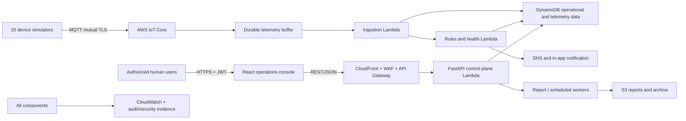
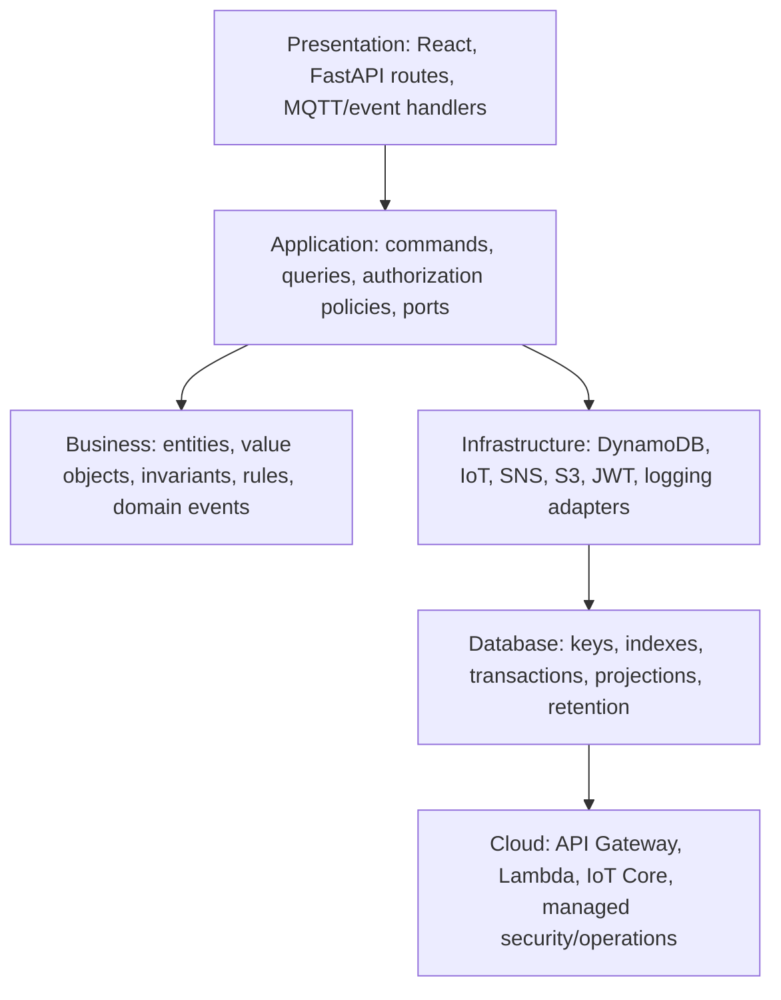
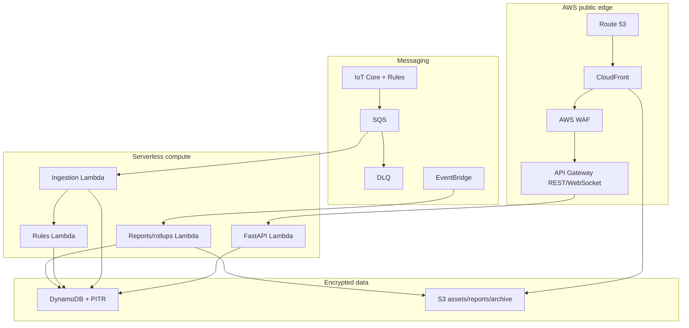
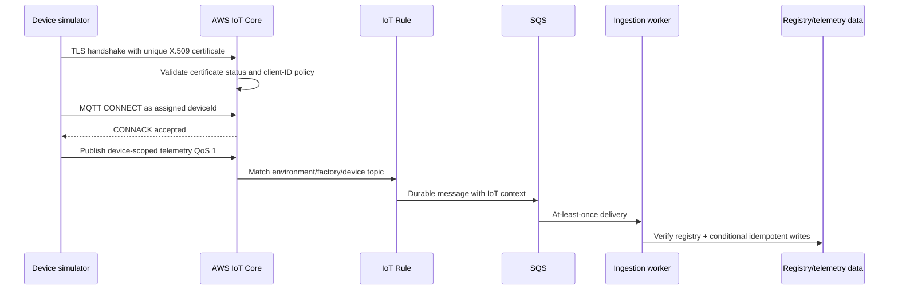
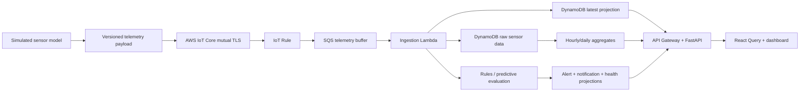

# Software Architecture Document

## Industrial IoT Device Management & Predictive Monitoring Platform on AWS

| Document field | Value |
|---|---|
| Status | Architecture baseline for stakeholder approval |
| Version | 2.0 |
| Date | 2026-08-05 |
| Architecture owner | Principal Software / Solution / AWS Cloud Architect |
| Intended audience | Development, QA, DevSecOps, cloud operations, security reviewers, academic reviewers, recruiters, and hiring managers |
| Scope | Requirements and architecture only; no application implementation |
| Decision method | Problem -> Alternatives -> Recommendation -> Rationale -> Advantages -> Tradeoffs |

This Software Architecture Document (SAD) is the canonical design baseline. It is implementation-ready but contains no application, UI, backend, Lambda, or SQL code. All timestamps are UTC at service boundaries. Human access is role- and factory-scoped; device access is certificate- and topic-scoped. The initial demonstration uses 20 simulated devices, while keys, contracts, and operational boundaries support growth without redesigning the product identity model.

---

# 1. Business Requirements

## 1.1 Business problem

A manufacturing organization operates multiple factories containing heterogeneous machines that continuously generate temperature, humidity, pressure, vibration, voltage, current, power, RPM, health, and connectivity data. The organization lacks a centralized and trusted system to establish device identity, determine current machine condition, identify emerging failures, coordinate alert response, measure energy use, and prove who changed operational or security configuration.

The absence of a common operational view creates delayed fault detection, avoidable downtime, fragmented maintenance decisions, inconsistent access controls, unverified device data, alert fatigue, energy waste, and incomplete incident evidence.

## 1.2 Current challenges

| ID | Challenge | Business consequence |
|---|---|---|
| BC-01 | Device inventories are distributed across spreadsheets and local knowledge. | Ownership, location, status, and certificate posture cannot be trusted. |
| BC-02 | Telemetry is not centrally ingested or normalized. | Cross-machine trends and factory comparisons are slow or impossible. |
| BC-03 | Devices do not have a consistently enforced identity lifecycle. | Shared credentials and weak topic controls enable impersonation or cross-device publication. |
| BC-04 | Online/offline status is inferred manually. | Disconnections can remain unnoticed until production is affected. |
| BC-05 | Thresholds and anomaly criteria are inconsistent. | Similar conditions generate different operational responses. |
| BC-06 | Alert acknowledgement, assignment, escalation, and resolution are not governed. | Critical work is duplicated, delayed, or lost between shifts. |
| BC-07 | Machine health lacks an explainable calculation. | Users cannot distinguish evidence-based degradation from arbitrary scoring. |
| BC-08 | User access does not consistently follow factory responsibility. | Personnel may receive excessive access or lack access needed for response. |
| BC-09 | Configuration and privileged actions are not immutably audited. | Investigations cannot reconstruct who changed what, when, or why. |
| BC-10 | Application and ingestion health are not visible beside factory operations. | Users may trust stale dashboards or misinterpret platform failure as machine failure. |
| BC-11 | Energy use is not attributable by device and factory. | Waste and peak-load opportunities remain hidden. |
| BC-12 | Physical hardware is unavailable for the capstone. | A simulator must prove the real cloud contract without becoming a simplified parallel architecture. |

## 1.3 Business goals

| ID | Goal | Target outcome |
|---|---|---|
| BG-01 | Establish a single operational source of truth. | All registered demo devices have an authoritative factory, lifecycle state, identity posture, and latest condition. |
| BG-02 | Detect and communicate abnormal conditions quickly. | Qualifying threshold or disconnect conditions create an alert within 60 seconds. |
| BG-03 | Enable proactive maintenance. | Degradation is explained through contributing metrics, trend context, and alert history before simulated failure. |
| BG-04 | Enforce trustworthy human and device identities. | All protected human actions require JWT authentication and server-side RBAC; all device connections require unique X.509 identity. |
| BG-05 | Create accountability. | Every privileged mutation produces an attributable, queryable, append-only audit event. |
| BG-06 | Improve multi-factory awareness. | Authorized leaders compare health, connectivity, alert load, utilization, and energy across factories. |
| BG-07 | Demonstrate production engineering. | Architecture, infrastructure, tests, security controls, observability, recovery, and documentation are reviewable and reproducible. |

## 1.4 Stakeholders

| Stakeholder | Needs | Platform value |
|---|---|---|
| Executive/plant leadership | Current risk, factory performance, energy trend | Executive dashboard and scheduled reports |
| Super Administrator | Platform governance, access, security, retention | Platform-wide administration and evidence |
| Factory Administrator | Local identity, device, and configuration control | Factory-scoped administration with least privilege |
| Factory Manager | Prioritized operational view and accountable response | KPI, alert ownership, factory comparison, reports |
| Maintenance Engineer | Diagnostics and emerging-failure context | Telemetry correlation, health explanation, maintenance timeline |
| Operator | Clear live status and first-line action | Low-latency monitoring and alert acknowledgement |
| Viewer/auditor | Safe read-only visibility | Scoped dashboards, analytics, reports, and permitted evidence |
| Security team | Identity posture and investigation evidence | Certificate inventory, authentication/security events, audit archive |
| DevOps/cloud operations | Reliable and observable service | SLOs, alarms, dashboards, runbooks, reproducible deployment |
| Academic and hiring reviewers | Evidence of engineering maturity | Traceability, design rationale, risk analysis, testable architecture |

## 1.5 Business benefits

- Reduced mean time to detect through freshness evaluation and centralized rules.
- Reduced mean time to acknowledge and resolve through assignment, history, and notifications.
- Better maintenance prioritization through explainable health and correlated telemetry.
- Lower security exposure through per-device credentials, least-privilege topics, server-side authorization, and revocation.
- Stronger compliance and investigation readiness through separated audit, authentication, device, security, and application evidence.
- Improved energy awareness through device/factory power and consumption analytics.
- Lower platform administration burden through serverless managed services and infrastructure as code.
- Portfolio value through explicit tradeoffs, measurable requirements, security testing, and recovery design.

## 1.6 Scope boundaries

### In scope

- Multi-factory hierarchy and six human roles.
- User authentication, JWT sessions, refresh rotation, RBAC, factory scope, and session revocation.
- Device registry, provisioning metadata, configuration versions, certificates, quarantine, transfer, and archive.
- Secure MQTT telemetry ingestion from 20 realistic simulated machines.
- Live monitoring, historical telemetry, dashboards, analytics, energy, utilization, and health.
- Rule-based thresholds, anomaly heuristics, explainable health scoring, and predictive-risk indicators.
- Alert lifecycle, notifications, reports, audit/activity/security/authentication/device logs.
- AWS infrastructure, DevSecOps controls, observability, backup, recovery, documentation, and deployment.

### Out of scope for the initial release

- Direct actuation, closed-loop machine control, emergency stop, or safety instrumented system decisions.
- Production firmware, physical sensor manufacture, PLC programming, or plant-network redesign.
- Autonomous ML decisions; initial predictive monitoring remains explainable and human-supervised.
- ERP, CMMS, SCADA, procurement, billing, and inventory write integration.
- Native mobile applications and offline-first field workflows.
- Commercial multi-tenant billing and customer self-service tenancy.

## 1.7 Business rules

1. Every active device belongs to exactly one factory; transfer is authorized, reasoned, and audited.
2. Every non-super-administrator is limited to explicitly assigned factories.
3. Device certificates are unique, revocable, and never shared between logical devices.
4. A device is online only when its last accepted heartbeat is inside the configured freshness window.
5. Raw telemetry is append-only; derived correction never rewrites the original event.
6. Alert state transitions preserve actor, time, previous state, new state, and note.
7. Privileged mutations and denied privileged attempts generate appropriate audit/security evidence.
8. Report creation and download enforce authorization at execution/download time, not only request time.
9. Disabled users and revoked certificates lose access as soon as revocation propagation permits.
10. The platform supports operational decisions but does not claim safety certification or replace plant safety systems.

## 1.8 Success measures

- 20 independently authenticated simulated machines publish continuously using the production telemetry contract.
- Dashboard counts reconcile with registered device and alert state under documented freshness semantics.
- Cross-factory authorization tests deny all unauthorized read and write paths.
- Temperature, pressure, humidity, health, disconnect, authentication, and certificate-expiry scenarios are demonstrable.
- 100% of privileged mutations in the acceptance suite create complete audit evidence.
- p95 API and telemetry freshness targets in Section 3 are met under expected and burst tests.
- Infrastructure can be recreated from version control without undocumented console actions.
- A reviewer can deploy, operate, troubleshoot, and demonstrate the platform using the final documentation.

## 1.9 Future expansion direction

The architecture reserves clear extension points for real devices, CMMS integration, learned anomaly models, digital twins, edge buffering, advanced time-series analytics, mobile workflows, multi-region recovery, and commercial multi-tenancy. These are evolution paths, not hidden dependencies of the first release.

---

---

# 2. Functional Requirements

Priority: **P0** is mandatory for the first production-like release; **P1** follows after core acceptance; **P2** is an approved enhancement.

## 2.1 Authentication

**Purpose:** Establish and maintain attributable human sessions without exposing credentials or relying on client-side trust.

**Inputs:** email, password, refresh token, password-reset token, session identifier, device/browser metadata, correlation identifier.

**Outputs:** short-lived JWT access token, rotating refresh token/cookie, user identity, role, factory scope, permissions, active-session list, authentication events, stable safe errors.

**Requirements:**

- FR-AUTH-01 P0: Verify credentials only for active users and issue a short-lived access token.
- FR-AUTH-02 P0: Rotate refresh tokens and revoke the complete token family when reuse is detected.
- FR-AUTH-03 P0: Revoke sessions on logout, password reset, user disablement, token-version change, or administrative action.
- FR-AUTH-04 P0: Apply rate limiting and temporary lockout without revealing whether an account exists.
- FR-AUTH-05 P0: Record success, failure, lockout, reset, refresh reuse, and revocation as authentication/security events.
- FR-AUTH-06 P1: Support single-use, expiration-controlled password reset.
- FR-AUTH-07 P1: Allow users and authorized administrators to review and revoke selected sessions.

**Business rules:** access token target lifetime is 15 minutes; refresh tokens are opaque and hashed at rest; passwords use Argon2id or an accepted adaptive alternative; secrets, passwords, complete tokens, and reset links never enter logs.

## 2.2 Dashboard

**Purpose:** Present a role- and factory-scoped operational summary without forcing users to inspect individual devices.

**Inputs:** authorized factory scope, time range, latest device projections, aggregate telemetry, active alerts, data-quality/freshness metadata.

**Outputs:** total factories; total/online/offline/critical devices; health distribution; average temperature/humidity/pressure/power; today's alerts; energy, utilization, trend, and attention widgets.

**Requirements:**

- FR-DASH-01 P0: Display required metrics with unit, time range, last-updated time, and scope.
- FR-DASH-02 P0: Support drill-down from organization to factory to device while retaining context.
- FR-DASH-03 P0: Identify stale, partial, failed, empty, and unauthorized widget states distinctly.
- FR-DASH-04 P0: Never classify missing/stale data as healthy.
- FR-DASH-05 P1: Compare current period with the previous equivalent period.

**Business rules:** dashboards query bounded projections rather than raw table scans; each widget enforces authorization independently; cross-factory views are limited to Super Administrator or explicit multi-factory assignments.

## 2.3 Device Registration and Management

**Purpose:** Govern the complete logical device, machine association, configuration, certificate, and lifecycle state.

**Inputs:** device name, serial, machine type, factory, tags, metadata, configuration, transfer target, quarantine/archive reason, provisioning request.

**Outputs:** registry record, unique device identity, AWS IoT Thing/certificate metadata, configuration version, current posture, lifecycle/audit events, one-time provisioning package.

**Requirements:**

- FR-DEV-01 P0: Register a device only when serial/name uniqueness and factory authorization pass.
- FR-DEV-02 P0: Create one IoT identity and least-privilege policy per device.
- FR-DEV-03 P0: Expose private credential material only once through the secure provisioning workflow.
- FR-DEV-04 P0: Activate, deactivate, quarantine, unquarantine, archive, restore, and transfer according to policy.
- FR-DEV-05 P0: Display last accepted telemetry, connection, health, alerts, certificate, desired/reported configuration, and maintenance history.
- FR-DEV-06 P0: Version configuration changes and preserve actor/reason.
- FR-DEV-07 P1: Validate bulk import row-by-row and report partial failure explicitly.
- FR-DEV-08 P1: Support reusable machine/device configuration profiles.

**Business rules:** device transfer requires access to both factories; archive is soft while history exists; registry disablement and certificate revocation are independent controls; reported state never silently overwrites desired state.

## 2.4 Live Monitoring

**Purpose:** Show current machine telemetry and connectivity with transparent freshness and quality.

**Inputs:** latest device projection, live-update signal, authorized filters, selected metric, freshness threshold.

**Outputs:** live grid/table, status, current values, sparklines, data quality, last-seen time, reconnect state, critical-device view.

**Requirements:**

- FR-LIVE-01 P0: Refresh visible current values within five seconds of accepted ingestion under normal load.
- FR-LIVE-02 P0: Provide grid and dense table modes with factory/type/status/health filters.
- FR-LIVE-03 P0: Show connected, reconnecting, stale, offline, quarantined, and data-quality states.
- FR-LIVE-04 P0: Allow visual updates to pause for accessibility without stopping ingestion.
- FR-LIVE-05 P0: Re-fetch canonical authorized state after reconnect rather than replaying untrusted UI messages.

**Business rules:** the WebSocket/push channel carries minimal change signals; canonical values come from authorized APIs; the page never accepts arbitrary browser-submitted device state.

## 2.5 Analytics

**Purpose:** Explain environmental, health, energy, utilization, connectivity, and factory performance trends.

**Inputs:** scope, devices, metrics, time range, aggregation interval, comparison period, quality filters.

**Outputs:** temperature/humidity/pressure trends, power/energy, utilization, factory performance, alert timeline, faulty-device ranking, health distribution, connectivity duration.

**Requirements:**

- FR-ANA-01 P0: Query bounded raw or aggregate data at an interval appropriate to the time range.
- FR-ANA-02 P0: Label unit, interval, time zone, population, last update, and quality coverage.
- FR-ANA-03 P0: Rank faulty and high-energy devices within authorized scope.
- FR-ANA-04 P0: Provide accessible tabular summaries for charts.
- FR-ANA-05 P1: Compare current and prior equivalent periods.
- FR-ANA-06 P1: Allow controlled export through the report process.

**Business rules:** long-range queries use hourly/daily aggregates; missing data is not interpolated without an explicit quality marker; energy uses canonical kW/kWh semantics.

## 2.6 Reports

**Purpose:** Produce controlled, attributable exports without tying long work to synchronous API requests.

**Inputs:** report type, filters, factory scope, range, format, schedule, requester, recipients.

**Outputs:** queued job, progress/status, encrypted S3 object, checksum, expiry, short-lived download authorization, delivery/audit events.

**Requirements:**

- FR-REP-01 P0: Generate factory health, device health, telemetry, energy, alert, audit, and security reports asynchronously.
- FR-REP-02 P0: Expose queued, processing, completed, expired, cancelled, and failed states.
- FR-REP-03 P0: Authorize at request, execution, and download.
- FR-REP-04 P0: Label scope, filters, units, time zone, generated time, quality, requester, and checksum.
- FR-REP-05 P1: Schedule recurring reports and disable a schedule when requester authorization is revoked.

**Business rules:** reports expire after policy-defined retention; object keys are server generated; a user never supplies an S3 key; downloaded links are short lived and audited.

## 2.7 Alerts

**Purpose:** Convert qualifying conditions into deduplicated, prioritized, accountable work.

**Inputs:** normalized telemetry, device freshness, health result, authentication/certificate events, rule configuration, suppression windows.

**Outputs:** current alert, occurrence count, severity, assignment, lifecycle timeline, notification event, SLA metrics.

**Requirements:**

- FR-ALT-01 P0: Create alerts for threshold breach, degraded health, disconnect, authentication failure, and certificate expiry.
- FR-ALT-02 P0: Configure metric, operator, threshold, duration, severity, hysteresis, cooldown, scope, and enabled state.
- FR-ALT-03 P0: Deduplicate equivalent active conditions and retain every occurrence.
- FR-ALT-04 P0: Acknowledge, assign, comment, suppress, and resolve according to role.
- FR-ALT-05 P0: Preserve immutable lifecycle history.
- FR-ALT-06 P1: Measure time to acknowledge, assign, and resolve.

**Business rules:** transient spikes do not open alerts until duration qualifies; hysteresis/cooldown prevent flapping; resolve requires actor and reason; recurrence after cooldown creates a new occurrence or alert per policy.

## 2.8 Notifications

**Purpose:** Deliver relevant alert/report/security information through controlled channels without making delivery success equivalent to alert success.

**Inputs:** event, severity, factory, user/channel preferences, policy, quiet hours, recipient, template.

**Outputs:** in-app notification, SNS delivery request, attempt history, provider identifier, success/failure status.

**Requirements:**

- FR-NOT-01 P0: Deliver configured in-app and SNS notifications for qualifying events.
- FR-NOT-02 P0: Record every delivery attempt and terminal failure.
- FR-NOT-03 P0: Deduplicate repeated notification requests using event/channel/recipient identity.
- FR-NOT-04 P1: Support severity, factory, channel, and quiet-hour preferences within mandatory policy.
- FR-NOT-05 P1: Test a route with a clearly labeled non-production notification.

**Business rules:** critical mandatory routes cannot be disabled by lower roles; notification failure does not remove or resolve the source alert; sensitive values are excluded from messages and URLs.

## 2.9 Audit Logs

**Purpose:** Preserve immutable evidence of privileged business activity and denied high-impact attempts.

**Inputs:** actor/session, action, resource, factory, result, safe before/after summary, reason, source context, correlation ID.

**Outputs:** queryable hot event, immutable archive copy, actor/resource timeline, controlled audit report.

**Requirements:**

- FR-AUD-01 P0: Record user/role/factory/device/rule/alert/report/setting/security changes.
- FR-AUD-02 P0: Record actor type/ID, action, resource, scope, outcome, timestamp, source, correlation ID, and safe change summary.
- FR-AUD-03 P0: Expose query-only APIs; no application role can edit or delete an audit event.
- FR-AUD-04 P0: Separate audit, application, device, security, and authentication log classes.
- FR-AUD-05 P1: Export authorized evidence through the report process.

**Business rules:** sensitive fields use allowlisted summaries; archive retention is policy controlled; CloudTrail is complementary AWS administrative evidence, not a replacement for business audit.

## 2.10 User Management

**Purpose:** Govern user lifecycle, role, factory assignment, status, sessions, and preferences.

**Inputs:** identity/contact fields, role, factory assignments, status, grantor, change reason.

**Outputs:** user record, assignment records, effective permissions/scopes, revoked sessions, audit/security events.

**Requirements:**

- FR-USR-01 P0: Create, read, update, disable, restore, and search users according to grant authority.
- FR-USR-02 P0: Assign one role and one or more factories.
- FR-USR-03 P0: Prevent grantors from assigning permission or scope beyond their own authority.
- FR-USR-04 P0: Revoke active sessions immediately after disablement or security action.
- FR-USR-05 P1: Review effective permission, assignments, sessions, and recent activity.

**Business rules:** Factory Administrator cannot grant Super Administrator; last active Super Administrator cannot be disabled; self-demotion and self-scope removal require special policy and warning.

## 2.11 Security Center

**Purpose:** Consolidate device and human identity posture, security events, findings, certificate risk, and investigation state.

**Inputs:** authentication failures, authorization denials, certificate lifecycle, quarantine, invalid telemetry, IoT rejection, security rules.

**Outputs:** posture score/summary, certificate-expiry inventory, quarantined devices, findings, event timeline, review disposition.

**Requirements:**

- FR-SEC-01 P0: Summarize certificate expiry/revocation, failed authentication, denied authorization, quarantined devices, and open findings.
- FR-SEC-02 P0: Filter findings by severity, status, type, factory, device/user, and time.
- FR-SEC-03 P0: Record investigation owner, status, note, and disposition without altering source evidence.
- FR-SEC-04 P1: Link findings to related audit/authentication/device events.

**Business rules:** only security-authorized roles see sensitive event detail; private keys, passwords, tokens, raw secrets, and unsafe payloads never appear.

## 2.12 Settings

**Purpose:** Manage versioned platform, factory, user, retention, unit, threshold, notification, and session policy.

**Inputs:** setting name/value, scope, expected version, actor, reason.

**Outputs:** validated versioned setting, effective configuration, audit event, conflict/problem result.

**Requirements:**

- FR-SET-01 P0: Read effective settings and their source (platform/factory/user).
- FR-SET-02 P0: Update authorized settings with schema validation and optimistic concurrency.
- FR-SET-03 P0: Audit sensitive setting changes with safe before/after values.
- FR-SET-04 P1: Preview impact and restore a prior permitted version.

**Business rules:** platform security/retention settings require Super Administrator; factory defaults cannot weaken mandatory platform security; secrets are references, not setting values returned to clients.

## 2.13 Factory Management

**Purpose:** Define factory identity, status, location, time zone, operating defaults, users, devices, and KPIs.

**Inputs:** name, code, location, time zone, status, thresholds, freshness, notification defaults.

**Outputs:** factory aggregate, scoped user/device associations, factory KPI projection, audit history.

**Requirements:**

- FR-FAC-01 P0: Create, read, update, archive, restore, search, and compare factories according to role.
- FR-FAC-02 P0: Restrict every factory resource/list to authorized scope.
- FR-FAC-03 P0: Present device, online, health, alert, energy, and activity summary.
- FR-FAC-04 P0: Prevent destructive deletion when devices/history exist.
- FR-FAC-05 P1: Configure validated factory thresholds/freshness defaults that cannot weaken platform mandates.

**Business rules:** factory code is unique; timestamps are stored UTC and presented using factory/user zone; archive preserves historical relationships.

## 2.14 Device Simulator

**Purpose:** Emulate real industrial device behavior using the exact production identity, topic, schema, timing, retry, and observability contract.

**Inputs:** device catalog, per-device certificate path, MQTT endpoint, publish rate, random seed, scenario, duration, jitter, reconnect policy.

**Outputs:** telemetry, heartbeat, lifecycle events, reported configuration, structured simulator logs, scenario summary.

**Requirements:**

- FR-SIM-01 P0: Model 20 independently identified machines across at least ten industrial types.
- FR-SIM-02 P0: Generate correlated, physically plausible values rather than independent uniform random values.
- FR-SIM-03 P0: Support normal, warning, critical, disconnect, recovery, replay, and credential-failure scenarios.
- FR-SIM-04 P0: Use unique credentials and production MQTT topics per device.
- FR-SIM-05 P0: Produce deterministic scenario output when a seed is supplied.
- FR-SIM-06 P1: Configure catalog/rate/scenario without source modification.

**Business rules:** rate and duration have cost guardrails; private keys remain outside source control; simulator logs redact credentials; device time and sequence are preserved through replay.

## 2.15 Predictive Monitoring

**Purpose:** Identify emerging failure risk using explainable evidence before a trustworthy labeled ML dataset exists.

**Inputs:** recent telemetry windows, rate of change, threshold state, device type profile, freshness, recurring alerts, maintenance events.

**Outputs:** health score, risk band, contributing factors, trend direction, confidence/data-quality flag, recommended inspection priority.

**Requirements:**

- FR-PRED-01 P0: Calculate a deterministic 0-100 health score using documented weighted factors.
- FR-PRED-02 P0: Explain each score reduction and the evidence window.
- FR-PRED-03 P0: Distinguish Healthy, Warning, Critical, and Unknown; missing data yields Unknown.
- FR-PRED-04 P0: Detect sustained drift and rate-of-change anomalies using device-type baselines.
- FR-PRED-05 P1: Correlate repeated alerts and maintenance notes with risk.
- FR-PRED-06 P2: Introduce a shadow-mode learned model only after data quality, labels, drift monitoring, and human review are established.

**Business rules:** v1 never claims remaining useful life or autonomous failure prediction; rules and weights are versioned; score changes are reproducible; quality/confidence is displayed beside risk.

## 2.16 Cross-cutting functional rules

- Every list supports bounded page size, deterministic ordering, cursor pagination, server-side filtering, and scope enforcement.
- Every retry-sensitive mutation accepts an idempotency key.
- Every protected mutation produces correlation and audit context.
- Every error uses a stable safe code; internal stack/secret details remain in protected logs.
- Every P0 requirement maps to implementation ownership and automated or operational verification before release.

---

---

# 3. Non-Functional Requirements

## 3.1 Performance

| ID | Requirement | Verification |
|---|---|---|
| NFR-PERF-01 | Read API p95 <= 500 ms and p99 <= 1,000 ms under expected load. | Load test and CloudWatch percentiles |
| NFR-PERF-02 | Non-job mutation API p95 <= 800 ms. | Load test |
| NFR-PERF-03 | Accepted telemetry becomes visible in live monitoring within 5 seconds p95. | End-to-end timestamp test |
| NFR-PERF-04 | A qualifying alert is persisted within 60 seconds, including duration/freshness policy. | Scenario timing test |
| NFR-PERF-05 | Dashboard usable content renders within 3 seconds at p75 on representative broadband. | Browser performance test |
| NFR-PERF-06 | Query APIs accept page sizes 1-100 and reject unbounded time ranges/scans. | Contract/security tests |

## 3.2 Availability and fault tolerance

| ID | Requirement | Verification |
|---|---|---|
| NFR-AVL-01 | API monthly availability objective is 99.9%, excluding approved maintenance. | SLI calculation |
| NFR-AVL-02 | Ingestion buffers transient downstream failure and does not silently discard accepted messages. | Fault injection |
| NFR-AVL-03 | Compute is stateless and replaceable; no single process instance is required. | Architecture/deployment test |
| NFR-AVL-04 | Target RPO: 5 minutes for core/audit data; 15 minutes for derived analytics. Target RTO: 4 hours. | Recovery exercise |
| NFR-AVL-05 | Poison events move after bounded retry to an encrypted DLQ with alarm and redrive runbook. | DLQ exercise |
| NFR-AVL-06 | Browser reconnect uses jitter and canonical refetch; live-channel loss does not corrupt current state. | Resilience UI test |

## 3.3 Scalability

- Initial acceptance: 20 devices at one telemetry message per five seconds, with 5x burst headroom.
- Evolution target: 10,000 devices without redesigning device identity, API resources, or authorization contracts.
- Time-series partitions use time buckets and factory export sharding to avoid hot keys.
- API Gateway, Lambda, IoT Core, SQS, and DynamoDB use independent quotas/concurrency with alarms.
- Report and analytics jobs do not consume synchronous API capacity.
- Metric dimensions remain bounded; device IDs reside in logs/traces rather than high-cardinality metrics.

## 3.4 Security

- TLS 1.2+ for external traffic; MQTT mutual TLS with unique X.509 certificate.
- At-rest encryption for DynamoDB, SQS, SNS, S3, secrets, and logs using KMS appropriate to classification.
- Authorization defaults deny and combines permission, factory/resource scope, session state, and contextual rule.
- Access token target lifetime 15 minutes; rotating refresh tokens are hashed, revocable, and reuse-detecting.
- Input uses typed allowlists, length/range bounds, safe output encoding, and upload/export limits.
- CI performs secret, dependency, static code, IaC, container, license, and SBOM/provenance checks.
- Critical findings block release; high findings require documented exploitability assessment, owner, deadline, and approval.

## 3.5 Reliability and data integrity

- Telemetry is idempotent by device ID + event ID; reused ID with different payload is rejected.
- Device event time and server ingestion time are both preserved.
- Conditional writes/transactions prevent lost updates and enforce uniqueness/state transitions.
- Units, schema version, sequence, valid range, quality, and clock-skew state accompany processing.
- Alert/audit lifecycle history is append-only.
- Aggregates are reproducible from retained raw data and periodically reconciled.

## 3.6 Maintainability

- Clean dependency rule prevents domain code importing FastAPI, boto3, DynamoDB documents, UI, or environment concerns.
- Frontend, backend, simulator, infrastructure, contracts, documentation, and tests have explicit ownership.
- Types, API/event schemas, configuration keys, and infrastructure inputs are documented and versioned.
- Domain logic runs in unit tests without AWS network access through ports/adapters.
- Breaking contracts require versioning, compatibility window, and migration/deprecation plan.
- Environment change requires configuration only, not source modification.

## 3.7 Usability and accessibility

- Responsive support from 360 px width through large operations displays.
- WCAG 2.2 AA target for contrast, keyboard navigation, focus, names, error association, and reduced motion.
- Status never relies on color alone.
- Charts include unit, legend, range, freshness, tooltip, and accessible table/summary.
- Loading, empty, stale, partial failure, permission denied, and retry states are intentionally designed.
- Destructive/high-impact actions identify the exact target and consequence before confirmation.

## 3.8 Monitoring and logging

- Structured JSON logs include timestamp, level, service, environment, correlation ID, and redacted context.
- Application, device, audit, security, and authentication classes have separate retention/access policy.
- Correlation propagates across API Gateway, Lambda, SQS/event messages, notifications, and audit.
- Dashboards/alarms cover errors, latency, throttles, concurrency, IoT rejects, queue age, DLQ depth, DynamoDB throttling, notification/report failure, telemetry acceptance/rejection, and stale devices.
- Every production alarm names an owner, severity, threshold, and runbook.

## 3.9 Data retention baseline

| Class | Retention baseline |
|---|---|
| Raw telemetry | 30 days hot; optional S3 analytical export before TTL |
| Hourly/daily aggregates | 13 months |
| Audit/security/authentication evidence | Searchable hot window plus 7-year immutable archive baseline |
| Application/device diagnostics | 90 days hot; optional lifecycle archive |
| Reports | 30 days unless policy shortens it |
| Sessions/idempotency records | Active lifetime plus 30-day investigation window |

Legal/compliance owners must approve final retention before a real organizational deployment.

---

---

# 4. Complete System Architecture

## 4.1 Recommended high-level architecture

The system uses a **serverless event-driven architecture** with a **modular FastAPI control plane**, separate telemetry/rules/report workers, DynamoDB operational/time-series projections, React web client, and secure MQTT device plane.



## 4.2 Low-level component responsibilities

| Component | Responsibility | Interactions | Failure/scaling boundary |
|---|---|---|---|
| React web application | Presentation, routing, accessible charts, server-state cache, permission-aware controls | REST and minimal live-update channel | Static asset deployment; no trusted authorization |
| API Gateway REST | Public API boundary, throttling, request limits, access logs | WAF, FastAPI Lambda | Edge quota/latency independent of workers |
| API Gateway WebSocket | Authorized live change notification | Browser, rules/current-state publisher | Disconnect tolerated through refetch |
| FastAPI control plane | Auth/session, users, factories, devices, alerts, reports, settings, analytics reads | DynamoDB, S3, IoT management, async queues | Stateless request-driven scaling |
| AWS IoT Core | Device authentication, broker, topic authorization, rule routing | Device clients, IoT Rule | Device trust boundary and broker scale |
| Telemetry queue | Backpressure, retry, decoupling | IoT Rule, ingestion worker, DLQ | Queue age defines ingestion backlog |
| Ingestion worker | Identity consistency, schema/range/quality, idempotency, raw/current writes | Queue, core registry, telemetry/aggregate tables | Scales by queue depth; poison data isolated |
| Rules/health worker | Threshold duration, hysteresis, anomaly heuristic, health, alert dedupe | Normalized events, core/aggregate tables, SNS, WebSocket | Independent retry/DLQ; deterministic |
| Job workers | Reports, rollups, retention, freshness, scheduled tasks | EventBridge, DynamoDB, S3, SNS | Long work outside request path |
| DynamoDB | Operational state, telemetry, aggregates, evidence indexes | API/workers | Table/partition-specific capacity |
| S3 | Web assets, reports, archive, analytical export | CloudFront, API/jobs, audit stream | Independent storage/lifecycle |
| SNS | Notification fan-out | Rules/jobs, verified recipients | Delivery failure does not mutate alert truth |
| CloudWatch | Logs, metrics, alarms, dashboards | All AWS and application components | Observability plane |

## 4.3 Layered architecture



The diagram expresses runtime collaboration. Source dependencies point inward: domain/business code does not import cloud/framework details; infrastructure implements interfaces declared by the application/domain boundary.

## 4.4 Deployment architecture



Initial Lambda functions do not join a customer VPC because dependencies are AWS managed APIs protected by IAM/TLS. This avoids NAT cost and networking/cold-start complexity. If private dependencies are introduced, functions move to private subnets with VPC endpoints and restricted egress.

## 4.5 Principal interaction flows

### Human request

1. CloudFront/WAF accepts HTTPS and applies edge policy.
2. API Gateway enforces stage throttling/limits and forwards correlation context.
3. Middleware verifies JWT signature, issuer, audience, expiry, token version, and session policy.
4. Authorization combines permission, factory scope, resource ownership/state, and contextual rules.
5. Transport validation applies allowlisted type/length/range constraints.
6. Application use case invokes domain policies and repository/service ports.
7. DynamoDB conditional/transactional writes preserve invariants.
8. Privileged mutation commits audit/outbox evidence atomically where practical.
9. API returns versioned data or safe problem details with correlation ID.

### Telemetry event

1. Device connects with unique certificate and client ID.
2. IoT policy restricts connect/publish/subscribe resources.
3. IoT Rule routes accepted messages to SQS.
4. Ingestion verifies topic/payload/registry identity, schema, range, timestamp, sequence, and idempotency.
5. Raw telemetry is stored; latest projection advances conditionally.
6. Normalized event triggers rule/health evaluation.
7. Qualifying conditions create/dedupe alerts, notifications, and live change signals.
8. Failures retry then enter DLQ with alarm and redrive evidence.

## 4.6 Architecture quality attributes

- **Security:** separate human/device trust domains; default deny; least privilege; immutable evidence.
- **Reliability:** durable buffering, idempotency, conditional writes, DLQ/redrive, projections/reconciliation.
- **Scale:** independent serverless scaling and time-bucketed/sharded keys.
- **Maintainability:** modular clean boundaries with extractable services.
- **Operability:** explicit SLOs, correlation, alarms, safe health views, recovery runbooks.
- **Cost:** pay-per-use baseline, TTL/lifecycle, on-demand DynamoDB, bounded simulator rates.

---

---

# 5. AWS Architecture

## 5.1 Service selection matrix

| Service | Role and connection | Why recommended | Alternatives considered | Tradeoffs |
|---|---|---|---|---|
| AWS IoT Core | Mutual-TLS device broker; Rules route telemetry to SQS/Lambda; lifecycle events feed security/freshness | Native X.509 identity, IoT policy variables, managed MQTT scale, shadows/rules integration | Self-managed Mosquitto/EMQX on EC2/EKS; API Gateway ingestion | Managed service reduces broker operations; IoT policies/topic design require specialist care and service cost |
| AWS Lambda | Runs FastAPI adapter, ingestion, rules, report/rollup/freshness workers | Independent event/request scale, no servers, pay-per-use, strong AWS integration | ECS Fargate; EKS; EC2 | Cold starts and execution limits; long/high-steady workloads may favor containers |
| Amazon DynamoDB | Core operational state, telemetry, aggregates, event indexes; PITR and TTL | Serverless scale, predictable keyed latency, Streams/transactions/TTL, stated project requirement | Aurora PostgreSQL; Timestream; MongoDB | Access-pattern-first denormalization and careful key evolution; not suited to ad-hoc joins |
| Amazon CloudWatch | Structured logs, metrics, dashboards, alarms, Logs Insights | Native AWS telemetry and alarms with minimal integration | Prometheus/Grafana; OpenSearch; third-party APM | Cost/cardinality/retention governance required; analytical UX less rich than specialized platforms |
| AWS IAM | Runtime/deployment/service authorization, CI OIDC, KMS/key/resource policy | Native short-lived credentials and least privilege | Long-lived access keys; custom auth layer | Policy complexity; requires tests and access analysis |
| Amazon API Gateway | REST and WebSocket edge, throttling, access logs, domains | Serverless Lambda integration, quotas, stages, authorizers, managed WebSockets | ALB + ECS/Lambda; AppSync | Higher per-request cost at sustained volume; timeout/payload limits |
| Amazon SNS | Email/SMS-compatible notification fan-out and verified subscriptions | Managed delivery, topic policies, Lambda/SQS integration | SES, Pinpoint, third-party provider | Limited workflow/personalization and delivery semantics; SMS cost/regional constraints |
| Amazon S3 | Private web origin, report/export storage, audit/archive, lifecycle | Durable, encrypted, versionable, low-cost, presigned access | EFS; DynamoDB blobs; local disk | Object semantics/eventual workflow; object access must never rely on public ACLs |

## 5.2 Supporting AWS services

| Service | Recommendation and rationale | Alternative/tradeoff |
|---|---|---|
| Amazon SQS + DLQ | Buffer telemetry, isolate poison events, create backpressure/retry boundary. Direct IoT-to-Lambda is simpler but couples acceptance to compute availability and burst concurrency. |
| Amazon EventBridge | Schedule freshness, rollups, report execution, certificate checks; optionally route domain events. CloudWatch scheduled events are less expressive; excessive event-bus use can obscure flows. |
| CloudFront | Serve private S3 web assets, TLS, caching, security headers. Direct S3 website hosting cannot preserve the required private-origin/security posture. |
| AWS WAF | Managed web/API rules and rate-based protection at edge. Application-only filters remain necessary but should not absorb commodity attack traffic alone. |
| AWS KMS | Encryption keys and policy separation for data classes/environments. AWS-owned keys are simpler; customer-managed keys improve policy/audit control at added cost/operations. |
| Secrets Manager / SSM Parameter Store | Secret rotation/custody and non-secret configuration. Environment files are acceptable only for local development and never production secret distribution. |
| CloudTrail + AWS Config | AWS administrative audit and configuration/drift evidence. Application audit remains separate because CloudTrail cannot represent domain actions. |
| AWS Budgets / Cost Anomaly Detection | Per-environment spend thresholds and anomaly alarms. Manual billing review is too slow for simulator/rate mistakes. |

## 5.3 Environment/account strategy

Preferred enterprise posture separates security/log archive, non-production, and production accounts under AWS Organizations. Capstone budget may use one account, but `dev`, `test`, and `prod-like` must still use isolated stacks, domains, roles, tables, buckets, queues, keys, secrets, certificates, log groups, and budgets.

No environment shares JWT keys, device credentials, data tables, report buckets, deployment roles, or notification topics.

## 5.4 IAM strategy

- Separate roles for API, ingestion, rules, reports, deployment, CI, and operations.
- CI authenticates through OIDC and short-lived role sessions; no long-lived AWS key in repository settings.
- API can administer only necessary IoT metadata and cannot read device private keys.
- Ingestion writes telemetry/current state but cannot manage users or report objects.
- Report worker reads authorized snapshots and writes only report prefixes.
- Resource ARNs include environment. Wildcards require written justification and policy tests.
- Human break-glass access is time-limited, monitored, and reviewed.

## 5.5 Reliability, cost, and quota posture

- DynamoDB on-demand capacity initially; provisioned/autoscaling only after demand evidence.
- Reserved Lambda concurrency protects API and prevents ingestion from consuming all account capacity.
- SQS visibility timeout exceeds worker timeout and supports bounded redrive.
- Telemetry TTL, aggregate retention, S3 lifecycle, and log retention cap storage cost.
- Simulator enforces rate/duration maximums.
- Alarms cover account/service quota utilization before exhaustion.
- PITR, scheduled backup, DLQ drill, and restore rehearsal are acceptance criteria.

---

---

# 6. Software Architecture

## 6.1 Pattern evaluation

| Pattern | Strengths | Weaknesses | Decision |
|---|---|---|---|
| Traditional layered monolith | Simple deployment and transactions | Feature coupling and shared-layer growth | Use layer semantics, not a global layer cake |
| Microservices | Independent deployment/scale/ownership | Network failure, distributed transactions, tracing, operational overhead | Reject for initial team/scale; preserve later extraction path |
| Event-sourced/CQRS everywhere | Complete history and specialized reads | Significant modeling, consistency, storage, and developer complexity | Use append-only histories and projections selectively, not universal event sourcing |
| Modular monolith with Clean Architecture | Clear business boundaries, testability, one control-plane deployment, extraction path | Requires discipline and dependency checks | **Recommended for control plane** |
| Event-driven workers | Decoupled telemetry, backpressure, independent scale | Eventual consistency and replay/idempotency complexity | **Recommended for ingestion, rules, projections, jobs** |

## 6.2 Recommended hybrid

The control plane is a modular FastAPI application using Clean Architecture. Telemetry ingestion, rules/health, and asynchronous jobs are separate Lambda entrypoints because they have different trust, scaling, retry, and latency behavior. Modules communicate through application interfaces or explicit domain events; no module reads another module's storage representation as an undocumented shortcut.

## 6.3 Layer responsibilities

| Layer | Responsibilities | Permitted dependencies | Prohibited concerns |
|---|---|---|---|
| Presentation | React pages/components, route metadata, FastAPI routes, MQTT/SQS/schedule handlers, transport mapping | Application contracts | Business invariants, direct DynamoDB, secrets |
| Application | Commands, queries, handlers, authorization policies, transaction/idempotency orchestration, ports | Business/domain | FastAPI request objects, boto3 clients, UI |
| Business/domain | Entities, value objects, invariants, health/rule policy, lifecycle state, domain events | Standard language/runtime only | AWS, HTTP, database documents, environment |
| Infrastructure | Repository/gateway/crypto/JWT/clock/notification/observability adapters | Application ports and domain types | Presentation behavior |
| Database | Key/index mapping, conditional/transactional persistence, projection, migration/backfill, TTL | Infrastructure contracts | Domain policy decisions |
| Cloud | API Gateway/Lambda/IoT/SQS/DynamoDB/S3/SNS/CloudWatch/IAM configuration | Deployment composition | Application business logic in console-only configuration |

## 6.4 Backend modules

Authentication, Users, Factories, Devices, Telemetry, Health & Predictive Monitoring, Alerts, Notifications, Analytics, Reports, Audit, Security, Settings, and Platform Health each own their domain/application/adapters/tests. Shared code is restricted to stable cross-cutting primitives: identifiers, time, units, problems, pagination, correlation, authorization vocabulary, idempotency, and observability.

## 6.5 Frontend architecture

- React/TypeScript feature directories align to product modules.
- React Router owns route hierarchy and permission-aware navigation metadata.
- React Query owns server state, deduplication, retry, invalidation, stale state, and request cancellation.
- Shadcn UI/Tailwind form an owned accessible design system; authorization is never delegated to component visibility.
- Recharts consumes normalized view models and always has accessible textual/tabular alternatives.
- Typed API client maps versioned contracts and `application/problem+json` into consistent safe feedback.
- Client state is limited to ephemeral UI preferences, session shell, selected scope, and draft input; authoritative business state stays server-side.

## 6.6 Decision consequences

**Advantages:** focused domain tests; fewer distributed transactions; low operational burden; independent telemetry scale; clear ownership; future service extraction; local development without AWS for domain logic.

**Tradeoffs:** control-plane modules deploy together; eventual consistency must be shown in UI; key/projection changes require discipline; transaction boundaries across asynchronous components need idempotency/outbox/reconciliation.

## 6.7 Architecture governance

- Architecture Decision Records use Problem -> Alternatives -> Recommendation -> Rationale -> Advantages -> Tradeoffs.
- Static dependency rules prevent domain/framework and cross-module private imports.
- OpenAPI, AsyncAPI, JSON Schema, permission matrix, and DynamoDB access patterns are reviewed contracts.
- Any deviation from this SAD requires an ADR and stakeholder approval before implementation becomes the new baseline.

---

---

# 7. Database Design

## 7.1 DynamoDB design strategy

The schema is defined as logical entity collections mapped to four physical DynamoDB tables. This preserves the required business schemas while allowing telemetry, operational configuration, aggregates, and evidence to scale and retain independently.

| Physical table | Logical collections | Protection |
|---|---|---|
| `iot-core-{env}` | Users, Factories, Machines, Devices, Alerts, Notifications, Reports, Settings, Sessions, Alert Rules, Idempotency, Outbox | KMS, PITR, scheduled backup |
| `iot-telemetry-{env}` | Sensor Data | KMS, TTL baseline 30 days, optional stream/export |
| `iot-aggregates-{env}` | Device latest, factory latest, hourly/daily rollups, predictive/health projections | KMS, PITR, 13-month aggregate retention |
| `iot-events-{env}` | Audit Logs, Device Logs, Security Events, Authentication Events, Activity projection | KMS, PITR, class-specific TTL plus immutable S3 archive |

Design rules:

- Primary keys use immutable generated identifiers, never editable names.
- Request paths use `GetItem`, `Query`, or bounded batch operations; unbounded `Scan` is prohibited.
- High-volume keys use day/month buckets and deterministic shards.
- Conditional writes/transactions enforce uniqueness and lifecycle invariants.
- `schemaVersion`, `createdAt`, `updatedAt`, `version`, and `factoryId` appear where applicable.
- TTL is an expiration/cost control, not an exact scheduler.
- Denormalized display fields are allowed in projections, with stream/outbox reconciliation.

## 7.2 Users logical table

**Purpose:** Store human identity, credential hash, lifecycle status, role, contact/profile fields, and security version. Factory assignments and sessions are colocated item types under the user aggregate.

**Physical table and keys:**

- Profile: `PK=USER#{userId}`, `SK=PROFILE`.
- Factory assignment: `PK=USER#{userId}`, `SK=FACTORY#{factoryId}`.
- Session: `PK=USER#{userId}`, `SK=SESSION#{sessionId}`.

| Attribute | Type | Required | Description |
|---|---|:---:|---|
| `userId` | String | Yes | Immutable generated identifier |
| `normalizedEmail` | String | Yes | Lowercase normalized login/uniqueness value |
| `displayEmail` | String | Yes | Presentation email |
| `passwordHash` | String | Yes | Adaptive one-way hash; never returned |
| `name` | String | Yes | Human display name |
| `role` | Enum | Yes | One of six approved roles |
| `status` | Enum | Yes | Invited, Active, Locked, Disabled |
| `tokenVersion` | Integer | Yes | Incremented for broad access-token invalidation |
| `timeZone` | String | Yes | IANA time zone |
| `notificationPreferenceRef` | String | No | Reference to user preference item |
| `lastLoginAt` | Timestamp | No | Most recent successful login |
| `failedLoginCount` | Integer | Yes | Current bounded lockout counter |
| `lockedUntil` | Timestamp | No | Temporary lock expiry |
| `createdAt`, `updatedAt` | Timestamp | Yes | UTC audit timestamps |
| `version` | Integer | Yes | Optimistic concurrency version |

**Indexes:** `GSI1PK=EMAIL#{normalizedEmail}`, `GSI1SK=USER` for login/uniqueness; reverse assignment `GSI2PK=FACTORY#{factoryId}`, `GSI2SK=USER#{status}#{userId}`.

**Relationships:** many-to-many with Factories through assignment items; one-to-many with Sessions, Reports, Notifications, and Audit Logs; `role` resolves to a versioned permission definition.

**Sample record:**

```json
{
  "pk": "USER#usr_01J5A8F6M3Y2",
  "sk": "PROFILE",
  "entityType": "USER",
  "schemaVersion": 1,
  "userId": "usr_01J5A8F6M3Y2",
  "normalizedEmail": "ana.rao@example.com",
  "displayEmail": "ana.rao@example.com",
  "passwordHash": "<redacted-adaptive-hash>",
  "name": "Ana Rao",
  "role": "SUPER_ADMINISTRATOR",
  "status": "ACTIVE",
  "tokenVersion": 3,
  "timeZone": "Asia/Kolkata",
  "failedLoginCount": 0,
  "createdAt": "2026-08-05T08:00:00Z",
  "updatedAt": "2026-08-05T08:00:00Z",
  "version": 1
}
```

## 7.3 Factories logical table

**Purpose:** Store factory identity, location, operating state, time zone, ownership metadata, and references to effective factory policy.

**Keys:** profile `PK=FACTORY#{factoryId}`, `SK=PROFILE`; factory settings `PK=FACTORY#{factoryId}`, `SK=SETTINGS`; factory KPI remains in aggregates table.

| Attribute | Type | Required | Description |
|---|---|:---:|---|
| `factoryId` | String | Yes | Immutable generated identifier |
| `code` | String | Yes | Unique normalized business code |
| `name` | String | Yes | Factory display name |
| `status` | Enum | Yes | Active, Maintenance, Archived |
| `address` | Map | Yes | City, state/region, country, postal code |
| `geo` | Map | No | Latitude and longitude for display/integration |
| `timeZone` | String | Yes | IANA time zone |
| `operatingCalendar` | Map | No | Shifts/operating windows |
| `defaultFreshnessSeconds` | Integer | Yes | Offline threshold baseline |
| `managerUserId` | String | No | Accountable factory manager reference |
| `createdAt`, `updatedAt` | Timestamp | Yes | UTC audit timestamps |
| `archivedAt` | Timestamp | No | Soft-archive time |
| `version` | Integer | Yes | Optimistic concurrency version |

**Indexes:** uniqueness item `PK=UNIQUE#FACTORY_CODE#{normalizedCode}`, `SK=LOCK`; list index `GSI1PK=FACTORY_STATUS#{status}`, `GSI1SK=NAME#{normalizedName}#{factoryId}`.

**Relationships:** one-to-many with Machines, Devices, Alerts, Logs, Reports, Notifications, and Settings; many-to-many with Users.

**Sample record:**

```json
{
  "pk": "FACTORY#fac_01J5A91C7XQ4",
  "sk": "PROFILE",
  "entityType": "FACTORY",
  "factoryId": "fac_01J5A91C7XQ4",
  "code": "PE-01",
  "name": "Plant East",
  "status": "ACTIVE",
  "address": {"city": "Pune", "region": "Maharashtra", "country": "IN"},
  "timeZone": "Asia/Kolkata",
  "defaultFreshnessSeconds": 60,
  "managerUserId": "usr_01J5A8F6M3Y2",
  "createdAt": "2026-08-05T08:00:00Z",
  "updatedAt": "2026-08-05T08:00:00Z",
  "version": 1
}
```

## 7.4 Machines logical table

**Purpose:** Represent the business/physical machine independently from the connected device identity. A machine can receive a replacement device while retaining maintenance and operational history.

**Keys:** `PK=MACHINE#{machineId}`, `SK=PROFILE`; maintenance events `PK=MACHINE#{machineId}`, `SK=MAINT#{timestamp}#{eventId}`.

| Attribute | Type | Required | Description |
|---|---|:---:|---|
| `machineId` | String | Yes | Immutable machine identifier |
| `factoryId` | String | Yes | Owning factory boundary |
| `assetCode` | String | Yes | Unique factory asset code |
| `name` | String | Yes | Display name |
| `machineType` | Enum | Yes | CNC, boiler, press, compressor, packaging, cooling, generator, conveyor, robot, pump |
| `manufacturer` | String | No | Manufacturer name |
| `model` | String | No | Manufacturer model |
| `commissionedAt` | Date | No | Commission date |
| `criticality` | Enum | Yes | Critical, High, Standard |
| `ratedPowerKw` | Number | No | Nameplate rating |
| `operatingProfileId` | String | Yes | Valid range/health profile reference |
| `currentDeviceId` | String | No | Active attached device |
| `status` | Enum | Yes | Active, Maintenance, Retired |
| `tags` | String set | No | Search/grouping tags |
| `createdAt`, `updatedAt` | Timestamp | Yes | UTC audit timestamps |
| `version` | Integer | Yes | Optimistic concurrency version |

**Indexes:** `GSI1PK=FACTORY#{factoryId}`, `GSI1SK=MACHINE#{status}#{machineType}#{machineId}`; uniqueness item per factory asset code.

**Relationships:** belongs to one Factory; may have historical Devices but one current device; owns maintenance timeline; operating profile defines metric bounds and predictive weights.

**Sample record:**

```json
{
  "pk": "MACHINE#mac_01J5AA09Z2R7",
  "sk": "PROFILE",
  "entityType": "MACHINE",
  "machineId": "mac_01J5AA09Z2R7",
  "factoryId": "fac_01J5A91C7XQ4",
  "assetCode": "BLR-002",
  "name": "Boiler-02",
  "machineType": "BOILER",
  "manufacturer": "Demo Industrial Systems",
  "criticality": "CRITICAL",
  "ratedPowerKw": 12.5,
  "operatingProfileId": "profile_boiler_v1",
  "currentDeviceId": "dev_01J5AA7KQ8T1",
  "status": "ACTIVE",
  "tags": ["steam", "line-a"],
  "version": 2
}
```

## 7.5 Devices logical table

**Purpose:** Store cloud-connected device identity, IoT Thing/certificate references, connection/lifecycle state, configuration versions, and attachment to a machine.

**Keys:** profile `PK=DEVICE#{deviceId}`, `SK=PROFILE`; certificate `SK=CERT#{certificateId}`; configuration `SK=CONFIG#{zeroPaddedVersion}`; rule state `SK=RULESTATE#{ruleId}`.

| Attribute | Type | Required | Description |
|---|---|:---:|---|
| `deviceId` | String | Yes | MQTT client ID and immutable logical ID |
| `serialNumber` | String | Yes | Globally unique normalized serial |
| `factoryId` | String | Yes | Authorization/topic boundary |
| `machineId` | String | Yes | Attached physical machine |
| `iotThingName` | String | Yes | AWS IoT Thing reference |
| `status` | Enum | Yes | Provisioning, Active, Inactive, Quarantined, Archived |
| `connectionStatus` | Enum | Yes | Online, Offline, Unknown |
| `lastAcceptedAt` | Timestamp | No | Last accepted message ingestion time |
| `lastHeartbeatAt` | Timestamp | No | Last accepted heartbeat time |
| `activeCertificateId` | String | No | Active certificate metadata reference |
| `certificateStatus` | Enum | Yes | Pending, Active, Expiring, Revoked |
| `desiredConfigVersion` | Integer | Yes | Latest desired version |
| `reportedConfigVersion` | Integer | Yes | Last reported version |
| `firmwareVersion` | String | No | Reported firmware/simulator version |
| `schemaVersion` | Integer | Yes | Expected telemetry schema |
| `quarantineReason` | String | No | Safe reason code/text |
| `createdAt`, `updatedAt` | Timestamp | Yes | UTC audit timestamps |
| `version` | Integer | Yes | Optimistic concurrency version |

**Indexes:** `GSI1PK=FACTORY#{factoryId}`, `GSI1SK=DEVICE#{status}#{connectionStatus}#{deviceId}`; `GSI2PK=MACHINE#{machineId}`, `GSI2SK=DEVICE#{createdAt}`; uniqueness lock `UNIQUE#DEVICE_SERIAL#{normalizedSerial}`.

**Relationships:** belongs to Factory and Machine; owns Sensor Data, Device Logs, configurations, certificates, Alerts, rule state, and latest/aggregate projections.

**Sample record:**

```json
{
  "pk": "DEVICE#dev_01J5AA7KQ8T1",
  "sk": "PROFILE",
  "entityType": "DEVICE",
  "deviceId": "dev_01J5AA7KQ8T1",
  "serialNumber": "BLR-PE-0024",
  "factoryId": "fac_01J5A91C7XQ4",
  "machineId": "mac_01J5AA09Z2R7",
  "iotThingName": "prod-pe01-dev-01J5AA7KQ8T1",
  "status": "ACTIVE",
  "connectionStatus": "ONLINE",
  "lastAcceptedAt": "2026-08-05T09:30:00.417Z",
  "lastHeartbeatAt": "2026-08-05T09:30:00.401Z",
  "activeCertificateId": "cert_8f21a19d",
  "certificateStatus": "ACTIVE",
  "desiredConfigVersion": 12,
  "reportedConfigVersion": 12,
  "firmwareVersion": "sim-1.0.0",
  "schemaVersion": 1,
  "version": 18
}
```

## 7.6 Sensor Data logical table

**Purpose:** Store immutable, validated, time-series telemetry with event time, ingestion time, quality, schema, and canonical units.

**Keys:** `PK=DEVICE#{deviceId}#DAY#{yyyyMMdd}`, `SK=TS#{eventTimeIso}#EVENT#{eventId}`.

| Attribute | Type | Required | Description |
|---|---|:---:|---|
| `deviceId`, `factoryId`, `machineId` | String | Yes | Identity and authorization dimensions |
| `eventId` | String | Yes | Device-generated idempotency identifier |
| `sequence` | Integer | Yes | Monotonic device sequence |
| `eventTime` | Timestamp | Yes | Device observation time |
| `ingestedAt` | Timestamp | Yes | Server accepted time |
| `temperatureC` | Number | Yes | Canonical Celsius |
| `humidityPct` | Number | Yes | Relative humidity 0-100 |
| `pressureKpa` | Number | Yes | Canonical kilopascal |
| `vibrationMmS` | Number | Yes | RMS millimetres per second |
| `voltageV` | Number | Yes | Volts |
| `currentA` | Number | Yes | Amperes |
| `powerKw` | Number | Yes | Kilowatts |
| `rpm` | Integer | Yes | Revolutions per minute |
| `machineHealthPct` | Number | Yes | Device-reported health hint; platform calculates independent health |
| `machineState` | Enum | Yes | Idle, Running, Warning, Fault, Stopped |
| `connectionStatus` | Enum | Yes | Device-reported connection status |
| `quality` | Enum | Yes | Good, Late, OutOfOrder, Suspect |
| `schemaVersion` | Integer | Yes | Payload contract version |
| `payloadHash` | String | Yes | Detect event-ID reuse with changed content |
| `ttl` | Epoch seconds | Yes | Raw retention expiration |

**Indexes:** bounded factory export `GSI1PK=FACTORY#{factoryId}#DAY#{yyyyMMdd}#SHARD#{00..N}`, `GSI1SK=TS#{eventTimeIso}#DEVICE#{deviceId}#EVENT#{eventId}`. Factory dashboards use aggregates rather than raw GSI queries.

**Relationships:** belongs to Device/Machine/Factory; feeds aggregate, predictive, rule, alert, and report projections. Raw records are not updated.

**Sample record:**

```json
{
  "pk": "DEVICE#dev_01J5AA7KQ8T1#DAY#20260805",
  "sk": "TS#2026-08-05T09:30:00.000Z#EVENT#evt_00001052",
  "entityType": "SENSOR_DATA",
  "deviceId": "dev_01J5AA7KQ8T1",
  "factoryId": "fac_01J5A91C7XQ4",
  "machineId": "mac_01J5AA09Z2R7",
  "eventId": "evt_00001052",
  "sequence": 1052,
  "eventTime": "2026-08-05T09:30:00.000Z",
  "ingestedAt": "2026-08-05T09:30:00.417Z",
  "temperatureC": 96.4,
  "humidityPct": 46.1,
  "pressureKpa": 510.2,
  "vibrationMmS": 5.9,
  "voltageV": 415.0,
  "currentA": 12.7,
  "powerKw": 8.9,
  "rpm": 1480,
  "machineHealthPct": 42,
  "machineState": "WARNING",
  "connectionStatus": "ONLINE",
  "quality": "GOOD",
  "schemaVersion": 1,
  "payloadHash": "sha256:5d2b...",
  "ttl": 1798450200
}
```

## 7.7 Alerts logical table

**Purpose:** Store current actionable alert state, deduplication identity, assignment, severity, condition context, and immutable event timeline.

**Keys:** alert profile `PK=ALERT#{alertId}`, `SK=PROFILE`; history `SK=EVENT#{timestamp}#{eventId}`; dedupe lock `PK=DEDUPE#ALERT#{dedupeKey}`, `SK=ACTIVE`.

| Attribute | Type | Required | Description |
|---|---|:---:|---|
| `alertId` | String | Yes | Immutable alert identifier |
| `factoryId`, `deviceId`, `machineId` | String | Yes | Scope and affected resources |
| `ruleId`, `ruleVersion` | String/Integer | Yes | Reproducible source rule |
| `type` | Enum | Yes | Threshold, Health, Disconnect, Authentication, Certificate |
| `severity` | Enum | Yes | Critical, High, Medium, Low |
| `status` | Enum | Yes | Open, Acknowledged, Suppressed, Resolved |
| `dedupeKey` | String | Yes | Equivalent active condition identity |
| `metric`, `operator`, `threshold`, `observedValue`, `unit` | Mixed | Conditional | Condition evidence |
| `openedAt`, `lastOccurredAt` | Timestamp | Yes | Lifecycle times |
| `occurrenceCount` | Integer | Yes | Deduplicated occurrences |
| `assigneeUserId` | String | No | Current owner |
| `acknowledgedAt`, `resolvedAt` | Timestamp | No | Transition times |
| `resolutionCode`, `resolutionNote` | String | No | Resolution evidence |
| `version` | Integer | Yes | Conditional transition version |

**Indexes:** `GSI1PK=FACTORY#{factoryId}`, `GSI1SK=ALERT#{status}#{severityRank}#{reverseTime}#{alertId}`; `GSI2PK=DEVICE#{deviceId}`, `GSI2SK=ALERT#{status}#{openedAt}`; assignee index `GSI3PK=ASSIGNEE#{userId}`, `GSI3SK=ALERT#{status}#{severityRank}#{openedAt}`.

**Relationships:** belongs to Factory/Device/Machine/Rule; owns Alert Events and Notification requests; references assignee User; related evidence references Sensor Data/event IDs.

**Sample record:**

```json
{
  "pk": "ALERT#alt_01J5ACD2VMQ9",
  "sk": "PROFILE",
  "entityType": "ALERT",
  "alertId": "alt_01J5ACD2VMQ9",
  "factoryId": "fac_01J5A91C7XQ4",
  "deviceId": "dev_01J5AA7KQ8T1",
  "machineId": "mac_01J5AA09Z2R7",
  "ruleId": "rule_boiler_temperature",
  "ruleVersion": 4,
  "type": "THRESHOLD",
  "severity": "CRITICAL",
  "status": "OPEN",
  "dedupeKey": "dev_01J5AA7KQ8T1:rule_boiler_temperature",
  "metric": "temperatureC",
  "operator": "GT",
  "threshold": 90,
  "observedValue": 96.4,
  "unit": "C",
  "openedAt": "2026-08-05T09:24:00Z",
  "lastOccurredAt": "2026-08-05T09:30:00Z",
  "occurrenceCount": 7,
  "version": 7
}
```

## 7.8 Audit Logs logical table

**Purpose:** Preserve immutable, attributable, security-classified evidence of privileged business changes and denied high-impact actions.

**Keys:** `PK=SCOPE#{factoryId-or-PLATFORM}#MONTH#{yyyyMM}#SHARD#{0..N}`, `SK=TS#{eventTimeIso}#EVENT#{eventId}`.

| Attribute | Type | Required | Description |
|---|---|:---:|---|
| `eventId` | String | Yes | Immutable event identifier |
| `eventClass` | Enum | Yes | Audit, Security, Authentication, Activity |
| `eventTime`, `ingestedAt` | Timestamp | Yes | Occurrence and acceptance times |
| `actorType`, `actorId` | String | Yes | User, device, service, or system actor |
| `sessionId` | String | No | Human session reference |
| `action` | String | Yes | Stable action vocabulary |
| `resourceType`, `resourceId` | String | Yes | Target identity |
| `factoryId` | String | No | Factory scope; absent for platform event |
| `result` | Enum | Yes | Success, Denied, Failed |
| `reasonCode` | String | No | Stable safe reason |
| `changeSummary` | Map | No | Allowlisted before/after safe values |
| `sourceContext` | Map | Yes | Controlled IP hash/network class/user-agent class |
| `correlationId`, `requestId` | String | Yes | End-to-end trace references |
| `classification` | Enum | Yes | Internal, Sensitive, Restricted |
| `archiveStatus` | Enum | Yes | Pending, Archived, Failed |
| `ttl` | Epoch seconds | No | Hot-copy expiry by class |

**Indexes:** `GSI1PK=ACTOR#{actorId}#MONTH#{yyyyMM}`, `GSI1SK=TS#{eventTimeIso}#EVENT#{eventId}`; `GSI2PK=RESOURCE#{resourceType}#{resourceId}`, `GSI2SK=TS#{eventTimeIso}#EVENT#{eventId}`; optional correlation lookup with short retention.

**Relationships:** references Users/Devices/Services as actors and any governed resource as target; append-only archive stream writes immutable S3 evidence. Application APIs are query-only.

**Sample record:**

```json
{
  "pk": "SCOPE#fac_01J5A91C7XQ4#MONTH#202608#SHARD#2",
  "sk": "TS#2026-08-05T10:04:18Z#EVENT#aud_01J5ADP4",
  "entityType": "AUDIT_EVENT",
  "eventId": "aud_01J5ADP4",
  "eventClass": "AUDIT",
  "eventTime": "2026-08-05T10:04:18Z",
  "ingestedAt": "2026-08-05T10:04:18.083Z",
  "actorType": "USER",
  "actorId": "usr_01J5A8F6M3Y2",
  "sessionId": "ses_01J5ADK0",
  "action": "DEVICE_CERTIFICATE_ROTATION_STARTED",
  "resourceType": "DEVICE",
  "resourceId": "dev_01J5AA7KQ8T1",
  "factoryId": "fac_01J5A91C7XQ4",
  "result": "SUCCESS",
  "changeSummary": {"certificateStatus": {"before": "ACTIVE", "after": "ROTATING"}},
  "sourceContext": {"networkClass": "CORPORATE", "userAgentClass": "WEB"},
  "correlationId": "corr_a81f",
  "requestId": "req_75ab",
  "classification": "SENSITIVE",
  "archiveStatus": "PENDING"
}
```

## 7.9 Device Logs logical table

**Purpose:** Record device connection, provisioning, configuration, validation, replay, firmware, and operational lifecycle events separately from sensor values.

**Keys:** `PK=DEVICE#{deviceId}#MONTH#{yyyyMM}`, `SK=TS#{eventTimeIso}#EVENT#{eventId}`.

| Attribute | Type | Required | Description |
|---|---|:---:|---|
| `eventId`, `deviceId`, `factoryId` | String | Yes | Event/resource identities |
| `eventType` | Enum | Yes | Connect, Disconnect, Provision, Config, Reject, Replay, Firmware, State |
| `severity` | Enum | Yes | Info, Warning, Error, Security |
| `eventTime`, `ingestedAt` | Timestamp | Yes | Device/server times |
| `messageCode` | String | Yes | Stable machine-readable code |
| `safeDetail` | Map | No | Allowlisted non-secret context |
| `certificateId` | String | No | Metadata reference only |
| `sequence` | Integer | No | Related device sequence |
| `correlationId` | String | Yes | Cross-component trace |
| `quality` | Enum | No | Valid, Suspect, Rejected |
| `ttl` | Epoch seconds | Yes | Diagnostic retention expiry |

**Indexes:** `GSI1PK=FACTORY#{factoryId}#MONTH#{yyyyMM}`, `GSI1SK=TS#{eventTimeIso}#DEVICE#{deviceId}`; security-class events are additionally projected to security event indexes.

**Relationships:** belongs to Device/Factory; may reference certificate/config version/telemetry event; feeds Security Center and Activity projection.

**Sample record:**

```json
{
  "pk": "DEVICE#dev_01J5AA7KQ8T1#MONTH#202608",
  "sk": "TS#2026-08-05T09:19:00Z#EVENT#dlog_01J5AE1P",
  "entityType": "DEVICE_LOG",
  "eventId": "dlog_01J5AE1P",
  "deviceId": "dev_01J5AA7KQ8T1",
  "factoryId": "fac_01J5A91C7XQ4",
  "eventType": "DISCONNECT",
  "severity": "WARNING",
  "eventTime": "2026-08-05T09:19:00Z",
  "ingestedAt": "2026-08-05T09:19:02Z",
  "messageCode": "HEARTBEAT_FRESHNESS_EXCEEDED",
  "safeDetail": {"freshnessSeconds": 60, "observedSeconds": 122},
  "correlationId": "corr_7ed1",
  "quality": "VALID",
  "ttl": 1799000000
}
```

## 7.10 Notifications logical table

**Purpose:** Store user in-app notifications, routing request identity, delivery attempts, provider references, read state, and expiry.

**Keys:** user inbox `PK=USER#{userId}`, `SK=NOTIFICATION#{createdAt}#{notificationId}`; canonical lookup `GSI2PK=NOTIFICATION#{notificationId}`, `GSI2SK=PROFILE`.

| Attribute | Type | Required | Description |
|---|---|:---:|---|
| `notificationId` | String | Yes | Immutable notification identifier |
| `userId`, `factoryId` | String | Yes | Recipient and scope |
| `sourceType`, `sourceId` | String | Yes | Alert/report/security source |
| `channel` | Enum | Yes | InApp, Email, SMS |
| `severity` | Enum | Yes | Notification priority |
| `templateId`, `templateVersion` | String/Integer | Yes | Reproducible safe message template |
| `title`, `safeMessage` | String | Yes | Rendered non-sensitive content |
| `status` | Enum | Yes | Queued, Sent, Delivered, Failed, Read |
| `providerMessageId` | String | No | SNS/provider correlation |
| `attemptCount` | Integer | Yes | Delivery attempts |
| `lastAttemptAt`, `deliveredAt`, `readAt` | Timestamp | No | Lifecycle times |
| `dedupeKey` | String | Yes | Source/channel/recipient identity |
| `failureCode` | String | No | Stable safe failure reason |
| `ttl` | Epoch seconds | Yes | Inbox/attempt retention |

**Indexes:** `GSI1PK=USER#{userId}#STATUS#{status}`, `GSI1SK=TS#{createdAt}#{notificationId}`; delivery worker index by status/next attempt.

**Relationships:** belongs to User and Factory; references Alert/Report/Security event; may contain multiple attempt child items if delivery detail volume requires it.

**Sample record:**

```json
{
  "pk": "USER#usr_01J5A8F6M3Y2",
  "sk": "NOTIFICATION#2026-08-05T09:25:00Z#not_01J5AEAK",
  "entityType": "NOTIFICATION",
  "notificationId": "not_01J5AEAK",
  "userId": "usr_01J5A8F6M3Y2",
  "factoryId": "fac_01J5A91C7XQ4",
  "sourceType": "ALERT",
  "sourceId": "alt_01J5ACD2VMQ9",
  "channel": "EMAIL",
  "severity": "CRITICAL",
  "templateId": "critical-alert",
  "templateVersion": 2,
  "title": "Critical machine alert",
  "safeMessage": "Boiler-02 requires immediate review in Plant East.",
  "status": "DELIVERED",
  "providerMessageId": "sns-msg-6810",
  "attemptCount": 1,
  "deliveredAt": "2026-08-05T09:25:02Z",
  "dedupeKey": "alt_01J5ACD2VMQ9:EMAIL:usr_01J5A8F6M3Y2"
}
```

## 7.11 Reports logical table

**Purpose:** Track asynchronous report/schedule lifecycle, immutable authorization/filter snapshot, output metadata, checksum, expiration, and failure.

**Keys:** requester list `PK=USER#{userId}`, `SK=REPORT#{createdAt}#{reportId}`; canonical lookup `GSI2PK=REPORT#{reportId}`, `GSI2SK=PROFILE`; schedules under factory/platform scope.

| Attribute | Type | Required | Description |
|---|---|:---:|---|
| `reportId` | String | Yes | Immutable report identifier |
| `type` | Enum | Yes | FactoryHealth, DeviceHealth, Telemetry, Energy, Alerts, Audit, Security |
| `format` | Enum | Yes | PDF, CSV, JSON |
| `requesterUserId` | String | Yes | Attributable requester |
| `factoryScope` | String list | Yes | Authorized snapshot, rechecked at execution/download |
| `filters` | Map | Yes | Bounded time/metric/status filters |
| `status` | Enum | Yes | Queued, Processing, Completed, Failed, Expired, Cancelled |
| `progressPct` | Integer | Yes | 0-100 observable progress |
| `objectKey` | String | No | Server-generated S3 key |
| `checksumSha256`, `sizeBytes` | String/Integer | No | Output integrity/size |
| `requestedAt`, `startedAt`, `completedAt`, `expiresAt` | Timestamp | Conditional | Lifecycle timestamps |
| `failureCode` | String | No | Stable safe failure reason |
| `idempotencyKey` | String | Yes | Duplicate request prevention |
| `version` | Integer | Yes | State transition concurrency |

**Indexes:** status/job worker `GSI1PK=REPORT_STATUS#{status}`, `GSI1SK=TS#{requestedAt}#{reportId}`; factory reporting list can use a bounded reverse item/index.

**Relationships:** belongs to requester User; references Factory/Device/Alert/Audit data through scope/filter snapshot; output belongs to S3; download events belong to Audit Logs.

**Sample record:**

```json
{
  "pk": "USER#usr_01J5A8F6M3Y2",
  "sk": "REPORT#2026-08-05T08:00:00Z#rep_01J5AF02",
  "entityType": "REPORT",
  "reportId": "rep_01J5AF02",
  "type": "FACTORY_HEALTH",
  "format": "PDF",
  "requesterUserId": "usr_01J5A8F6M3Y2",
  "factoryScope": ["fac_01J5A91C7XQ4"],
  "filters": {"from": "2026-08-01T00:00:00Z", "to": "2026-08-05T00:00:00Z"},
  "status": "COMPLETED",
  "progressPct": 100,
  "objectKey": "reports/prod/2026/08/rep_01J5AF02.pdf",
  "checksumSha256": "c9f1...42a0",
  "sizeBytes": 2840012,
  "requestedAt": "2026-08-05T08:00:00Z",
  "completedAt": "2026-08-05T08:00:42Z",
  "expiresAt": "2026-09-04T08:00:42Z",
  "idempotencyKey": "idem_451a",
  "version": 4
}
```

## 7.12 Settings logical table

**Purpose:** Store typed, versioned platform/factory/user configuration with inheritance, classification, validation schema, and safe audit history.

**Keys:** platform `PK=PLATFORM`, `SK=SETTING#{settingName}`; factory `PK=FACTORY#{factoryId}`, `SK=SETTING#{settingName}`; user preference `PK=USER#{userId}`, `SK=SETTING#{settingName}`.

| Attribute | Type | Required | Description |
|---|---|:---:|---|
| `settingName` | String | Yes | Stable namespaced key |
| `scopeType`, `scopeId` | String | Yes | Platform, Factory, User and identifier |
| `valueType` | Enum | Yes | Boolean, Integer, Decimal, String, Enum, Map, List |
| `value` | Mixed | Yes | Validated non-secret value |
| `classification` | Enum | Yes | PublicClient, Internal, SensitiveReference |
| `validationSchemaVersion` | Integer | Yes | Schema used to validate |
| `source` | Enum | Yes | Explicit, Inherited, Default |
| `updatedBy`, `updatedAt` | String/Timestamp | Yes | Attributable change |
| `changeReason` | String | Yes | Required for sensitive configuration |
| `version` | Integer | Yes | Optimistic concurrency/version history |

**Indexes:** direct scope/name lookup requires no GSI; optional `GSI1PK=SETTING_NAME#{settingName}`, `GSI1SK=SCOPE#{scopeType}#{scopeId}` supports governance queries.

**Relationships:** applies to Platform/Factory/User; references secrets by ARN/name only; effective settings are resolved platform -> factory -> user while mandatory platform bounds remain enforced.

**Sample record:**

```json
{
  "pk": "FACTORY#fac_01J5A91C7XQ4",
  "sk": "SETTING#telemetry.offlineFreshnessSeconds",
  "entityType": "SETTING",
  "settingName": "telemetry.offlineFreshnessSeconds",
  "scopeType": "FACTORY",
  "scopeId": "fac_01J5A91C7XQ4",
  "valueType": "INTEGER",
  "value": 60,
  "classification": "INTERNAL",
  "validationSchemaVersion": 2,
  "source": "EXPLICIT",
  "updatedBy": "usr_01J5A8F6M3Y2",
  "updatedAt": "2026-08-05T07:45:00Z",
  "changeReason": "Align line A heartbeat policy",
  "version": 5
}
```

## 7.13 Aggregate/latest projections

| Projection | Key | Content and use |
|---|---|---|
| Device latest | `PK=DEVICE#{deviceId}`, `SK=LATEST` | Latest metrics, event/ingestion time, quality, online, health, alert counts |
| Device hourly/daily | `PK=DEVICE#{deviceId}`, `SK=HOUR/DAY#{bucket}#METRIC#{metric}` | count, min, max, sum, average, quality counts |
| Factory latest KPI | `PK=FACTORY#{factoryId}`, `SK=LATEST` | device/connectivity/health/alert counts and current averages |
| Factory hourly KPI | `PK=FACTORY#{factoryId}`, `SK=HOUR#{bucket}` | energy, utilization, health, alert metrics |
| Platform dashboard | `PK=PLATFORM`, `SK=DASHBOARD#LATEST` | Bounded super-administrator cross-factory summary |
| Health projection | `PK=DEVICE#{deviceId}`, `SK=HEALTH#LATEST` | score, risk band, data quality, factor contributions, policy version |

Workers update projections idempotently. Exact lifecycle counts use transactions/state transition events; near-real-time aggregates show last-updated time and reconcile periodically.

## 7.14 Required access patterns

| # | Access pattern | Key/index strategy |
|---:|---|---|
| 1 | Authenticate by normalized email | Users GSI1 email key |
| 2 | Load user, factory assignments, sessions | User partition |
| 3 | List factory users | User assignment reverse GSI |
| 4 | List factories by status/name | Factory status/name GSI |
| 5 | List machines for factory/type/status | Machine factory GSI |
| 6 | Get device and configuration/certificate history | Device partition |
| 7 | List devices by factory/status/connection | Device factory GSI |
| 8 | Query device telemetry by bounded time | Daily telemetry partitions |
| 9 | Export factory telemetry by bounded time | Sharded factory telemetry GSI |
| 10 | Read live device/factory/dashboard state | Aggregate latest keys |
| 11 | Read hourly/daily analytical trend | Aggregate partition/range |
| 12 | List factory alerts by state/severity/newest | Alert factory GSI |
| 13 | Load alert with immutable timeline | Alert partition |
| 14 | Prevent duplicate active alert | Conditional dedupe item |
| 15 | List user's notifications/unread | User notification partition/status GSI |
| 16 | List/request/resume report jobs | User report partition/status GSI |
| 17 | Query audit by scope/time | Monthly sharded events partition |
| 18 | Investigate audit by actor/resource | Audit GSI1/GSI2 |
| 19 | Read effective setting | Direct platform/factory/user keys |
| 20 | Resume idempotency/outbox work | Status/time GSI |

## 7.15 Transactions, consistency, backup, and migration

- Transactions protect device registration + serial lock, factory code lock, alert transition + event, critical setting + audit/outbox, and bounded role/scope change + revocation record.
- Strong reads are limited to immediate security/uniqueness/state checks. Dashboards and analytics accept labeled eventual consistency.
- Optimistic conflict returns HTTP 409 with current version reference.
- PITR and scheduled backups protect core, aggregates, and events; restore creates new tables and validates before cutover.
- Schema evolution uses `schemaVersion`, backward-compatible adapters, idempotent rate-limited backfills, and GSI-before-code sequencing.
- Raw telemetry export, event archive, and restoration are checksum/reconciliation verified.

---

# 8. API Design

## 8.1 API standards

- Base path: `/api/v1`; JSON media type; errors use `application/problem+json`.
- Bearer JWT is required except login, refresh, password reset, and minimal liveness.
- All times are ISO 8601 UTC. Metric APIs declare canonical units.
- Lists use `limit` (1-100) and opaque `cursor`; filters and sort fields are allowlisted.
- Retry-sensitive POST requests require `Idempotency-Key`.
- Updates use expected `version` or `If-Match`; conflicts return 409.
- `X-Correlation-ID` is accepted only when valid and is always returned.
- Request/response examples below are representative canonical payloads. Fields omitted from compact examples remain defined by the OpenAPI schema.

## 8.2 Standard errors and validation

| HTTP | Stable code | Meaning |
|---:|---|---|
| 400 | `VALIDATION_FAILED` | Type, format, range, length, enum, or cross-field rule failed |
| 401 | `AUTHENTICATION_REQUIRED`, `TOKEN_EXPIRED`, `SESSION_REVOKED` | Identity/session not acceptable |
| 403 | `PERMISSION_DENIED`, `FACTORY_SCOPE_DENIED`, `RESOURCE_STATE_DENIED` | Authenticated but operation not authorized |
| 404 | `RESOURCE_NOT_FOUND` | Not found or intentionally concealed out-of-scope resource |
| 409 | `VERSION_CONFLICT`, `DUPLICATE_RESOURCE`, `IDEMPOTENCY_CONFLICT`, `INVALID_STATE_TRANSITION` | Current resource/request state conflicts |
| 413 | `PAYLOAD_TOO_LARGE` | Body/import/export limit exceeded |
| 422 | `BUSINESS_RULE_VIOLATION` | Structurally valid request violates domain rule |
| 429 | `RATE_LIMITED` | Edge/application rate exceeded; retry metadata supplied |
| 500 | `INTERNAL_ERROR` | Safe generic unexpected error with correlation ID |
| 503 | `DEPENDENCY_UNAVAILABLE` | Required managed dependency unavailable |

Problem example:

```json
{
  "type": "https://docs.example.invalid/problems/factory-scope-denied",
  "title": "Factory access denied",
  "status": 403,
  "code": "FACTORY_SCOPE_DENIED",
  "detail": "You do not have access to the requested resource.",
  "instance": "/api/v1/devices/dev_01J5AA7KQ8T1",
  "correlationId": "corr_a81f"
}
```

Global validation: strings are trimmed and Unicode-normalized; IDs match documented generated formats; email is normalized; user-entered text has explicit lengths; enum values are closed; numeric metrics/settings have min/max; `from < to`; time range/interval combinations are bounded; query sort is allowlisted; unknown request fields are rejected for security-sensitive models.

## 8.3 Authentication and current-user endpoints

| Method and URL | Purpose / auth | Example request -> response | Validation and endpoint errors |
|---|---|---|---|
| `POST /auth/login` | Create human session / Public, strict rate limit | `{"email":"ana.rao@example.com","password":"<secret>"}` -> `{"accessToken":"<jwt>","expiresIn":900,"user":{"id":"usr_...","role":"SUPER_ADMINISTRATOR"}}` | Valid email; password 8-128; 401 `INVALID_CREDENTIALS`; 423 `ACCOUNT_LOCKED`; 429 |
| `POST /auth/refresh` | Rotate refresh family / Refresh cookie/token | `{}` -> `{"accessToken":"<jwt>","expiresIn":900}` | Valid unrevoked token/family; 401 `REFRESH_INVALID`, `REFRESH_REUSE_DETECTED` |
| `POST /auth/logout` | Revoke current session / Authenticated | `{}` -> `{"revoked":true}` | Active session; idempotent; 401 |
| `POST /auth/logout-all` | Revoke all user sessions / Authenticated | `{"reason":"user_request"}` -> `{"revokedSessions":3}` | Reason enum; 401 |
| `POST /auth/password-reset/request` | Start non-enumerating reset / Public, strict rate limit | `{"email":"ana.rao@example.com"}` -> `{"accepted":true}` | Valid email; always safe 202-style response; 429 |
| `POST /auth/password-reset/confirm` | Consume reset token / Public token | `{"token":"<opaque>","newPassword":"<secret>"}` -> `{"reset":true}` | Token single-use/unexpired; password policy; 400 `RESET_TOKEN_INVALID` |
| `GET /me` | Effective profile/role/scope / Authenticated | `{}` -> `{"id":"usr_...","role":"SUPER_ADMINISTRATOR","factoryIds":["*"]}` | 401; disabled/revoked session denied |
| `PATCH /me` | Update permitted profile / Authenticated | `{"name":"Ana Rao","timeZone":"Asia/Kolkata","version":3}` -> `{"version":4}` | Name 2-100; valid IANA zone; 409 version |
| `GET /me/sessions` | List owned sessions / Authenticated | `?limit=25` -> `{"items":[{"id":"ses_...","current":true}],"page":{"nextCursor":null}}` | Limit/cursor; 401 |
| `DELETE /me/sessions/{sessionId}` | Revoke owned session / Authenticated | `{}` -> `{"revoked":true}` | Owned session ID; 404 concealed; current session allowed with logout result |
| `GET /me/notification-preferences` | Read preferences / Authenticated | `{}` -> `{"channels":{"inApp":true,"email":true},"minimumSeverity":"HIGH"}` | 401 |
| `PUT /me/notification-preferences` | Replace preferences / Authenticated | `{"channels":{"inApp":true,"email":false},"minimumSeverity":"CRITICAL","version":2}` -> `{"version":3}` | Mandatory route policy; channel booleans; severity enum; 409 |

## 8.4 Users, roles, and assignments

| Method and URL | Purpose / auth | Example request -> response | Validation and endpoint errors |
|---|---|---|---|
| `GET /users` | Search scoped users / `users:read` | `?role=OPERATOR&status=ACTIVE&limit=25` -> `{"items":[{"id":"usr_...","role":"OPERATOR"}],"page":{"nextCursor":"..."}}` | Filter enums; search <=100; 403 scope |
| `POST /users` | Create user/invitation / `users:create` | `{"email":"ravi@example.com","name":"Ravi Kumar","role":"MAINTENANCE_ENGINEER","factoryIds":["fac_..."]}` -> `{"id":"usr_...","status":"INVITED","version":1}` | Unique email; grantor authority; factory set 1-50; 409 duplicate; 403 grant |
| `GET /users/{userId}` | Read user/effective access / `users:read` | `{}` -> `{"id":"usr_...","role":"OPERATOR","factoryIds":["fac_..."],"status":"ACTIVE"}` | Valid ID; 404/concealed out of scope |
| `PATCH /users/{userId}` | Update safe profile / `users:update` | `{"name":"Ravi Kumar","timeZone":"Asia/Kolkata","version":2}` -> `{"version":3}` | Profile bounds; 409; 403 |
| `POST /users/{userId}/disable` | Disable and revoke sessions / `users:disable` | `{"reason":"employment_ended","version":3}` -> `{"status":"DISABLED","revokedSessions":2,"version":4}` | Cannot disable last Super Admin; reason required; 409/422 |
| `POST /users/{userId}/restore` | Restore eligible user / `users:update` | `{"reason":"access_restored","version":4}` -> `{"status":"ACTIVE","version":5}` | Eligible status; reason; 409/422 |
| `PUT /users/{userId}/role` | Change role / `users:assign_scope` | `{"role":"FACTORY_MANAGER","reason":"promotion","version":5}` -> `{"role":"FACTORY_MANAGER","version":6}` | Role enum; grantor authority; last Super Admin/self rules; 403/422/409 |
| `PUT /users/{userId}/factories` | Replace factory assignments / `users:assign_scope` | `{"factoryIds":["fac_1","fac_2"],"reason":"regional coverage","version":6}` -> `{"factoryIds":["fac_1","fac_2"],"version":7}` | 1-50 unique authorized factories; 403/409 |
| `GET /users/{userId}/sessions` | Review user sessions / `users:read` plus security policy | `{}` -> `{"items":[{"id":"ses_...","lastUsedAt":"..."}]}` | Sensitive access policy; 403/404 |
| `DELETE /users/{userId}/sessions/{sessionId}` | Revoke selected session / `users:disable` or security policy | `{"reason":"security_review"}` -> `{"revoked":true}` | Reason 3-250; 403/404 |
| `GET /users/{userId}/activity` | Recent safe activity / `users:read` plus log policy | `?from=...&to=...` -> `{"items":[{"action":"ALERT_ACKNOWLEDGED"}]}` | Max range 90d; factory scope; 403 |
| `GET /roles` | Role definitions / Authenticated | `{}` -> `{"items":[{"id":"VIEWER","permissions":["devices:read"]}]}` | Only effective safe definitions; 401 |

## 8.5 Factory endpoints

| Method and URL | Purpose / auth | Example request -> response | Validation and endpoint errors |
|---|---|---|---|
| `GET /factories` | List authorized factories / `factories:read` | `?status=ACTIVE&limit=25` -> `{"items":[{"id":"fac_...","name":"Plant East"}]}` | Status enum; bounded search; scope filter mandatory |
| `POST /factories` | Create factory / `factories:create` | `{"code":"PE-01","name":"Plant East","timeZone":"Asia/Kolkata","location":{"city":"Pune","country":"IN"}}` -> `{"id":"fac_...","version":1}` | Unique code; name 2-120; valid zone/country; 409 |
| `GET /factories/{factoryId}` | Factory profile / `factories:read` | `{}` -> `{"id":"fac_...","code":"PE-01","status":"ACTIVE","version":3}` | Valid ID/scope; 404 concealed |
| `PATCH /factories/{factoryId}` | Update metadata / `factories:update` | `{"name":"Plant East","location":{"city":"Pune","country":"IN"},"version":3}` -> `{"version":4}` | Safe fields; 409; archived state denied |
| `POST /factories/{factoryId}/archive` | Soft archive / `factories:archive` | `{"reason":"site_closed","version":4}` -> `{"status":"ARCHIVED","version":5}` | No active devices; reason; 422/409 |
| `POST /factories/{factoryId}/restore` | Restore / `factories:update` | `{"reason":"site_reopened","version":5}` -> `{"status":"ACTIVE","version":6}` | Eligible state/code available; 422/409 |
| `GET /factories/{factoryId}/summary` | Current KPI projection / `factories:read` | `{}` -> `{"devices":24,"online":21,"critical":3,"healthPct":86,"powerKw":182.4}` | Scope; returns freshness/quality metadata |
| `GET /factories/{factoryId}/settings` | Effective factory settings / `settings:read` | `{}` -> `{"offlineFreshnessSeconds":60,"source":"FACTORY","version":5}` | Scope; secret values excluded |
| `PUT /factories/{factoryId}/settings` | Update factory settings / `settings:manage_factory` | `{"offlineFreshnessSeconds":60,"version":5,"reason":"line policy"}` -> `{"version":6}` | Mandatory platform lower bounds; typed schema; 422/409 |
| `GET /factories/compare` | Compare factories / `analytics:read` | `?factoryId=fac_1&factoryId=fac_2&from=...&to=...` -> `{"items":[{"factoryId":"fac_1","healthPct":91}]}` | 2-10 unique authorized factories; range <=13 months |

## 8.6 Machine endpoints

| Method and URL | Purpose / auth | Example request -> response | Validation and endpoint errors |
|---|---|---|---|
| `GET /machines` | List machines / `devices:read` | `?factoryId=fac_...&type=BOILER` -> `{"items":[{"id":"mac_...","name":"Boiler-02"}]}` | Scope; type/status enums; cursor |
| `POST /machines` | Register physical machine / `devices:create` | `{"factoryId":"fac_...","assetCode":"BLR-002","name":"Boiler-02","machineType":"BOILER","criticality":"CRITICAL","operatingProfileId":"profile_boiler_v1"}` -> `{"id":"mac_...","version":1}` | Unique asset code within factory; authorized factory; enum/range; 409 |
| `GET /machines/{machineId}` | Machine profile/history summary / `devices:read` | `{}` -> `{"id":"mac_...","currentDeviceId":"dev_...","status":"ACTIVE"}` | Scope/ID; 404 |
| `PATCH /machines/{machineId}` | Update machine metadata / `devices:update` | `{"criticality":"HIGH","version":2}` -> `{"version":3}` | Mutable fields only; 409 |
| `POST /machines/{machineId}/retire` | Retire physical asset / `devices:update` | `{"reason":"asset_replaced","version":3}` -> `{"status":"RETIRED","version":4}` | Device detached/inactive; reason; 422 |
| `GET /machines/{machineId}/maintenance` | Maintenance timeline / `devices:read` | `?limit=25` -> `{"items":[{"type":"INSPECTION","note":"Bearing inspected"}]}` | Scoped cursor; sensitive notes policy |
| `POST /machines/{machineId}/maintenance` | Add maintenance event / maintenance permission | `{"type":"INSPECTION","note":"Bearing inspected","performedAt":"2026-08-05T08:00:00Z"}` -> `{"id":"mnt_..."}` | Type enum; note 3-2000; time not unreasonable future; audit |

## 8.7 Device, certificate, and configuration endpoints

| Method and URL | Purpose / auth | Example request -> response | Validation and endpoint errors |
|---|---|---|---|
| `GET /devices` | List/filter devices / `devices:read` | `?factoryId=fac_...&connection=OFFLINE&limit=25` -> `{"items":[{"id":"dev_...","health":"CRITICAL"}]}` | Scope; enum filters; tag count; cursor |
| `POST /devices` | Register logical device / `devices:create` | `{"machineId":"mac_...","factoryId":"fac_...","serialNumber":"BLR-PE-0024","schemaVersion":1}` -> `{"id":"dev_...","status":"PROVISIONING","version":1}` | Unique serial; machine/factory agreement; one current active device; 409/422 |
| `GET /devices/{deviceId}` | Device/current posture / `devices:read` | `{}` -> `{"id":"dev_...","connectionStatus":"ONLINE","healthPct":42,"version":18}` | Scope/ID; 404 |
| `PATCH /devices/{deviceId}` | Update metadata/tags / `devices:update` | `{"tags":["steam","line-a"],"version":18}` -> `{"version":19}` | Tag count 0-20; tag length 1-32; 409 |
| `POST /devices/{deviceId}/activate` | Activate eligible device / `devices:update` | `{"reason":"commissioned","version":19}` -> `{"status":"ACTIVE","version":20}` | Active certificate/config required; 422 |
| `POST /devices/{deviceId}/deactivate` | Deactivate device / `devices:update` | `{"reason":"maintenance","version":20}` -> `{"status":"INACTIVE","version":21}` | Reason; state; 409 |
| `POST /devices/{deviceId}/archive` | Soft archive / `devices:update` | `{"reason":"retired","version":21}` -> `{"status":"ARCHIVED","version":22}` | Certificate revoked and inactive; 422 |
| `POST /devices/{deviceId}/restore` | Restore registry / `devices:update` | `{"reason":"returned_to_service","version":22}` -> `{"status":"INACTIVE","version":23}` | Serial/machine eligibility; 422/409 |
| `POST /devices/{deviceId}/transfer` | Transfer factory/machine / `devices:transfer` | `{"targetFactoryId":"fac_2","targetMachineId":"mac_2","reason":"asset_transfer","version":23}` -> `{"factoryId":"fac_2","version":24}` | Source/destination authority; inactive/quarantined policy; 403/422 |
| `POST /devices/{deviceId}/quarantine` | Restrict compromised device / `devices:quarantine` | `{"reasonCode":"CERTIFICATE_MISUSE","note":"Repeated rejected connects","version":24}` -> `{"status":"QUARANTINED","version":25}` | Reason enum/note; audit/security event; idempotent state |
| `POST /devices/{deviceId}/unquarantine` | Return after review / `devices:quarantine` | `{"reviewEventId":"sec_...","reason":"credential_rotated","version":25}` -> `{"status":"INACTIVE","version":26}` | Resolved finding/valid credential; 422 |
| `POST /devices/{deviceId}/provision` | Create Thing/certificate package / `devices:provision` | `{"policyProfile":"telemetry-v1"}` -> `{"provisioningId":"prov_...","downloadExpiresAt":"..."}` | Device in provisioning state; one-time idempotency; 409/422 |
| `GET /devices/{deviceId}/certificates` | List cert metadata / `devices:read` + security policy | `{}` -> `{"items":[{"id":"cert_...","status":"ACTIVE","expiresAt":"..."}]}` | Scope; private material excluded |
| `POST /devices/{deviceId}/certificates/rotate` | Start bounded rotation / `certificates:rotate` | `{"overlapMinutes":30,"reason":"scheduled_rotation"}` -> `{"rotationId":"rot_...","newCertificateId":"cert_..."}` | Overlap 0-1440; no active rotation; 409/422 |
| `POST /devices/{deviceId}/certificates/{certificateId}/revoke` | Revoke certificate / `certificates:revoke` | `{"reasonCode":"COMPROMISED","note":"Security finding sec_..."}` -> `{"status":"REVOKED"}` | Active/known cert; reason; cannot expose private key; audit/security |
| `GET /devices/{deviceId}/configuration` | Desired/reported/current config / `devices:read` | `{}` -> `{"desired":{"version":12,"publishIntervalSeconds":5},"reported":{"version":12}}` | Scope; secrets redacted |
| `PUT /devices/{deviceId}/configuration/desired` | Create desired config version / `devices:configure` | `{"publishIntervalSeconds":5,"offlineThresholdSeconds":60,"expectedVersion":12,"reason":"sampling policy"}` -> `{"desiredVersion":13}` | Profile schema; rate/cost bounds; 409/422 |
| `GET /devices/{deviceId}/configuration/history` | Config versions / `devices:read` | `?limit=25` -> `{"items":[{"version":12,"changedBy":"usr_..."}]}` | Scope/cursor; safe values only |
| `GET /devices/{deviceId}/maintenance` | Device-associated events / `devices:read` | `{}` -> `{"items":[{"type":"CALIBRATION","performedAt":"..."}]}` | Scope/cursor |
| `POST /devices/imports` | Submit validated bulk import / `devices:create` | `{"uploadId":"upl_...","factoryId":"fac_..."}` -> `{"jobId":"imp_...","status":"VALIDATING"}` | Signed upload ownership; file type/size/row limits; 413/422 |
| `GET /devices/imports/{jobId}` | Import results / `devices:create` | `{}` -> `{"status":"COMPLETED_WITH_ERRORS","accepted":18,"rejected":2}` | Requester/admin/scope; 404 |

---

## 8.8 Telemetry and live-monitoring endpoints

| Method and URL | Purpose / auth | Example request -> response | Validation and endpoint errors |
|---|---|---|---|
| `GET /devices/{deviceId}/telemetry/latest` | Latest canonical values / `telemetry:read` | `{}` -> `{"eventTime":"...","ingestedAt":"...","metrics":{"temperatureC":96.4},"quality":"GOOD"}` | Scope; missing data returns explicit null/quality, not fabricated values |
| `GET /devices/{deviceId}/telemetry` | Bounded series / `telemetry:read` | `?metric=temperatureC&from=...&to=...&interval=5m` -> `{"items":[{"time":"...","avg":72.4,"unit":"C"}]}` | Allowed metrics; max ranges by interval; from<to; 400 `RANGE_TOO_LARGE` |
| `GET /devices/{deviceId}/telemetry/quality` | Quality summary / `telemetry:read` | `?from=...&to=...` -> `{"goodPct":99.4,"late":4,"rejected":2}` | Range <=90d; scope |
| `GET /factories/{factoryId}/monitoring` | Current factory grid/table / `telemetry:read` | `?status=CRITICAL&limit=50` -> `{"items":[{"deviceId":"dev_...","connection":"ONLINE","health":"CRITICAL"}]}` | Scope; page <=100; only latest projection |
| `GET /monitoring/critical` | Critical/offline across authorized scope / `telemetry:read` | `?limit=25` -> `{"items":[{"deviceId":"dev_...","reason":"TEMPERATURE"}]}` | Authorization-derived factory set; cursor |
| `POST /realtime/tickets` | Mint short-lived WebSocket ticket / Authenticated | `{"factoryIds":["fac_..."],"channels":["device-latest","alerts"]}` -> `{"ticket":"<opaque>","expiresIn":60}` | Requested scope subset; allowed channels; rate limit; 403 |
| `GET /realtime/connection-info` | Return endpoint/heartbeat policy / Authenticated | `{}` -> `{"url":"wss://...","heartbeatSeconds":30,"reconnectMaxSeconds":30}` | 401; URL is platform generated |

MQTT device ingestion is not exposed through human REST endpoints. Its contract appears in Section 11.

## 8.9 Dashboard and analytics endpoints

| Method and URL | Purpose / auth | Example request -> response | Validation and endpoint errors |
|---|---|---|---|
| `GET /dashboard` | Composed role-aware dashboard / `analytics:read` | `?factoryId=fac_...&range=24h` -> `{"kpis":{"devices":24,"online":21},"freshness":{"generatedAt":"..."}}` | Scope; range enum; partial widget errors represented safely |
| `GET /analytics/metric-trends` | Environmental trends / `analytics:read` | `?metric=temperatureC&factoryId=fac_...&from=...&to=...&interval=1h` -> `{"series":[{"time":"...","avg":71.2,"unit":"C"}]}` | Metric allowlist; range/interval matrix; 400 |
| `GET /analytics/power` | Power/energy trends / `analytics:read` | `?factoryId=fac_...&from=...&to=...&interval=1h` -> `{"powerKw":[...],"energyKwh":9842}` | Scope; interval/range; canonical units |
| `GET /analytics/utilization` | Machine utilization / `analytics:read` | `?factoryId=fac_...&groupBy=machineType` -> `{"items":[{"group":"CNC","utilizationPct":82.4}]}` | Group enum; operating calendar version included |
| `GET /analytics/factory-performance` | Factory KPI comparison / `analytics:read` | `?from=...&to=...` -> `{"items":[{"factoryId":"fac_...","performanceIndex":91}]}` | Authorized factories only; method/version declared |
| `GET /analytics/alerts-timeline` | Alert trend / `analytics:read` | `?severity=CRITICAL&interval=1d` -> `{"items":[{"time":"...","opened":4,"resolved":2}]}` | Severity/status enums; range/interval |
| `GET /analytics/faulty-devices` | Ranked degradation / `analytics:read` | `?limit=10` -> `{"items":[{"deviceId":"dev_...","healthPct":42,"factors":["temperature"]}]}` | Limit 1-50; Unknown separated from Critical |
| `GET /analytics/health-distribution` | Health bands / `analytics:read` | `?factoryId=fac_...` -> `{"healthy":18,"warning":3,"critical":2,"unknown":1}` | Scope; freshness included |
| `GET /analytics/connectivity` | Online duration/transitions / `analytics:read` | `?from=...&to=...&groupBy=device` -> `{"items":[{"deviceId":"dev_...","onlinePct":97.1}]}` | Group enum; range <=13 months |
| `GET /analytics/predictive-risk` | Explainable risk ranking / `analytics:read` | `?factoryId=fac_...&minimumRisk=WARNING` -> `{"items":[{"deviceId":"dev_...","risk":"CRITICAL","healthPct":42,"confidence":"HIGH"}]}` | Risk enum; scope; policy version/quality returned |

## 8.10 Alert and rule endpoints

| Method and URL | Purpose / auth | Example request -> response | Validation and endpoint errors |
|---|---|---|---|
| `GET /alerts` | Filtered alert inbox / `alerts:read` | `?status=OPEN&severity=CRITICAL&limit=25` -> `{"items":[{"id":"alt_...","deviceId":"dev_..."}]}` | Scope; enum/date filters; cursor |
| `GET /alerts/{alertId}` | Alert condition/current state / `alerts:read` | `{}` -> `{"id":"alt_...","status":"OPEN","observedValue":96.4,"version":7}` | Scope/ID; 404 |
| `GET /alerts/{alertId}/events` | Immutable timeline / `alerts:read` | `?limit=50` -> `{"items":[{"type":"OPENED","actor":"RULES_ENGINE"}]}` | Cursor; redacted safe notes |
| `POST /alerts/{alertId}/acknowledge` | Acknowledge / `alerts:acknowledge` | `{"note":"Technician dispatched","version":7}` -> `{"status":"ACKNOWLEDGED","version":8}` | Note 3-1000 where policy; valid transition; 409/422 |
| `POST /alerts/{alertId}/assign` | Assign eligible user / `alerts:assign` | `{"assigneeUserId":"usr_...","version":8}` -> `{"assigneeUserId":"usr_...","version":9}` | Assignee active, correct factory/role; 422/409 |
| `POST /alerts/{alertId}/resolve` | Resolve / `alerts:resolve` | `{"resolutionCode":"MAINTENANCE_COMPLETED","note":"Valve calibrated","version":9}` -> `{"status":"RESOLVED","version":10}` | Reason enum/note; active-condition policy; 422/409 |
| `POST /alerts/{alertId}/comments` | Add investigation note / operational permission | `{"note":"Observed elevated vibration at bearing 2"}` -> `{"eventId":"aev_..."}` | Note 1-2000; safe text; immutable event |
| `POST /alerts/{alertId}/suppress` | Time-bound suppression / elevated alert policy | `{"until":"2026-08-05T12:00:00Z","reason":"planned_maintenance","version":9}` -> `{"status":"SUPPRESSED","version":10}` | Future duration <= policy maximum; reason; 422 |
| `GET /alert-rules` | List rule definitions / `alert_rules:read` | `?factoryId=fac_...&enabled=true` -> `{"items":[{"id":"rule_...","metric":"temperatureC"}]}` | Scope/filter; cursor |
| `POST /alert-rules` | Create rule / `alert_rules:manage` | `{"factoryId":"fac_...","metric":"temperatureC","operator":"GT","threshold":90,"durationSeconds":120,"hysteresis":3,"cooldownSeconds":600,"severity":"CRITICAL"}` -> `{"id":"rule_...","version":1}` | Metric/operator/unit compatible; profile bounds; durations; 422 |
| `GET /alert-rules/{ruleId}` | Rule and evaluation summary / `alert_rules:read` | `{}` -> `{"id":"rule_...","enabled":true,"version":4,"activeDevices":1}` | Scope/ID |
| `PATCH /alert-rules/{ruleId}` | Update rule/version / `alert_rules:manage` | `{"threshold":92,"reason":"engineering review","version":4}` -> `{"version":5}` | Full rule revalidation; reason; 409/422 |
| `POST /alert-rules/{ruleId}/enable` | Enable rule / `alert_rules:manage` | `{"reason":"approved","version":5}` -> `{"enabled":true,"version":6}` | Valid config; 409/422 |
| `POST /alert-rules/{ruleId}/disable` | Disable new evaluation / `alert_rules:manage` | `{"reason":"maintenance","version":6}` -> `{"enabled":false,"version":7}` | Existing alerts preserved; reason |
| `POST /alert-rules/{ruleId}/test` | Dry-run evaluation / `alert_rules:manage` | `{"deviceId":"dev_...","sample":{"temperatureC":96.4}}` -> `{"wouldOpen":true,"severity":"CRITICAL","explanation":["threshold","duration"]}` | Sample metric/profile validation; no alert mutation |

## 8.11 Notification endpoints

| Method and URL | Purpose / auth | Example request -> response | Validation and endpoint errors |
|---|---|---|---|
| `GET /notification-channels` | Safe route metadata / `settings:read` | `{}` -> `{"items":[{"id":"chn_...","type":"SNS_EMAIL","verified":true}]}` | Scope; recipient partially masked |
| `POST /notification-channels` | Create/verify route / `settings:manage_factory` | `{"factoryId":"fac_...","type":"SNS_EMAIL","address":"ops@example.com"}` -> `{"id":"chn_...","status":"PENDING_VERIFICATION"}` | Type/address; scope; duplicate 409 |
| `PATCH /notification-channels/{channelId}` | Update enabled metadata / `settings:manage_factory` | `{"enabled":false,"version":2}` -> `{"version":3}` | Mandatory route cannot be disabled; 422/409 |
| `DELETE /notification-channels/{channelId}` | Remove eligible route / `settings:manage_factory` | `{"reason":"distribution_changed"}` -> `{"deleted":true}` | Mandatory/active dependency checks; 422 |
| `POST /notification-channels/{channelId}/test` | Marked test delivery / `settings:manage_factory` | `{"message":"ForgeSight route verification"}` -> `{"attemptId":"nat_...","status":"QUEUED"}` | Fixed/safe template preferred; rate limit |
| `GET /notifications` | Current user inbox / Authenticated | `?status=UNREAD&limit=25` -> `{"items":[{"id":"not_...","title":"Critical machine alert"}]}` | Owned recipient only; cursor |
| `POST /notifications/{notificationId}/read` | Mark owned in-app notification read / Authenticated | `{}` -> `{"read":true,"readAt":"..."}` | Owned in-app notification; idempotent; 404 |

## 8.12 Report endpoints

| Method and URL | Purpose / auth | Example request -> response | Validation and endpoint errors |
|---|---|---|---|
| `GET /reports` | List authorized jobs / `reports:read` | `?status=COMPLETED&limit=25` -> `{"items":[{"id":"rep_...","type":"FACTORY_HEALTH"}]}` | Requester/admin/scope filter; cursor |
| `POST /reports` | Request async report / `reports:create` | `{"type":"FACTORY_HEALTH","format":"PDF","factoryIds":["fac_..."],"from":"...","to":"..."}` -> `{"id":"rep_...","status":"QUEUED"}` | Idempotency; scope; type/format/range compatibility; 413/422 |
| `GET /reports/{reportId}` | Job status/metadata / `reports:read` | `{}` -> `{"id":"rep_...","status":"COMPLETED","progressPct":100,"expiresAt":"..."}` | Execution-time authorization; 404 |
| `POST /reports/{reportId}/retry` | Retry eligible failure / `reports:create` | `{"reason":"dependency_recovered","version":3}` -> `{"status":"QUEUED","version":4}` | Failed/retryable; attempts limit; 422/409 |
| `DELETE /reports/{reportId}` | Expire report object / owner/admin policy | `{"reason":"no_longer_required","version":4}` -> `{"status":"EXPIRED","version":5}` | Metadata/audit retained; object deletion async; 409 |
| `POST /reports/{reportId}/download-ticket` | Short-lived download / `reports:read` | `{}` -> `{"url":"https://signed.example/...","expiresIn":60,"checksumSha256":"..."}` | Recheck scope/status/expiry; rate limit; no caller key |
| `GET /report-schedules` | List schedules / `reports:read` | `{}` -> `{"items":[{"id":"rs_...","cadence":"WEEKLY"}]}` | Scope/cursor |
| `POST /report-schedules` | Create schedule / `reports:schedule` | `{"type":"ALERT_SUMMARY","factoryIds":["fac_..."],"cadence":"WEEKLY","timeZone":"Asia/Kolkata","recipients":["usr_..."]}` -> `{"id":"rs_...","enabled":true}` | Cadence/zone/recipients/scope; 422 |
| `PATCH /report-schedules/{scheduleId}` | Update/enable schedule / `reports:schedule` | `{"enabled":false,"version":2}` -> `{"version":3}` | Scope; valid future execution; 409 |
| `DELETE /report-schedules/{scheduleId}` | Remove schedule / `reports:schedule` | `{"reason":"retired"}` -> `{"deleted":true}` | Scope/reason; history/audit retained |

## 8.13 Audit, activity, security, settings, and health endpoints

| Method and URL | Purpose / auth | Example request -> response | Validation and endpoint errors |
|---|---|---|---|
| `GET /audit-events` | Query immutable audit / `audit:read` | `?factoryId=fac_...&action=DEVICE_UPDATED&from=...&to=...` -> `{"items":[{"id":"aud_...","result":"SUCCESS"}]}` | Range <=1y per query; scope/classification; cursor |
| `GET /audit-events/{eventId}` | Audit detail / `audit:read` | `{}` -> `{"id":"aud_...","action":"DEVICE_UPDATED","changeSummary":{"tags":{"before":[],"after":["line-a"]}}}` | Scope/classification; 404 |
| `GET /activity-events` | User-facing safe activity / activity policy | `?factoryId=fac_...&limit=25` -> `{"items":[{"label":"Alert acknowledged","time":"..."}]}` | Safe projection only; cursor/scope |
| `GET /security/overview` | Security posture / `security:read` | `{}` -> `{"expiringCertificates":3,"authFailuresToday":18,"quarantinedDevices":2,"openFindings":11}` | Scope and classification |
| `GET /security/events` | Security/auth events / `security:read` | `?severity=HIGH&status=OPEN` -> `{"items":[{"id":"sec_...","type":"CERTIFICATE_REUSE"}]}` | Enum/range/scope; cursor |
| `GET /security/certificates` | Certificate inventory / `security:read` | `?expiresWithinDays=30` -> `{"items":[{"deviceId":"dev_...","daysRemaining":9}]}` | Days 1-365; no private material |
| `GET /security/quarantined-devices` | Quarantine list / `security:read` | `{}` -> `{"items":[{"deviceId":"dev_...","reasonCode":"CERTIFICATE_MISUSE"}]}` | Scope/cursor |
| `POST /security/events/{eventId}/review` | Record investigation disposition / `security:manage` | `{"status":"REVIEWING","note":"Credential rotation in progress","version":2}` -> `{"version":3}` | Status transition/note; source evidence immutable; 409 |
| `GET /settings/platform` | Safe platform settings / `settings:read` plus platform policy | `{}` -> `{"session":{"accessTokenMinutes":15},"retention":{"telemetryDays":30}}` | Secret references redacted; 403 |
| `PUT /settings/platform` | Update platform settings / `settings:manage_platform` | `{"retention":{"telemetryDays":30},"reason":"approved policy","version":8}` -> `{"version":9}` | Schema/security lower bounds; reason; 422/409 |
| `GET /settings/catalog` | Units/types/enums catalog / Authenticated | `{}` -> `{"machineTypes":["CNC","BOILER"],"units":{"temperature":"C"}}` | Versioned safe catalog |
| `GET /health/live` | Process liveness / Public minimal | `{}` -> `{"status":"alive"}` | No dependency/secret detail; edge rate limit |
| `GET /health/ready` | Dependency-aware readiness / Restricted operations | `{}` -> `{"status":"ready","checks":{"configuration":"ok","database":"ok"}}` | Safe bounded checks; 503 when not ready |
| `GET /version` | Safe build metadata / Authenticated/operations | `{}` -> `{"version":"1.0.0","commit":"5b53e9d","builtAt":"..."}` | No environment secrets/topology |
| `GET /platform-health` | Operational summary / `platform_health:read` | `{}` -> `{"api":{"availabilityPct":99.98},"ingestion":{"oldestQueueSeconds":0}}` | Safe aggregated metrics only |
| `GET /platform-health/incidents` | Recent service incidents / `platform_health:read` | `?from=...&to=...` -> `{"items":[{"service":"notifications","status":"DEGRADED"}]}` | Range <=90d; safe incident detail |

## 8.14 API response envelopes

List response:

```json
{
  "items": [],
  "page": {"nextCursor": null, "limit": 25},
  "meta": {"correlationId": "corr_a81f", "generatedAt": "2026-08-05T10:00:00Z"}
}
```

State-changing response includes resource `version`, audit/correlation reference where appropriate, and `202 Accepted` plus job/location for asynchronous work. The OpenAPI document produced before backend implementation becomes executable source of truth and must preserve this inventory or record an approved ADR/change.

---

# 9. Folder Structure

The repository is a monorepo so architecture, contracts, application surfaces, infrastructure, tests, and operational evidence evolve together. Implementation folders are created only when their phase is approved.

```text
industrial-iot-device-monitoring-platform/
├── README.md
├── CONTRIBUTING.md
├── SECURITY.md
├── CODE_OF_CONDUCT.md
├── LICENSE
├── Makefile
├── .editorconfig
├── .env.example
├── .gitignore
├── .pre-commit-config.yaml
├── .github/
│   ├── CODEOWNERS
│   ├── dependabot.yml
│   ├── pull_request_template.md
│   ├── ISSUE_TEMPLATE/
│   └── workflows/
│       ├── ci.yml
│       ├── security.yml
│       ├── deploy-dev.yml
│       └── deploy-prod.yml
├── docs/
│   ├── SOFTWARE_ARCHITECTURE_DOCUMENT.md
│   ├── adr/
│   ├── api/
│   ├── architecture/
│   ├── operations/
│   ├── security/
│   └── testing/
├── contracts/
│   ├── openapi/
│   │   └── iot-platform-v1.yaml
│   ├── asyncapi/
│   │   └── device-messaging-v1.yaml
│   ├── events/
│   │   ├── telemetry-v1.schema.json
│   │   ├── alert-event-v1.schema.json
│   │   └── audit-event-v1.schema.json
│   └── examples/
├── frontend/
│   ├── package.json
│   ├── vite.config.ts
│   ├── tsconfig.json
│   ├── public/
│   │   └── assets/
│   └── src/
│       ├── app/
│       │   ├── providers/
│       │   ├── router/
│       │   └── styles/
│       ├── features/
│       │   ├── auth/
│       │   ├── dashboard/
│       │   ├── factories/
│       │   ├── machines/
│       │   ├── devices/
│       │   ├── monitoring/
│       │   ├── analytics/
│       │   ├── alerts/
│       │   ├── notifications/
│       │   ├── reports/
│       │   ├── audit/
│       │   ├── security/
│       │   ├── users/
│       │   ├── settings/
│       │   └── platform-health/
│       ├── shared/
│       │   ├── api/
│       │   ├── components/
│       │   ├── hooks/
│       │   ├── lib/
│       │   ├── schemas/
│       │   ├── types/
│       │   └── utilities/
│       ├── test/
│       └── main.tsx
├── backend/
│   ├── pyproject.toml
│   ├── src/iot_platform/
│   │   ├── bootstrap/
│   │   ├── config/
│   │   ├── shared/
│   │   │   ├── domain/
│   │   │   ├── application/
│   │   │   ├── infrastructure/
│   │   │   └── observability/
│   │   ├── modules/
│   │   │   ├── auth/
│   │   │   ├── users/
│   │   │   ├── factories/
│   │   │   ├── machines/
│   │   │   ├── devices/
│   │   │   ├── telemetry/
│   │   │   ├── predictive/
│   │   │   ├── alerts/
│   │   │   ├── notifications/
│   │   │   ├── analytics/
│   │   │   ├── reports/
│   │   │   ├── audit/
│   │   │   ├── security/
│   │   │   └── settings/
│   │   └── entrypoints/
│   │       ├── api/
│   │       ├── telemetry_worker/
│   │       ├── rules_worker/
│   │       └── jobs/
│   └── tests/
│       ├── unit/
│       ├── integration/
│       ├── contract/
│       └── security/
├── simulator/
│   ├── pyproject.toml
│   ├── src/iot_simulator/
│   │   ├── cli/
│   │   ├── catalog/
│   │   ├── devices/
│   │   ├── scenarios/
│   │   ├── telemetry/
│   │   ├── mqtt/
│   │   ├── credentials/
│   │   └── observability/
│   ├── config/
│   │   ├── device-catalog.example.yaml
│   │   └── scenarios.example.yaml
│   └── tests/
├── infrastructure/
│   ├── app/
│   ├── stacks/
│   │   ├── edge/
│   │   ├── api/
│   │   ├── iot/
│   │   ├── messaging/
│   │   ├── data/
│   │   ├── observability/
│   │   └── security/
│   ├── environments/
│   ├── policies/
│   └── tests/
├── assets/
│   ├── architecture/
│   ├── screenshots/
│   └── report-templates/
├── scripts/
│   ├── bootstrap/
│   ├── development/
│   ├── deployment/
│   └── operations/
└── tests/
    ├── e2e/
    ├── performance/
    ├── resilience/
    └── fixtures/
```

## 9.1 Ownership and dependency rules

- A feature/module exposes a public application contract; consumers do not import private implementation.
- Backend domain code contains no FastAPI, boto3, DynamoDB, environment, or transport type.
- Frontend components obtain server data only through typed query/mutation hooks and the API client.
- Generated OpenAPI/AsyncAPI types are marked and never hand-edited.
- Generic `utilities` remains small; business operations belong to a named module.
- Tests mirror ownership and observable behavior.
- Certificates, keys, secrets, `.env`, reports, build output, and simulator runtime data are ignored.
- Architecture diagrams and runbooks are versioned; console-only configuration is prohibited.

## 9.2 Documentation mapping

- `docs/adr`: one decision per record with alternatives/tradeoffs.
- `docs/api`: human API usage linked to canonical contracts.
- `docs/architecture`: C4/component/deployment/data diagrams.
- `docs/security`: threat model, identity, secrets, incident response, hardening.
- `docs/operations`: deploy, rollback, alarms, DLQ, certificate, backup/restore runbooks.
- `docs/testing`: strategy, traceability, performance, resilience, accessibility, security evidence.

---

# 10. Security Architecture

## 10.1 Trust boundaries

1. **Public browser edge:** untrusted browser/input through CloudFront/WAF/API Gateway.
2. **Human identity boundary:** credentials, JWT, refresh/session state, RBAC/factory authorization.
3. **Device boundary:** untrusted simulator/physical client terminating mutual TLS at IoT Core.
4. **Application compute boundary:** separately permissioned API, ingestion, rules, and jobs.
5. **Data boundary:** encrypted tables/buckets/queues with resource-specific IAM/KMS policies.
6. **Operations boundary:** CI/deployment/administration separated from runtime identities.

Human JWTs cannot authenticate MQTT. Device certificates cannot authenticate human APIs. A compromised client in one domain does not automatically cross the other.

## 10.2 Human authentication and JWT flow

```mermaid
sequenceDiagram
    participant U as User browser
    participant E as WAF/API Gateway
    participant A as Auth module
    participant D as User/session store
    U->>E: Login email/password over TLS
    E->>A: Rate-limited validated request
    A->>D: Load normalized email; verify adaptive hash/status
    D-->>A: User, role, token version, assignments
    A->>D: Create refresh family/session + auth event
    A-->>U: Short JWT + rotating refresh credential
    U->>E: API request with Bearer JWT
    E->>A: Verify signature/claims/session policy
    A-->>E: Identity + permission + factory scope
```

JWT requirements:

- Asymmetric signing is preferred so verifiers do not hold the signing secret. Recommended algorithms are accepted modern RSA/ECDSA according to AWS/library support and key operations.
- Claims: `iss`, `aud`, `sub`, `iat`, `nbf`, `exp`, `jti`, `sid`, role identifier, token version, and minimal scope reference.
- Access token target lifetime: 15 minutes. No password, secret, private data, or full mutable permission list.
- Signing keys are managed/rotated securely; `kid` supports overlap. Unknown/disabled keys are rejected.
- Refresh credentials are opaque, high entropy, hashed at rest, rotated every use, family-linked, and reuse-detecting.
- Logout/revocation affects refresh immediately; high-risk operations may consult session/token version for immediate access-token revocation.

Alternatives: fully stateless long-lived JWT is rejected due poor revocation; storing all API sessions server-side improves control but adds read load; the hybrid short-access/rotating-refresh design balances latency and control.

## 10.3 Authorization and RBAC

Authorization decision:

```text
authenticated session
AND permission in effective role
AND resource factory in trusted assignment set
AND contextual resource-state policy permits action
```

| Role | Scope | Principal capabilities |
|---|---|---|
| Super Administrator | Platform-wide | All governance; cannot mutate historical audit evidence |
| Factory Administrator | Assigned factories | Local users, factories, machines/devices, certificates, rules/settings |
| Factory Manager | Assigned factories | Operational analytics, alerts, reports, approved rules/config actions |
| Maintenance Engineer | Assigned factories | Diagnostics, maintenance, alert acknowledgement/resolve, approved device actions |
| Operator | Assigned factories | Live monitoring, acknowledgement, observational notes, predefined reports |
| Viewer | Assigned factories | Read-only dashboards, analytics, devices, alerts, approved reports |

Rules: default deny; backend policy is authoritative; client visibility is convenience only; grantors cannot exceed their own authority; list filters cannot broaden trusted scope; device transfer requires source and destination access; audit evidence has no update/delete permission.

Every protected operation tests unauthenticated, revoked, wrong role, right role/wrong factory, disallowed resource state, valid path, body/query privilege escalation, and cross-factory list leakage.

## 10.4 Device authentication and certificate validation

- One logical device has one MQTT client ID, IoT Thing, active X.509 certificate, and least-privilege IoT policy during normal operation.
- IoT Core validates the certificate chain/status during mutual TLS.
- Policy permits `Connect` only as the assigned client ID; publish only the device's telemetry/heartbeat/event/reported topics; subscribe only its desired-config topic.
- Ingestion re-verifies topic factory/device against payload and registry association. Mismatch is rejected and becomes a security event.
- Registry state and certificate state are checked independently. Quarantine/revocation restricts publish even if cached registry data exists.
- Rotation has bounded overlap, explicit completion, expiry alarms, and revocation of the old certificate.
- Private keys are created/delivered through a one-time secure workflow and never stored in DynamoDB, logs, frontend, repository, or later read APIs.

Alternatives: shared certificates are rejected; symmetric keys simplify clients but worsen compromise scope/rotation; custom MQTT broker certificate logic increases operations and risk.

## 10.5 API and input security

- TLS 1.2+, HSTS, secure headers/CSP, restricted CORS, no wildcard credentials.
- WAF managed rules plus rate-based rules; application adds per-identity/operation throttles.
- Typed request models reject unknown fields for sensitive operations.
- Explicit bounds for strings, arrays, page/range, numeric settings, file size/rows, and job duration.
- IDs are opaque and never authorize access by themselves.
- Output encoding and React default escaping prevent injection; rich user HTML is not accepted initially.
- Errors conceal existence for out-of-scope resources and never return stack traces, policies, secrets, hashes, tokens, or internal topology.
- Idempotency record binds key to actor, route, and request hash; mismatched reuse is a conflict/security signal.
- Optimistic concurrency prevents lost configuration/security updates.

## 10.6 Secrets and encryption

- Secrets Manager stores JWT signing references/credentials and third-party secrets; SSM stores non-secret configuration where appropriate.
- Runtime roles read only required names/versions. Browser code reads no AWS or application secret.
- CI uses GitHub OIDC to AWS roles; no long-lived cloud key.
- DynamoDB/SQS/SNS/S3/logs are encrypted at rest; key policies separate runtime use, security administration, and audit.
- S3 Block Public Access is enforced. CloudFront uses origin access control. Report URLs are time-limited and audited.
- Logs redact authorization/cookie headers, passwords, tokens, reset links, private keys, secret configuration, and report URLs.

## 10.7 Least privilege matrix

| Runtime role | Required access | Explicitly excluded |
|---|---|---|
| API role | Core/aggregate reads/writes by module, report object tickets, limited IoT administration | Raw certificate private keys, broad audit mutation, deployment actions |
| Ingestion role | Read active device metadata; write telemetry/latest; emit normalized event/metrics | User/report/settings administration |
| Rules role | Read normalized/latest/rules; write health/alert/outbox; publish SNS/live signal | Credential/user mutation |
| Report role | Read authorized data snapshots; write report prefix; update job | IoT/certificate/user administration |
| Archive role | Read event stream; append archive prefix | Operational state mutation |
| CI deployment role | Deploy approved stack/artifacts in one environment | Runtime data reads, unrestricted account administration |

## 10.8 Threat protection

| Threat | Control |
|---|---|
| Credential stuffing | WAF/rate limit, non-enumerating errors, adaptive lockout, auth alarms, future MFA |
| JWT theft/replay | Short lifetime, secure refresh cookie/storage strategy, rotation, reuse detection, session revocation, CSP |
| Broken object/factory authorization | Central policy, trusted scope derivation, negative matrix, concealed 404, no client-trusted factory IDs |
| Device impersonation | Per-device certificate, client/topic policy, payload/topic/registry consistency, revocation/quarantine |
| Telemetry replay/tamper | TLS, event ID/sequence, time skew, payload hash, idempotency, quality/security events |
| Injection/XSS | Typed validation, no SQL, allowlists, output encoding, CSP, dependency scanning |
| Alert flooding | Duration, hysteresis, cooldown, dedupe, per-device/rule metrics, notification idempotency |
| Data exfiltration via report | Scope snapshot/recheck, server-generated key, encrypted object, short ticket, checksum, audit |
| Privilege escalation | Grantor-bound administration, separation of duties, last-admin protection, audit/alarms |
| Supply chain compromise | Lockfiles, dependency policies, SAST/SCA, SBOM, provenance, pinned actions, signed/attributed commits |
| Cloud misconfiguration | IaC, policy tests, Config/CloudTrail, Access Analyzer, review gates, drift monitoring |
| Denial of service/cost attack | WAF/API throttles, quotas, reserved concurrency, SQS backpressure, rate/duration/range limits, budgets |

## 10.9 Security evidence and incident response

- Authentication, authorization, device rejection, certificate, quarantine, WAF, CloudTrail, dependency, and administrative events feed monitored evidence.
- Findings have severity, owner, state, source evidence, timeline, disposition, and remediation reference.
- Incident flow: detect -> triage -> contain (session/certificate revoke, quarantine, WAF rule) -> eradicate -> recover -> verify -> post-incident review.
- Evidence access is restricted and logged. Archive integrity uses encryption, versioning/object lock where available, and checksums.
- Security alarms link to runbooks for credential abuse, certificate reuse, cross-device topic denial, large reject rate, DLQ growth, anomalous report activity, and IAM drift.

---

# 11. IoT Architecture

## 11.1 Simulated machine catalog

All 20 virtual machines use distinct device identity and parameterized correlated behavior. Ranges are representative demo baselines, not safety limits; operating profiles are versioned and validated by engineering owners.

| # | Device | Machine type | Primary operating profile | Normal publish | Principal simulated risk |
|---:|---|---|---|---:|---|
| 1 | `CNC-01` | CNC milling machine | 35-75 °C; 800-2400 RPM; vibration 1-4 mm/s | 5 s | Tool wear causes vibration/temperature drift |
| 2 | `CNC-02` | CNC turning machine | 35-78 °C; 700-2200 RPM; power 4-14 kW | 5 s | Spindle imbalance and power rise |
| 3 | `Boiler-01` | Industrial boiler | 60-90 °C; pressure 350-550 kPa | 5 s | Over-temperature/over-pressure |
| 4 | `Boiler-02` | Industrial boiler | 60-90 °C; pressure 350-550 kPa | 5 s | Sustained thermal escalation |
| 5 | `Press-01` | Hydraulic press | 40-78 °C; pressure 450-750 kPa | 5 s | Hydraulic pressure loss/vibration |
| 6 | `Press-02` | Hydraulic press | 40-78 °C; power 8-18 kW | 5 s | Seal degradation/current rise |
| 7 | `Compressor-01` | Air compressor | 45-80 °C; pressure 600-850 kPa | 5 s | Overheat and pressure instability |
| 8 | `Compressor-02` | Air compressor | 45-80 °C; vibration 1.5-4.5 mm/s | 5 s | Bearing degradation |
| 9 | `Packaging-01` | Packaging line | 25-60 °C; 200-900 RPM | 10 s | Jam, RPM drop, current spike |
| 10 | `Packaging-02` | Packaging line | 25-60 °C; power 2-8 kW | 10 s | Utilization loss and repeated stops |
| 11 | `Cooling-01` | Industrial chiller | 5-45 °C process; power 4-12 kW | 5 s | Cooling inefficiency and refrigerant proxy drift |
| 12 | `Cooling-02` | Industrial chiller | 5-45 °C process; pressure 180-350 kPa | 5 s | Over-temperature/pressure abnormality |
| 13 | `Generator-01` | Diesel generator | 55-90 °C; 1500 RPM; voltage 400-430 V | 5 s | Voltage/frequency instability |
| 14 | `Generator-02` | Backup generator | 50-88 °C; power 15-50 kW | 5 s | Overload and thermal rise |
| 15 | `Conveyor-01` | Conveyor belt | 20-55 °C; 300-800 RPM | 10 s | Belt friction and motor current increase |
| 16 | `Conveyor-02` | Conveyor belt | 20-55 °C; vibration 1-4.5 mm/s | 10 s | Roller/bearing degradation |
| 17 | `Robot-01` | Six-axis robotic arm | 30-70 °C; power 3-10 kW | 5 s | Servo current/vibration anomaly |
| 18 | `Robot-02` | Welding robotic arm | 35-78 °C; power 5-14 kW | 5 s | Duty-cycle heat and axis degradation |
| 19 | `Pump-01` | Centrifugal pump | 30-70 °C; pressure 250-600 kPa | 5 s | Cavitation vibration/pressure loss |
| 20 | `Pump-02` | Process pump | 30-72 °C; current 5-18 A | 5 s | Blockage current/pressure increase |

Every event includes all required metrics. A metric less meaningful for a machine still has a plausible contextual value and an operating-profile interpretation; it is never replaced with unexplained random noise.

## 11.2 Telemetry generation model

- Baseline is device type + operating mode (Idle, Running, Loaded, Warning, Fault, Stopped).
- Values use bounded correlated noise around a mode baseline.
- Power is correlated with voltage, current, utilization/load, and efficiency.
- Temperature follows load and thermal inertia rather than instantaneous random jumps.
- Vibration follows RPM/load and increases under bearing/imbalance scenarios.
- Health declines from sustained/rising deviations, freshness, and fault state; it does not oscillate independently.
- Deterministic seed reproduces a scenario exactly.
- Scenario parameters define onset, slope, duration, peak, recovery, data dropout, and expected alerts.

## 11.3 Publishing frequency and event classes

| Event | Topic suffix | Frequency/trigger | QoS | Purpose |
|---|---|---|---:|---|
| Telemetry | `telemetry` | 5 s for critical/rotating equipment; 10 s for slower lines | 1 | Complete metric snapshot |
| Heartbeat | `heartbeat` | 30 s independent of telemetry | 1 | Freshness/connectivity proof |
| Device event | `events` | Connect, disconnect intent, scenario/state/fault/config event | 1 | Lifecycle/diagnostic context |
| Reported configuration | `config/reported` | Connect and after desired config application | 1 | Desired/reported reconciliation |
| Desired configuration | `config/desired` | Platform publish on approved change | 1 | Device-specific command/config channel |

QoS 1 implies at-least-once delivery; event identity and idempotency are mandatory. No direct machine-control command is in initial scope.

## 11.4 MQTT topic design

```text
iot/{environment}/factories/{factoryId}/devices/{deviceId}/telemetry
iot/{environment}/factories/{factoryId}/devices/{deviceId}/heartbeat
iot/{environment}/factories/{factoryId}/devices/{deviceId}/events
iot/{environment}/factories/{factoryId}/devices/{deviceId}/config/desired
iot/{environment}/factories/{factoryId}/devices/{deviceId}/config/reported
```

Topics include environment to prevent cross-environment publication. Server-side registry values, not device claims, define authorized factory/device resources.

## 11.5 Telemetry data format

```json
{
  "schemaVersion": 1,
  "eventId": "evt_00001052",
  "sequence": 1052,
  "deviceId": "dev_01J5AA7KQ8T1",
  "factoryId": "fac_01J5A91C7XQ4",
  "machineId": "mac_01J5AA09Z2R7",
  "eventTime": "2026-08-05T09:30:00.000Z",
  "metrics": {
    "temperatureC": 96.4,
    "humidityPct": 46.1,
    "pressureKpa": 510.2,
    "vibrationMmS": 5.9,
    "voltageV": 415.0,
    "currentA": 12.7,
    "powerKw": 8.9,
    "rpm": 1480
  },
  "machineHealthPct": 42,
  "machineState": "WARNING",
  "connectionStatus": "ONLINE",
  "firmwareVersion": "sim-1.0.0"
}
```

Validation: payload <=128 KB (target far smaller); closed schema by version; all required metrics; finite decimals; humidity 0-100; health 0-100; nonnegative pressure/vibration/current/power/RPM; device/profile absolute bounds; timestamp skew; nonnegative sequence; topic/payload/registry identity match.

## 11.6 Device identity and connection flow



Provisioning lifecycle: register Machine/Device -> create IoT Thing/certificate/policy -> one-time credential delivery -> simulator stores credential securely -> first connect -> registry confirms active identity -> reported configuration -> active state. Rotation creates new certificate with bounded overlap, validates new connection, then revokes old credential.

## 11.7 Offline, replay, and simulator security

- A simulator may buffer a bounded number/time window of events during connection loss.
- Replay preserves original event time, event ID, and sequence; it never restamps historical data as current.
- Reconnect uses exponential backoff with jitter and maximum delay.
- Excessive age is stored/rejected according to policy and marked Late; it cannot restore current online state incorrectly.
- Credential paths are configuration-only, excluded from repository, permission-restricted, and redacted.
- Simulator structured logs include device/scenario/event/correlation metadata but not certificate/private-key contents.

---

# 12. Data Flow

## 12.1 Complete sensor-to-dashboard lifecycle



### Step-by-step

1. Simulator loads a device profile, scenario, unique credential mapping, and deterministic seed.
2. Machine model advances state and calculates correlated canonical metrics.
3. Simulator creates a versioned payload with event ID, sequence, device/factory/machine IDs, event time, metrics, state, health hint, and connection status.
4. Client connects to IoT Core through mutual TLS using its unique certificate and assigned client ID.
5. IoT Core validates certificate status and IoT policy; unauthorized connection/topic is denied and observed.
6. Device publishes telemetry on its exact environment/factory/device topic with QoS 1.
7. IoT Rule selects only the approved topic/payload pattern and attaches trusted broker context.
8. Rule sends the message to encrypted SQS. Broker acceptance is decoupled from worker health.
9. Ingestion worker receives at-least-once delivery and establishes correlation context.
10. Worker loads/caches safe registry metadata and verifies active status, topic/payload identity, schema, ranges, clock skew, event ID/sequence, and payload hash.
11. Invalid data is rejected with bounded safe Device/Security log evidence and metrics; retryable infrastructure failure returns message to queue.
12. Worker conditionally writes immutable raw Sensor Data and advances latest projection only when sequence/time policy permits.
13. Duplicate identical event becomes a no-op; event-ID reuse with changed hash becomes a security/data-quality event.
14. Worker emits a normalized internal event for rules, aggregates, and live state.
15. Rules worker evaluates threshold duration, hysteresis, cooldown, freshness, rate-of-change, health factors, and data quality using versioned policy.
16. Qualifying condition transactionally creates/updates deduplicated Alert, immutable Alert Event, health projection, and outbox record.
17. Notification worker creates idempotent in-app/SNS attempts; delivery state is recorded independently of alert truth.
18. Live channel publishes a minimal resource-changed signal. Connected authorized browsers re-fetch canonical state.
19. Scheduled/stream workers update hourly/daily aggregates and reconcile device/factory/platform KPI projections.
20. Browser calls API Gateway through WAF/CloudFront, sends JWT, scope/range/filter, and correlation ID.
21. FastAPI verifies identity/session and server-side permission/factory/resource policy.
22. Query handler reads latest/aggregate/bounded raw data; no unbounded scan is performed.
23. API returns versioned JSON with unit, interval, quality, generated time, freshness, and pagination.
24. React Query caches server state, deduplicates requests, shows stale/partial/error states, and invalidates/refetches on live signals.
25. Recharts renders accessible chart views with table/summary; the UI never represents Unknown as Healthy.

## 12.2 Alert-to-response flow

1. Alert opens/dedupes from rule result.
2. Alert event/outbox commit preserves evidence.
3. Notification request fans out according to mandatory policy and preferences.
4. Authorized Operator/Engineer/Manager opens alert through scoped API.
5. Acknowledge/assign uses version check; conflicts return current state.
6. Investigation notes and maintenance actions append history.
7. Resolve validates permission, reason, condition policy, and version.
8. Resolution event updates KPI/SLA projections and generates audit/optional notification.
9. Recurrence after cooldown follows policy and remains traceable.

## 12.3 Report flow

1. User submits type/format/scope/range with idempotency key.
2. API validates current authorization and creates queued job with immutable filter/scope snapshot.
3. Worker rechecks requester and current scope before data query.
4. Worker reads bounded data/aggregates and produces labeled output.
5. Output is encrypted in server-generated S3 key with checksum/expiry; job becomes Completed.
6. Download request rechecks access and issues a short-lived signed URL.
7. Request/generation/download/expiry create audit evidence.

## 12.4 Failure and recovery paths

| Failure point | Response |
|---|---|
| IoT authentication/policy rejection | Reject connection/publish; metric/log/security alert; no ingestion |
| SQS backlog | Preserve messages; queue-age alarm; scale worker/reserved concurrency; no silent drop |
| Poison event | Bounded retry -> DLQ; safe metadata; controlled fix/redrive |
| DynamoDB throttle | Bounded exponential backoff; alarm; inspect hot key/capacity |
| Rule worker failure | Raw/latest telemetry remains; normalized event retries; alerts eventually reconcile |
| SNS failure | Alert remains open; delivery retries/failure recorded/alarmed |
| WebSocket loss | UI shows reconnecting; API remains available; canonical refetch on recovery |
| Report failure | Job Failed with safe code; idempotent authorized retry |
| Projection mismatch | Scheduled reconciliation rebuilds/compares from retained source events |

---

# 13. User Journeys

## 13.1 Administrator journey

**Persona:** Super Administrator or Factory Administrator with differences enforced by platform versus assigned-factory scope.

**Goal:** Establish a secure factory/device/user baseline and maintain trusted access and configuration.

**Preconditions:** active administrator session; permitted factory scope; healthy API/identity dependencies; security policy loaded.

1. Administrator signs in. Authentication applies throttling, credential verification, session creation, and auth evidence.
2. Dashboard presents only permitted factories and flags stale/partial data.
3. Administrator creates or opens a factory, reviews code/location/time zone/freshness/notification defaults, and saves with optimistic version.
4. Administrator creates a user, chooses an allowed role, and assigns only factories inside grant authority.
5. Administrator registers a Machine with type, asset code, criticality, and operating profile.
6. Administrator registers a Device attached to that Machine, validates serial uniqueness, and begins provisioning.
7. Platform creates IoT Thing/certificate/policy and exposes the one-time provisioning package. Administrator transfers it through the approved secure path.
8. Administrator verifies first connection, reported configuration, telemetry quality, certificate status, and latest state.
9. Administrator configures/approves alert rules within platform safety bounds and dry-runs a sample.
10. Security Center confirms no denied cross-device topic use, expiring credential, or unresolved provisioning issue.
11. Every factory/user/device/certificate/rule/configuration action appears in immutable audit history.

**Failure/exception behavior:** duplicate serial/code returns conflict without partial resource; out-of-scope grants are denied/audited; one-time credentials cannot be retrieved later; provisioning dependency failure remains a resumable state; version conflicts show latest state rather than overwriting.

**Outcome:** factory, users, machine/device identity, secure connectivity, rule policy, and evidence are ready for operations.

## 13.2 Factory Manager journey

**Goal:** Understand factory condition, prioritize risk, assign response, and report performance.

1. Manager signs in and lands on their default assigned factory.
2. Dashboard shows device/health/alert/energy KPIs with freshness and comparison period.
3. Manager drills into critical devices and reviews current metric, trend, health factor explanation, active alerts, and recent maintenance.
4. Manager opens the alert inbox, filters open Critical/High alerts, assigns an eligible Maintenance Engineer, and records operational priority.
5. Manager reviews factory analytics: utilization, energy, faulty devices, alert timeline, and connectivity.
6. Manager compares permitted factories if assigned more than one.
7. Manager requests a factory health report; the job runs asynchronously and rechecks authorization.
8. Manager downloads through a short-lived link and reviews audit trail for important threshold/assignment changes.

**Failure/exception behavior:** stale KPI is labeled; unauthorized factory route is concealed/denied; alert version conflicts present current owner/state; report cannot contain a revoked factory scope.

**Outcome:** prioritized work has an owner and evidence; management receives an attributable, scoped performance report.

## 13.3 Maintenance Engineer journey

**Goal:** Diagnose a degraded machine, coordinate safe intervention, and close the alert with evidence.

1. Engineer receives in-app/SNS notification and opens the exact alert.
2. Alert detail shows rule/version, current and triggering value, duration, occurrences, timeline, device/factory/machine, and data quality.
3. Engineer acknowledges the alert with a note; timer/ownership metrics update.
4. Device detail correlates temperature, pressure, vibration, RPM, current, power, health factors, configuration drift, connection, certificate, and maintenance events.
5. Engineer checks whether the pattern is sustained, a sensor-quality issue, or a repeated device event.
6. If allowed, engineer requests time-bound suppression for planned maintenance or asks an administrator to quarantine/configure.
7. Engineer performs the simulated intervention and records maintenance type, note, time, and result.
8. Engineer verifies the telemetry returns inside recovery/hysteresis bounds.
9. Engineer resolves with reason and note; history remains immutable and manager metrics update.

**Failure/exception behavior:** missing/stale data produces Unknown and blocks unsupported healthy conclusion; active condition may prevent resolution; unauthorized configuration/certificate action is absent in UI and denied by API.

**Outcome:** alert closure is supported by diagnostic data, maintenance evidence, recovery, and attributable history.

## 13.4 Viewer journey

**Goal:** Safely observe authorized operational performance without changing state or exposing sensitive evidence.

1. Viewer signs in and sees assigned factory/all-authorized dashboard.
2. Viewer filters time/factory and examines device/health/energy/alert charts with accessible summaries.
3. Viewer opens device inventory/detail, live monitoring, analytics, and read-only alert details.
4. Viewer accesses only approved completed reports or requests only predefined reports if policy grants it.
5. Viewer changes personal display/time-zone preferences but cannot change business/security settings.
6. Any direct navigation to user/security/privileged mutation returns access restricted; no sensitive detail leaks.

**Outcome:** leadership/auditor gains trustworthy read visibility while least privilege remains intact.

---

# 14. UI Planning

## 14.1 Experience principles

- Professional dark operations console influenced by AWS Console, Grafana, Datadog, and industrial monitoring systems without copying them.
- Persistent context for factory, time range, live/stale state, user role, and last update.
- Desktop information density with responsive mobile prioritization.
- Status uses label + icon + color. Unknown/stale/offline remain distinct.
- URL-addressable filters/drill-down where safe; backend authorization is always authoritative.
- Charts have units, quality, interval, freshness, accessible summary/table, and reduced-motion behavior.
- Every screen defines loading, empty, stale, partial failure, denied, conflict, and retry states.

## 14.2 Global application shell

| Region | Content/behavior |
|---|---|
| Header | Product identity, page title, factory selector, time selector, global search, notifications, user/profile menu, live/stale indicator |
| Navigation | Dashboard; Factories; Machines/Devices; Live Monitoring; Analytics; Alerts; Notifications; Reports; Audit; Security; Users; Settings; Platform Health, permission filtered |
| Main | Breadcrumb where needed, page header, scoped data, actions, freshness/quality metadata |
| Mobile | Drawer navigation, compact scope/time controls, full-route details instead of split panels |
| Accessibility | Skip link, keyboard navigation, visible focus, semantic headings/tables, live-region restraint, reduced motion |

## 14.3 Screen inventory

| Screen | Purpose and content | Primary actions | Critical states/role behavior |
|---|---|---|---|
| Login | Brand/security context, work email, password, reset link, safe generic error, session notice | Sign in; request reset | Loading; invalid; locked/rate limited; session expired; no account enumeration |
| Dashboard | Factory/device/connectivity/critical/alert KPIs; health distribution; temperature/humidity/pressure/power trends; attention list; energy; utilization | Change scope/range; drill to factory/device/alert; create permitted report | Widget partial failure; stale; no assigned factory; role-specific widget/action set |
| Factories | Search/filter list/cards/table; location/time zone/status; devices/online/critical/health/power/open alerts; compare view | Create/update/archive/restore; open factory; compare; edit defaults | Super/Factory Admin manage; others read; archive dependency warning; no-factory empty state |
| Factory Detail | Profile, operating status, KPI, device distribution, alerts, energy/utilization, assigned users, settings, activity | Edit allowed metadata/settings; open devices/alerts/reports | Scope denied; maintenance/archive banner; stale KPI; version conflict |
| Machines | Physical asset inventory with asset code, type, criticality, device attachment, maintenance status | Register/update/retire; attach device; add maintenance | Active-device retirement blocked; read-only roles; missing-device attention |
| Devices | Search/filter/paginate inventory; identity, factory/machine, type, connection, health, latest metrics, certificate, last seen, tags | Register/import; open detail; approved bulk action/export | Empty/import partial errors; offline/quarantined/certificate expiry visible; manage permission |
| Device Detail | Overview, telemetry, alerts, configuration desired/reported/history, certificates, maintenance, activity; explainable health | Quarantine/unquarantine; configure; rotate/revoke; add maintenance; open alert/report | Missing data Unknown; config conflict; certificate private material never displayed; privileged tabs/actions gated |
| Live Monitoring | Grid/dense table; live metric, connection, health, freshness, sparkline, quality; critical-only mode | Search/filter; grid/table; pause/resume visual updates; open device | Reconnecting; visual paused; stale/offline; partial device failure; keyboard-friendly table |
| Analytics | Tabs for environment, energy, utilization, performance, alerts, faulty devices, health, connectivity; comparison and quality | Select metrics/range/interval; compare; request report | Sparse/low-quality data; interval change; no comparison; accessible tables |
| Predictive Monitoring | Ranked risk; health score/confidence/quality; factor contributions; drift/rate-of-change; policy version | Drill device; compare evidence window; create maintenance/report | Unknown when insufficient; no unqualified failure/RUL claim; policy version visible |
| Alerts | Inbox filters/counts; split list/detail; severity/status/device/factory/assignee/time; timeline and condition | Acknowledge; assign; comment; suppress; resolve | Version conflict; active-condition warning; action permission; immutable history |
| Alert Rules | Rule list/detail; metric/operator/threshold/duration/hysteresis/cooldown/severity/scope/state; test result | Create/update/enable/disable/dry-run | Invalid unit/profile bounds; active alert impact; manager/admin permissions |
| Notifications | In-app inbox, unread/severity/source/time; channel/preference summary; delivery state | Mark read; open source; update own preferences | Mandatory routes cannot disable; provider failure shown safely; recipient-owned only |
| Reports | Report jobs and schedules; type/scope/range/requester/status/progress/expiry/checksum/size | Request; retry; expire; download ticket; schedule | Queued/processing/completed/failed/expired; authorization recheck; link expiry |
| Audit Logs | Query-only event table/detail; actor/action/resource/factory/result/time/correlation/change summary | Filter/search; open detail; controlled export | Sensitive redaction; no edit/delete; retention boundary; role/scope restrictions |
| Activity Logs | Human-readable recent operational timeline from safe projections | Filter by factory/resource/type; drill source | Not a substitute for immutable audit; safe labels only |
| User Management | User search/list/detail; role, factories, status, sessions, recent activity | Create/update/disable/restore; role/scope; revoke session | Grantor bounds; last Super Admin; self-change warning; lower roles denied |
| Security Center | Posture KPIs; certificate expiry; auth failures; quarantined devices; findings; event trends | Review/assign/disposition finding; open device/user/certificate evidence | Restricted fields; source evidence immutable; urgent severity; private keys absent |
| Settings | Profile, platform/factory policy, units/time zone, freshness, thresholds, retention, session, notification defaults; inheritance source | Update permitted setting; preview/restore version | Mandatory lower bounds; version conflict; secrets shown as references only |
| Profile | Name/email/role/scopes; time zone/display; notification preferences; sessions/security activity | Update own profile/preferences; revoke session; logout all | Role/scope read-only; current-session warning; safe auth history |
| Platform Health | API/ingestion/rules/notification/report status; SLO/latency; queue/DLQ; incidents; last deploy | Open incident/runbook; filter time/service | Operations roles only; dependency degradation; no topology/secrets in health detail |

## 14.4 Dashboard wireframe

```text
┌──────────────────────────────────────────────────────────────────────────────────────────┐
│ ForgeSight IoT    [Factory: All authorized ▾] [Last 24h ▾] Search  Help  Alerts  User ▾ │
├──────────────────┬───────────────────────────────────────────────────────────────────────┤
│ Dashboard        │ Production estate health                  Updated 8 sec ago · Live   │
│ Factories        │ ┌──────────┐ ┌──────────┐ ┌──────────┐ ┌──────────┐                  │
│ Machines/Devices │ │Factories │ │Devices   │ │Critical  │ │Alerts    │                  │
│ Live Monitoring  │ │4         │ │84 / 72 on│ │6         │ │13 today  │                  │
│ Analytics        │ └──────────┘ └──────────┘ └──────────┘ └──────────┘                  │
│ Predictive       │ ┌───────────────────────────────────┐ ┌───────────────────────────┐   │
│ Alerts           │ │ Environmental / power trend      │ │ Needs attention           │   │
│ Notifications    │ │ units · range · quality · chart  │ │ Boiler-02 · Critical      │   │
│ Reports          │ └───────────────────────────────────┘ │ CNC-07 · Offline          │   │
│ Audit & Activity │ ┌─────────────────┐ ┌───────────────┐ └───────────────────────────┘   │
│ Security         │ │ Health bands    │ │ Energy use    │                                 │
│ Users / Settings │ └─────────────────┘ └───────────────┘                                 │
└──────────────────┴───────────────────────────────────────────────────────────────────────┘
```

## 14.5 UI acceptance criteria

- Keyboard-only user can sign in, select scope, inspect a critical device, acknowledge an alert, and sign out.
- Screen reader receives meaningful status and chart summaries without dependence on visual position/color.
- Direct URL to unauthorized module produces a safe access result and no data request leakage.
- Stale/offline/unknown data is never represented as live/healthy.
- High-impact confirmation names target, consequence, and reason/audit requirement.
- Responsive views preserve critical status/action without horizontal loss; dense tables may scroll with fixed semantic headers.

---

# 15. Development Roadmap

Architecture approval is the only permitted next gate. Durations are indicative; evidence and acceptance determine completion.

| Phase | Milestone | Complexity | Dependencies | Expected output and exit evidence |
|---:|---|:---:|---|---|
| 1 | SAD and requirements baseline | High | Stakeholder/product/security input | This 17-section SAD; resolved open decisions; explicit approval |
| 2 | Contract and UX foundation | High | Approved SAD | OpenAPI/AsyncAPI/JSON schemas; permission matrix; design system/wireframes; ADRs; no backend behavior assumed |
| 3 | Frontend implementation | High | Approved contracts/UI plan | React/TypeScript product surfaces using typed mock adapters; accessibility/responsive/component tests |
| 4 | Backend control plane | Very High | OpenAPI/permissions/data ports | FastAPI clean modules, auth/session/RBAC/factory scope, core APIs, audit/error/observability foundations |
| 5 | DynamoDB persistence | High | Approved access patterns and application ports | Tables/indexes/repositories/transactions/TTL/projections/migrations; access-pattern/concurrency tests |
| 6 | Device simulator | High | AsyncAPI/schema and credential design | 20 unique realistic devices; deterministic scenarios; MQTT/retry/logging; contract/soak evidence |
| 7 | AWS integration | Very High | Stable backend/simulator/IaC decision | IoT Core, queues/DLQ, Lambda, API Gateway, DynamoDB, S3, SNS, CloudWatch; end-to-end dev demo |
| 8 | DevSecOps and hardening | Very High | Deployable integrated system | CI/CD OIDC, IAM/KMS/WAF/secrets, scans/SBOM/provenance, alarms/runbooks, threat/rollback exercises |
| 9 | System verification | Very High | Integrated hardened platform | Unit/integration/contract/E2E/performance/resilience/security/accessibility traceability and defect disposition |
| 10 | Documentation and production-like deployment | High | Passing evidence and environment approval | Final guides/diagrams/API, reproducible deploy, smoke/backup/restore/rollback, monitoring, demo/sign-off |

## 15.1 Milestone sequencing

1. Freeze contracts and permission vocabulary before broad UI/backend work.
2. Build one vertical skeleton (health -> auth -> authorization -> factory/device read) before parallel modules.
3. Prove DynamoDB keys with representative access/load before connecting all endpoints.
4. Validate one unique simulated device end to end before scaling to 20 and burst scenarios.
5. Add alert/notification/report workflows only after canonical telemetry and idempotency are stable.
6. Exercise security, backlog, DLQ, restore, and rollback controls rather than accepting configuration screenshots.
7. Reconcile all documentation with actual behavior before final deployment.

## 15.2 Quality gates for every implementation phase

- Formatting, linting, type checking, unit tests, contract compatibility.
- Negative role/factory authorization coverage.
- Secret, dependency, static, IaC, container, license, and SBOM scans.
- Accessible/responsive UI states where applicable.
- Observability/alarm/runbook coverage for new failure modes.
- Documentation and ADR updates in the same change.
- No unresolved critical finding; any high finding has approved owner/deadline/exploitability disposition.
- Explicit phase approval; work does not auto-advance.

## 15.3 Decision backlog

| Decision | Due | Criteria |
|---|---:|---|
| AWS SAM versus CDK | Before infrastructure implementation | Team fluency, policy testing, deployment ergonomics, portfolio clarity |
| JWT signing/key custody | Before backend authentication | Rotation, asymmetric verification, exposure, operational simplicity |
| WebSocket signal implementation | Before frontend/backend integration | authorization, reconnect, API Gateway cost/fit |
| Aggregate intervals/shards | Before persistence | expected rate, query range, chart fidelity, hot-key model |
| Long-term export format | Before AWS data lifecycle | Athena compatibility, compression, schema evolution, cost |
| Notification channels beyond SNS email | Before notification integration | delivery evidence, budget, region, privacy |

---

# 16. Risks

## 16.1 Risk scoring

Likelihood and impact use Low/Medium/High. Owners review risks at every phase gate; residual risk requires explicit acceptance.

| ID | Category | Risk | Likelihood | Impact | Mitigation / control | Trigger / contingency |
|---|---|---|:---:|:---:|---|---|
| R-01 | Technical | Modular control plane becomes tightly coupled | Medium | High | Public module contracts, dependency tests, ADR/code ownership | Cross-private import or coordinated change surge -> refactor boundary before feature growth |
| R-02 | Technical | Eventual consistency confuses users | Medium | High | Freshness/processing states, canonical refetch, reconciliation, documented SLAs | KPI mismatch -> show degraded/stale and run reconciliation |
| R-03 | Technical | Rule/health scoring appears arbitrary | Medium | High | Versioned policy, explainable factors, test fixtures, engineering review | Unexplained score complaint -> block prediction display until evidence restored |
| R-04 | Technical | Schema drift breaks simulator/ingestion | Medium | High | Versioned AsyncAPI/JSON Schema, compatibility tests, reject/quality metrics | Reject spike after release -> roll back producer/schema or enable compatible reader |
| R-05 | Data | Hot telemetry/factory partition | Medium | High | Day/hour buckets, deterministic factory shards, load model, throttling alarms | Uneven throttles -> add shard/bucket via compatible adapter/backfill |
| R-06 | Data | Aggregate counts diverge | Medium | Medium | Idempotent events, transactions for exact transitions, periodic reconciliation | Variance threshold -> rebuild affected projection |
| R-07 | Data | TTL deletes before archive | Low | High | Export/archive status monitoring and lifecycle sequencing | Archive lag approaches TTL -> suspend expiry/increase retention and drain backlog |
| R-08 | AWS | Lambda cold start/timeout delays API | Medium | Medium | Lean package, memory tuning, measured timeout, provisioned concurrency only where justified | p95 breach -> profile, tune, or move steady workload to Fargate |
| R-09 | AWS | Account/service quota exhaustion | Medium | High | Quota inventory, alarms, reserved concurrency, load/burst tests | >70% quota -> request increase or apply load shedding |
| R-10 | AWS | SQS backlog/DLQ grows unnoticed | Low | High | Oldest-message/DLQ alarms, dashboards, runbook/redrive drill | Age/depth alarm -> contain producer, scale/fix consumer, controlled redrive |
| R-11 | AWS | CloudWatch/storage cost exceeds budget | Medium | Medium | Retention, bounded log level/cardinality, TTL/lifecycle, budgets | Cost anomaly -> rate-limit simulator, reduce debug/retention, inspect top service |
| R-12 | Security | Cross-factory authorization leakage | Medium | Critical | Central deny policy, trusted scope, negative matrix, no client-trusted filters | Test/incident -> revoke sessions, contain endpoint, audit affected access |
| R-13 | Security | Device certificate/private key compromised | Medium | Critical | Unique cert, secure one-time delivery/storage, rotation/revoke/quarantine, detection | Reuse/anomaly -> revoke, quarantine, rotate, investigate events |
| R-14 | Security | JWT/refresh token theft | Medium | High | Short access, secure refresh, rotation/reuse detection, CSP, session controls | Reuse/abuse -> revoke family/token version, force reauth, investigate |
| R-15 | Security | Secrets committed or logged | Medium | Critical | Secret scan, redaction, protected secret manager, pre-commit/CI block | Detection -> revoke/rotate, purge exposure, investigate access |
| R-16 | Security | Dependency/supply-chain compromise | Medium | High | Lockfiles, SCA, pinned CI actions, SBOM/provenance, minimal deps | Critical advisory -> block deploy, update/remove, verify artifact |
| R-17 | Security | WAF/rate limit blocks legitimate operations | Medium | Medium | Monitor/count mode before block, per-route thresholds, safe overrides | False-positive spike -> scoped rule rollback/tune |
| R-18 | Performance | Dashboard queries scan raw telemetry | Medium | High | Explicit projections/access patterns, query guards, performance tests | Capacity/latency breach -> disable query path and use/rebuild projection |
| R-19 | Performance | Alert storm overloads users/services | Medium | High | Duration, hysteresis, cooldown, dedupe, notification idempotency, severity policy | Storm metrics -> suppress faulty rule, preserve evidence, review thresholds |
| R-20 | Performance | Simulator accidentally publishes excessive load | Medium | High | Max rate/duration/devices, environment endpoint allowlist, budget alarms | Rate/cost trigger -> stop simulator credentials/policy and drain queue |
| R-21 | Deployment | Console drift makes environments irreproducible | Medium | High | IaC-only change policy, Config/drift detection, protected roles | Drift -> assess, import/revert through reviewed template |
| R-22 | Deployment | Backward-incompatible contract/data change | Medium | High | Versioning, compatibility window, expand/migrate/contract, contract tests | Consumer failure -> roll back producer; keep compatible reader/writer |
| R-23 | Deployment | Rollback cannot handle data changes | Medium | High | Forward-compatible migrations, no destructive same-release change, rollback rehearsal | Failed deploy -> roll back code; run documented compensating migration |
| R-24 | Recovery | Backup exists but restore is unproven | Medium | Critical | Scheduled restore exercises, checksum/reconciliation, RTO measurement | Restore test fails -> block production approval and remediate runbook/permissions |
| R-25 | Product | Scope expands beyond capstone capacity | High | High | Ten gates, P0/P1/P2, change log, out-of-scope boundary | New request threatens gate -> defer through approved backlog |
| R-26 | Product | Predictive claims exceed evidence | Medium | High | Rules-first, explicit confidence/quality, no RUL claim, human review | Misinterpretation -> revise labels/docs, suspend affected view |

## 16.2 Top residual risks at architecture approval

1. Exact AWS service quotas and monthly cost depend on final region/rate/retention and must be measured in integration.
2. Custom JWT authentication increases implementation/security responsibility compared with managed Cognito; compensating design requires specialist review and rigorous tests.
3. DynamoDB analytics flexibility depends on access-pattern discipline; ad-hoc analytical needs may later justify S3/Athena/Timestream/OpenSearch.
4. Predictive value is limited without labeled failures; initial output is an explainable risk indicator, not an ML guarantee.
5. Single-region initial deployment accepts regional recovery RTO/RPO rather than active-active continuity.

---

# 17. Future Enhancements

Future work is introduced only through measured need, architecture decision, security/cost review, backward-compatible contract, and an approved roadmap phase.

## 17.1 AI predictive maintenance

Add supervised/unsupervised models after sufficient clean history, maintenance labels, failure examples, class-balance analysis, and feature governance exist. Begin in shadow mode beside deterministic rules. Required additions: feature definitions, training/validation split, model registry, approval, drift/data-quality monitoring, explanation, rollback, human override, and outcome feedback. Advantage: richer multivariate patterns. Tradeoff: false confidence, drift, operational cost, and governance burden.

## 17.2 Digital twin

Model machine structure, operating state, configuration, maintenance, and relationships using AWS IoT TwinMaker or an application-specific twin service. Use when topology/context becomes more valuable than flat device views. Advantage: spatial/contextual reasoning and simulation. Tradeoff: synchronization complexity and model maintenance.

## 17.3 Edge computing

Use AWS IoT Greengrass or an approved edge runtime for local buffering, protocol translation, aggregation, anomaly checks, and limited offline operation. Safety control remains outside this platform unless separately certified. Advantage: lower latency/bandwidth and resilience. Tradeoff: fleet patching, physical security, certificate lifecycle, and observability complexity.

## 17.4 Advanced multi-factory and commercial tenancy

Evolve from organization/factory scope to explicit tenant isolation, regional placement, tenant keys/quotas, data residency, billing, support boundaries, and tenant-aware observability. Factory support already exists; commercial tenancy requires stronger isolation/testing than a new `tenantId` field.

## 17.5 Mobile application

Provide a responsive PWA first, followed by React Native/native clients when camera/QR, push notification, offline work orders, or rugged-device features justify it. Mobile uses the same versioned API and device-independent authorization. Offline mutation requires conflict, expiry, encryption, and revocation policy.

## 17.6 Email and SMS alerts

Expand SNS email/SMS with Amazon SES, Pinpoint, or a vetted provider when templating, deliverability, regional SMS registration, preferences, escalation, or analytics require it. Retain notification idempotency, delivery evidence, quiet-hour/mandatory policy, data minimization, and cost controls.

## 17.7 ML analytics and forecasting

Add energy forecasting, utilization prediction, peer-group baselines, remaining-useful-life research, and maintenance optimization through a governed analytical platform. S3 Parquet + Glue/Athena provides low-cost history; SageMaker supports model lifecycle. Do not introduce until metrics, labels, ownership, and value hypothesis are measurable.

## 17.8 Grafana and Prometheus

Adopt Amazon Managed Service for Prometheus and Amazon Managed Grafana when CloudWatch dashboards no longer satisfy engineering SLI exploration or cross-service metrics. Preserve bounded labels and separate platform observability from customer operational analytics. Tradeoff: another query/dashboard/access model and additional cost.

## 17.9 Kubernetes deployment

Consider EKS only when workloads need sustained container compute, portability, specialized networking, sidecars, GPU/model serving, or independent service teams that justify cluster operations. Lambda remains recommended for initial scale. EKS adds node/control-plane cost, patching, autoscaling, policy, ingress, secrets, and on-call expertise.

## 17.10 Specialized data services

- **Amazon Timestream:** evaluate for larger time-series queries and retention tiers; tradeoff is another data model/service dependency.
- **Amazon OpenSearch:** evaluate for free-text/log/event investigation; tradeoff is cluster/serverless cost and index governance.
- **S3 + Glue + Athena:** recommended evolution for economical long-term telemetry and ad-hoc analytical queries.
- **ElastiCache:** consider only when measured read latency/load cannot be solved by DynamoDB projections/caching headers.

## 17.11 Enterprise integration and resilience

- CMMS integration creates maintenance work orders from approved alerts and reconciles closure.
- ERP/energy/SCADA connectors use event/API boundaries and remain least-privilege, observable, and idempotent.
- Multi-region evolves through replicated configuration/data strategy, device endpoint failover, S3 replication, tested DNS/routing, and explicit consistency/conflict policy.
- Federated identity, MFA, SSO, SCIM, and managed identity services reduce custom credential governance in a real enterprise deployment.

**Architecture work is complete. Awaiting explicit stakeholder approval before any development or code phase proceeds.**
