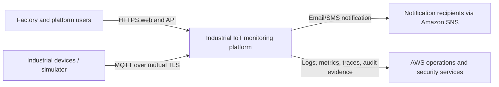
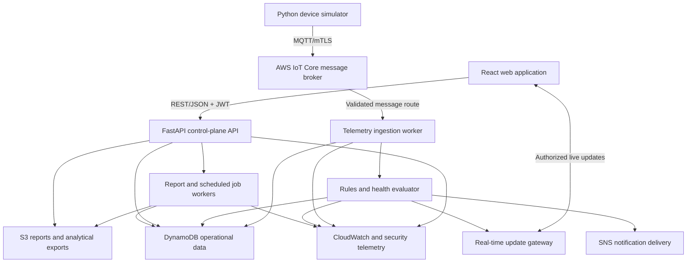
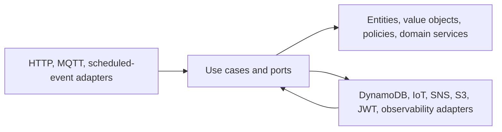
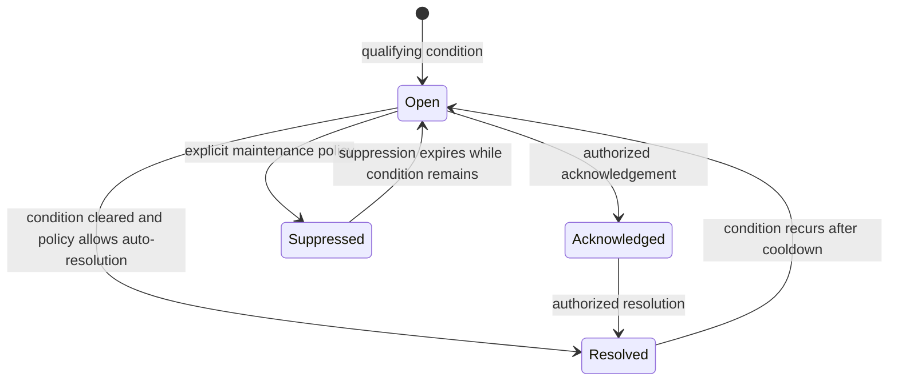

# 4. Complete Software Architecture

## 4.1 Architectural style

The platform uses a **serverless, event-driven architecture** with a **modular FastAPI control plane** and separate asynchronous telemetry workers. Inside each deployable unit, clean architecture separates domain rules from frameworks and AWS adapters.

This is intentionally not a collection of premature microservices. Device management, users, factories, alerts, reports, and audit capabilities begin as well-isolated modules in one API deployment. Telemetry ingestion and asynchronous jobs are separate because their scaling, failure, and security characteristics differ. A module can later become its own service without changing domain contracts.

## 4.2 System context

## 4.3 Container view

## 4.4 Deployable responsibilities

| Deployable | Responsibility | Scaling/failure boundary |
|---|---|---|
| Web application | Routing, presentation, accessibility, cached server state, authorization-aware navigation | Static assets scale independently; no trusted authorization logic |
| Control-plane API | Authentication, authorization, factories, users, devices, alert workflows, analytics reads, report requests, settings | Request-driven Lambda scaling; stateless |
| Telemetry ingestion worker | Schema validation, identity binding, quality flags, idempotency, latest state, raw writes | Scales with message/queue depth; malformed data isolated |
| Rules/health evaluator | Threshold state, hysteresis, anomaly/health scoring, deduplication, alert events | Independent retry and DLQ; deterministic rule evaluation |
| Job workers | Report generation, rollups, retention/maintenance tasks, scheduled evaluations | Long-running work remains outside request latency |
| Simulator | Production-compatible MQTT clients and deterministic scenarios | Runs outside trusted platform boundary; one identity per device |

## 4.5 Clean architecture boundaries

The dependency rule applies to source code, not runtime calls:

- **Domain:** factory, device, alert, role, permission, health, rule, session, and audit concepts. It imports no FastAPI, boto3, or UI framework.
- **Application:** commands, queries, authorization policies, transaction boundaries, and ports such as `DeviceRepository` or `NotificationPublisher`.
- **Adapters:** FastAPI routes, Pydantic transport schemas, DynamoDB repositories, IoT/SNS/S3 gateways, JWT implementation, and CloudWatch logging.
- **Composition:** configuration and dependency injection connect interfaces to adapters.

## 4.6 Core request flow

1. API Gateway/WAF accepts HTTPS and attaches request context.
2. FastAPI middleware creates or validates a correlation ID, applies security headers, and establishes safe logging context.
3. Authentication verifies the JWT signature, issuer, audience, expiry, token version, and session state where required.
4. Authorization evaluates permission and factory/resource scope. Client-side visibility never substitutes for this check.
5. Pydantic transport schemas validate types, ranges, lengths, and allowed values.
6. An application use case invokes domain policies and repository ports.
7. DynamoDB conditional writes or transactions preserve invariants and optimistic concurrency.
8. A privileged mutation writes its business state and audit event atomically where possible; otherwise an outbox record guarantees eventual audit publication.
9. The API returns a versioned envelope with data, correlation ID, and pagination metadata or a stable problem response.

## 4.7 Telemetry flow

1. A device connects to AWS IoT Core using its unique X.509 certificate.
2. IoT policy restricts the client ID and topic to the registered device namespace.
3. The device publishes a versioned payload with device ID, event ID, sequence, event time, metrics, and machine state.
4. An IoT Rule routes the event through a durable buffer to the ingestion worker.
5. The worker verifies topic/payload identity consistency, schema, bounds, timestamp skew, and idempotency.
6. It stores raw telemetry with TTL, updates the latest-device projection conditionally, and emits a normalized telemetry event.
7. The rules evaluator updates threshold state, health score, aggregates, and any deduplicated alert.
8. Authorized live clients receive a small update signal and re-fetch canonical values; clients never trust arbitrary device-published UI payloads.
9. Repeated failures enter a DLQ with alarms and a controlled redrive process.

## 4.8 Alert lifecycle

An alert record stores current state for efficient reads. An append-only alert-event collection preserves every occurrence and transition. Rule state records hold hysteresis, breach duration, and cooldown so transient spikes do not create alert storms.

## 4.9 Human identity and authorization model

- Password verification occurs only in the authentication module. Password hashes are never returned.
- Access tokens are short lived and contain stable subject, role identifier, session identifier, token version, and minimal factory scope references.
- Refresh tokens are opaque, hashed at rest, rotated, and grouped into a session family for reuse detection.
- RBAC permissions are declared centrally; resource checks combine permission, assigned factory set, resource factory, and exceptional conditions such as quarantine.
- Super Administrator is platform-scoped; every other role remains factory-scoped.
- High-impact actions require re-confirmation in the UI, stricter permission checks, audit detail, and optional step-up authentication in a future hardening release.

## 4.10 Device identity model

- The platform creates one AWS IoT Thing and one active certificate per logical device during normal operation.
- The certificate's IoT policy permits connect as its assigned client ID and publish only to its telemetry/heartbeat topics.
- Registry status and certificate status are independent: disabling a registry record does not replace certificate revocation.
- Rotation overlaps old/new certificates only for a bounded period. Revocation ends publish access and emits a security/audit event.
- Simulator credentials are stored outside source control with file permissions and environment-specific mapping.

## 4.11 Data architecture

- **DynamoDB operational tables:** identities, resources, current state, rules, alerts, sessions, jobs, and queryable event indexes.
- **Telemetry table:** time-bucketed partition keys distribute writes and support device/time queries; TTL controls hot retention.
- **Aggregate table:** hourly/daily rollups support dashboards without scanning raw events.
- **S3:** encrypted reports, lifecycle exports, and long-term evidence/analytical data.
- **CloudWatch Logs:** diagnostic streams with controlled retention; it is not the business audit system of record.

Details and access patterns are defined in [08-database-design.md](08-database-design.md).

## 4.12 API architecture

- Base path: `/api/v1`.
- JSON request/response contracts use camelCase externally and typed domain values internally.
- Successful list responses contain `items` and `page.nextCursor`; cursors are opaque and signed/validated.
- Errors use `application/problem+json` with `type`, `title`, `status`, `code`, `detail`, `instance`, and `correlationId`.
- Mutations use `Idempotency-Key` where retry could duplicate a business operation.
- Resource updates use `If-Match`/version checks for optimistic concurrency.
- All timestamps are ISO 8601 UTC; metric values carry canonical units.
- Deprecation and breaking changes require a new API version or compatibility window.

## 4.13 Frontend architecture

- Route groups align with product modules and permission gates.
- TanStack Query owns server state, request deduplication, cache invalidation, retries, and stale-state presentation.
- Context is limited to stable client concerns such as session shell, theme, and selected scope; business data does not become ad-hoc global state.
- A typed API client maps problem responses into consistent user-safe feedback.
- Feature directories contain pages, components, queries, schemas, and tests; a shared design system owns tokens and primitives.
- Charts consume normalized view models and always include textual summaries or accessible tabular alternatives.

## 4.14 Observability and error strategy

- Correlation IDs span edge, API, queue messages, workers, notifications, and audit events.
- Expected domain failures map to stable 4xx problems; unexpected failures return a generic 500 while retaining stack details only in protected logs.
- Metrics use bounded dimensions; device IDs stay in logs/traces rather than unbounded metric labels.
- Business metrics include telemetry accepted/rejected, device freshness, alerts opened/resolved, acknowledgement time, report duration, and notification failure.
- CloudWatch alarms route to an owned operations channel and reference runbooks.

## 4.15 Key architecture decisions

| Decision | Problem | Solution | Reason | Advantages | Tradeoffs |
|---|---|---|---|---|---|
| Modular API first | Many domains, small initial team | One modular FastAPI control plane plus separate workers | Preserves boundaries without distributed-system overhead | Faster delivery, local transactions, clear extraction path | API deploys together; discipline needed to prevent coupling |
| Asynchronous telemetry | Burst traffic and downstream failure | IoT Core -> durable queue -> ingestion worker | Decouples device acceptance from processing | Backpressure, retry, DLQ, independent scale | Eventual consistency and more operational components |
| DynamoDB access-pattern design | High write volume and serverless scale | Purpose-specific tables/keys and projections | Avoid scans and unpredictable relational joins | Elastic scale, managed availability, predictable latency | Denormalization and careful key evolution |
| Rules before ML | Need credible predictive monitoring with explainability | Threshold state, anomaly heuristics, and composite health score | No trustworthy labeled failure dataset exists initially | Demonstrable, testable, explainable | Less predictive sophistication until data matures |
| JWT plus server-side session state | Stateless API needs immediate revocation | Short JWT access token plus rotating refresh/session records | Balances scale and control | Fast validation, revocation, reuse detection | More complexity than fully stateless tokens |
| Push signal, canonical refetch | Live UI must remain trustworthy | WebSocket event signals trigger scoped API refetch | Keeps authorization and canonical response in one path | Small messages, consistent data | Additional gateway and cache invalidation logic |
| No VPC for initial Lambdas | AWS managed services are the dependencies | Use service endpoints without VPC attachment | Avoid NAT cost and cold-start/network complexity | Simpler, cheaper, fewer failure points | Revisit if private databases/services are added |

## 4.16 Evolution path

The modular boundaries intentionally support later additions: Cognito/federated identity, Timestream/OpenSearch for specialized analytics, SageMaker-based anomaly models, EventBridge integration, multi-region disaster recovery, CMMS/ERP connectors, and service extraction for high-scale domains. None is required to prove the first release, and none should be introduced without measured need.
