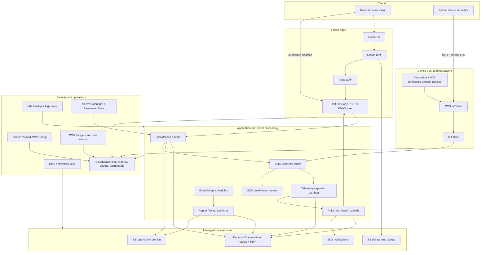
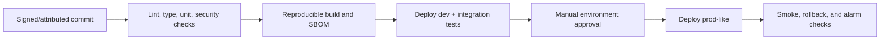

# 5. AWS Architecture

## 5.1 Target architecture



## 5.2 Environment and account strategy

Preferred production posture uses separate AWS accounts for `security/log-archive`, `non-production`, and `production`, governed through AWS Organizations. For the capstone, separate accounts may be cost-prohibitive; at minimum, use isolated CloudFormation/SAM stacks, names, IAM roles, data tables, keys, log groups, domains, and budgets for `dev`, `test`, and `prod-like`.

No environment may share device certificates, JWT signing material, tables, buckets, or deployment roles.

## 5.3 Service responsibilities

| AWS service | Responsibility | Critical configuration |
|---|---|---|
| CloudFront + S3 | Serve private React assets globally | Origin access control, HTTPS redirect, CSP/security headers, versioned assets |
| WAF | Protect HTTP endpoints | AWS managed rules, rate-based rules, monitored false positives |
| API Gateway | REST boundary and authorized WebSocket connections | Throttling, request limits, access logs, custom domain, stage controls |
| Lambda | FastAPI adapter, ingestion, rules, jobs | Least-privilege roles, reserved concurrency where needed, structured logs |
| AWS IoT Core | Device authentication, topic authorization, MQTT broker | Unique certs, constrained client/topic policies, lifecycle events |
| SQS | Buffer telemetry and asynchronous work | Visibility timeout, redrive policy, encryption, queue-age alarms |
| DynamoDB | Operational state, time series, alerts, audit index | On-demand capacity initially, PITR, TTL, encryption, no scans in requests |
| S3 | Reports, exports, archive | Block public access, KMS encryption, lifecycle, access logging, signed URLs |
| SNS | Notification fan-out | Encrypted topics, delivery status, subscription verification |
| EventBridge | Schedules and internal domain routing where useful | Explicit event schemas, retry/DLQ, least-privilege targets |
| CloudWatch | Logs, metrics, dashboards, alarms | Retention, redaction, metric filters, owned alarms and runbooks |
| CloudTrail/Config | AWS administrative evidence and drift posture | Multi-region trail, protected log destination, configuration recording |
| KMS | Encryption key control | Rotation, scoped key policies, separation by data class/environment |
| Secrets Manager/SSM | Runtime secrets and non-secret parameters | Rotation where supported, no browser access, deployment-time references |

## 5.4 Network and trust boundaries

- Browser traffic crosses the public edge through CloudFront/WAF/API Gateway. S3 origins are not public.
- Device traffic terminates at AWS IoT Core; application APIs do not accept raw device telemetry.
- Lambda initially runs outside a customer VPC because all dependencies are managed AWS public endpoints protected by IAM/TLS. This avoids NAT Gateway cost and unnecessary networking failure modes.
- A VPC is introduced only if private dependencies require it. At that point, use private subnets, VPC endpoints, restricted security groups, and controlled egress.
- Human JWTs are invalid for MQTT, and device certificates are invalid for human API workflows.

## 5.5 IoT topic and policy design

Topic convention:

```text
iot/{environment}/factories/{factoryId}/devices/{deviceId}/telemetry
iot/{environment}/factories/{factoryId}/devices/{deviceId}/heartbeat
iot/{environment}/factories/{factoryId}/devices/{deviceId}/events
iot/{environment}/factories/{factoryId}/devices/{deviceId}/config/desired
iot/{environment}/factories/{factoryId}/devices/{deviceId}/config/reported
```

Each device policy uses IoT policy variables or a generated resource scope so it can:

- connect only when MQTT client ID equals the registered device ID;
- publish only its telemetry, heartbeat, event, and reported-state topics;
- subscribe only to its desired-state topic;
- never enumerate or publish for another device or factory.

The ingestion worker verifies that the topic identity, payload device ID, registry factory, and active certificate association agree. A mismatch is rejected and becomes a security signal.

## 5.6 Data protection

- TLS 1.2+ for HTTPS and MQTT; HSTS at the edge.
- DynamoDB, SQS, SNS, S3, secrets, and logs encrypted at rest.
- S3 Block Public Access enforced account-wide where possible.
- Report downloads use short-lived URLs only after an authorization recheck.
- KMS key policies separate application use, security administration, and audit access.
- Sensitive configuration is referenced at runtime, not copied into templates or CI output.
- Log redaction covers passwords, tokens, cookies, authorization headers, certificate private keys, and report URLs.

## 5.7 Reliability design

| Failure | Platform behavior |
|---|---|
| Ingestion worker transient failure | SQS retries after visibility timeout; queue-age alarm detects backlog |
| Poison telemetry message | Bounded attempts then DLQ; event metadata retained for safe investigation |
| Rules evaluator failure | Normalized event retained/retried; telemetry storage remains independent |
| Notification provider failure | Alert remains valid; delivery attempt retries and records terminal failure |
| Report worker failure | Job becomes failed with safe reason and can be retried idempotently |
| DynamoDB throttling | SDK bounded exponential backoff; throttling alarm; inspect hot-key distribution |
| WebSocket disconnect | Browser reconnects with jitter and refetches canonical current state |
| Regional outage | Restore/redeploy from IaC and backups under initial RTO/RPO; multi-region is future scope |

## 5.8 Observability baseline

CloudWatch dashboards cover:

- API request count, 4xx/5xx, p50/p95/p99 latency, integration failures, throttles;
- Lambda invocations, errors, duration, concurrency, cold starts, throttles;
- IoT connect/auth/rule failures and rejected messages;
- SQS depth, oldest-message age, DLQ depth, processing throughput;
- DynamoDB consumed capacity, throttled requests, system errors;
- accepted/rejected telemetry, stale devices, rule evaluations, alerts by severity;
- notification success/failure and report generation duration;
- frontend availability and selected browser performance signals.

Every alert includes environment, service, severity, observed value, threshold, runbook link, and owner. High-cardinality identifiers belong in correlated logs, not metric dimensions.

## 5.9 IAM model

- Separate execution roles for API, ingestion, rules, reports, deployment, and CI.
- Resource-level permissions wherever AWS supports them; explicit environment prefixes prevent cross-environment access.
- The API cannot publish arbitrary IoT topics or read certificate private keys.
- The ingestion worker can write telemetry/current state and metrics but cannot manage users.
- The report worker reads scoped data and writes only the report bucket prefix.
- CI uses short-lived OIDC federation, not stored long-lived AWS access keys.
- Permission boundaries/service control policies are recommended for production accounts.

## 5.10 Cost controls

- DynamoDB on-demand capacity initially; evaluate provisioned/auto-scaling only from observed demand.
- Telemetry TTL and S3 lifecycle policies cap hot storage.
- CloudWatch retention is explicit; debug logging is disabled by default in production.
- Lambda memory/timeout is tuned through load evidence, not guesses.
- Budgets and anomaly alerts are created per environment.
- The simulator has a maximum rate and duration guardrail to prevent accidental cost spikes.

## 5.11 Deployment topology

Infrastructure is defined in AWS SAM or CDK (decision finalized before Phase 6 implementation) and deployed through promotion gates:



Deployment permissions are distinct from runtime roles. Artifacts are immutable and promoted by digest. Database changes are backward-compatible before application cutover, and rollback does not assume deleted data can be restored instantly.

## 5.12 AWS architecture acceptance checklist

- All resources are reproducible from version control.
- No S3 bucket, DynamoDB table, or log group is unintentionally public.
- Device policy negative tests prove cross-device publish and subscribe are denied.
- Runtime roles pass least-privilege review and have no wildcard actions without written justification.
- Backup/PITR, TTL, lifecycle, retention, alarms, and budgets are enabled by policy.
- A telemetry backlog/DLQ exercise and a restore exercise are documented.
- CloudTrail captures administrative actions, while application audit events capture business actions.
