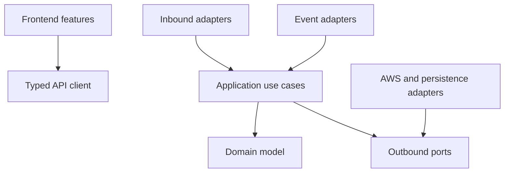

# 6. Module Breakdown

## 6.1 Product modules

| Module | Primary responsibilities | Key dependencies | Owns/produces |
|---|---|---|---|
| Authentication | Login, refresh rotation, logout, reset, session revocation, auth events | User repository, JWT/crypto, audit | Sessions, refresh families, auth events |
| User Management | User lifecycle, role and factory assignments, profile | Authorization, factory module | User aggregate and assignments |
| Factory Management | Factory lifecycle, metadata, policy defaults, KPI summary | Authorization, device/analytics queries | Factory aggregate |
| Device Management | Registry, provisioning, configuration, transfer, quarantine, certificate metadata | Factory, IoT adapter, audit | Device aggregate, config versions |
| Live Monitoring | Latest values, online freshness, real-time subscriptions | Telemetry projections, realtime gateway | Read models/subscription filters |
| Telemetry Ingestion | MQTT event validation, idempotency, raw/current writes, normalized events | IoT context, device registry, DynamoDB | Telemetry and latest-device state |
| Health & Rules | Threshold state, hysteresis, anomaly signals, health score | Telemetry events, rule repository | Health projection, rule state |
| Alerts | Alert creation/deduplication, assignment, acknowledgement, resolution, history | Rules, authorization, audit | Alert aggregate and alert events |
| Notifications | Preferences, routing, templates, delivery attempts | Alert events, SNS | Notification requests/attempts |
| Analytics | Time-series queries, aggregation, utilization, performance comparisons | Telemetry/aggregate repositories | Analytical read models |
| Dashboard | Role-aware organization/factory summaries | Devices, alerts, analytics | Composed dashboard view |
| Reports | Asynchronous report requests, generation, secure download, schedules | Analytics, audit, S3, jobs | Report jobs and objects |
| Audit Logs | Append-only privileged business action evidence | All mutation modules | Audit events and archive stream |
| Activity Logs | User-facing recent actions and operational timeline | Audit/alert/device events | Safe activity projection |
| Security Center | Certificate posture, failed auth, quarantine, suspicious events | Device identity, auth, security logs | Security findings/projections |
| Settings | System, factory, retention, threshold, and notification defaults | Authorization, audit | Versioned settings |
| Platform Health | Readiness, metrics, alarms, diagnostic status | CloudWatch/adapters | Health view and operational metrics |
| Simulator | Device models, scenarios, credential mapping, MQTT publishing | IoT Core and telemetry contract | Realistic versioned device events |

## 6.2 Backend module contract

Each backend module contains:

- `domain`: entities, value objects, policies, domain events, repository interfaces;
- `application`: commands, queries, handlers, authorization policies, data-transfer boundaries;
- `adapters/inbound`: FastAPI routes or event handlers and transport validation;
- `adapters/outbound`: DynamoDB, AWS IoT, SNS, S3, crypto, and logging implementations;
- `tests`: domain unit tests, adapter contract tests, authorization tests.

Modules may call another module only through an application interface or published event. They do not read another module's table items directly merely for convenience.

## 6.3 Frontend feature modules

| Feature | Principal screens/components | Important states |
|---|---|---|
| App shell | Navigation, command/search, factory selector, user menu | collapsed/mobile navigation, permission-filtered items |
| Dashboard | KPI cards, health distribution, alert/energy trends, attention list | stale metrics, partial widget failure, no assigned factories |
| Factories | List, detail, compare, edit policy | archived factory, no devices, insufficient scope |
| Devices | Inventory, detail, register, provision, configuration, maintenance | offline, critical, quarantined, certificate expiring |
| Live monitoring | Device grid, metric stream, status map/table | reconnecting, delayed data, invalid quality |
| Analytics | Metric trends, utilization, energy, performance, faulty devices | sparse data, aggregation changes, comparison unavailable |
| Alerts | Inbox, detail/timeline, rules, notification preferences | unassigned, acknowledged, suppressed, resolved |
| Reports | Builder, jobs, schedules, secure downloads | queued, expired, generation failure |
| Users | User list/detail, role/scope editor, sessions | disabled user, self-demotion protection |
| Audit/activity | Filtered immutable event views | sensitive fields redacted, retention boundary |
| Security center | Posture summary, certificate inventory, security events | urgent expiry, revoked cert, repeated auth failure |
| Settings | Profile, organization/factory defaults, retention, notifications | unsaved changes, optimistic conflict |
| Platform health | Service status, ingestion backlog, recent incidents | degraded dependency, unavailable metric |

## 6.4 Shared platform capabilities

- **Authorization policy engine:** one permission vocabulary used by route guards, APIs, tests, and documentation.
- **Validation and problem details:** common types, field constraints, stable errors, correlation IDs.
- **Time and units:** UTC clock port, canonical unit definitions, conversion only in view models.
- **Pagination and filtering:** bounded query objects and opaque cursors.
- **Idempotency:** request records for retry-sensitive mutations and event deduplication keys.
- **Audit publisher:** mandatory port used by privileged application commands.
- **Observability:** structured logging, metrics, trace context, redaction, health contributors.
- **Configuration:** typed settings loaded by environment with safe defaults and startup validation.

## 6.5 Dependency rules

Forbidden dependencies:

- domain -> FastAPI, boto3, DynamoDB documents, environment variables, or HTTP types;
- frontend view component -> raw network request;
- route -> direct DynamoDB client;
- device/telemetry code -> human session credentials;
- analytics read path -> unbounded DynamoDB Scan;
- any module -> secret values in logs or error responses.

## 6.6 Module-level definition of done

A module is complete only when its contracts, authorization rules, failure states, audit behavior, observability, unit tests, integration tests, accessibility impact, and documentation are complete. A page or endpoint without its security and operational behaviors is not considered implemented.
