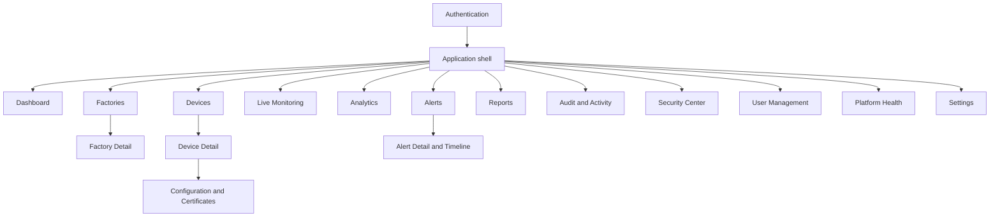

# 11. UI Wireframes

## 11.1 Experience direction

The interface is a dark, restrained operations console influenced by AWS Console, Grafana, Datadog, and industrial HMIs without copying them. Dense information is organized by hierarchy and urgency. Critical status is prominent, but decorative glow, excessive gradients, and animation do not compete with operational data.

### Global design rules

- Persistent desktop navigation; compact drawer on small screens.
- Factory and time-range context remain visible and consistent during drill-down.
- Status uses icon + label + color, never color alone.
- UTC-backed timestamps display user-local time with a discoverable UTC value.
- Charts always show unit, range, freshness, legend, tooltip, and accessible summary/table.
- Every data region has loading, empty, stale, partial failure, permission, and retry states.
- High-impact actions name the exact factory/device/user and require confirmation.
- Keyboard access, visible focus, skip links, reduced motion, and WCAG 2.2 AA contrast are baseline requirements.

## 11.2 Information architecture



Navigation entries are permission-filtered, but direct routes still depend on backend authorization.

## 11.3 Desktop application shell and dashboard

```text
┌────────────────────────────────────────────────────────────────────────────────────────────┐
│ ◈ ForgeSight IoT       [Factory: All authorized ▾]  [Last 24h ▾]  Search  ?  🔔  User ▾   │
├──────────────────┬─────────────────────────────────────────────────────────────────────────┤
│ Overview         │ Dashboard                                  Updated 8 sec ago  ● Live    │
│ ▣ Dashboard      │ Production estate health                                              │
│                  │                                                                         │
│ Operations       │ ┌────────────┐ ┌────────────┐ ┌────────────┐ ┌────────────┐              │
│ ◫ Factories      │ │ Factories  │ │ Devices    │ │ Critical   │ │ Alerts     │              │
│ ◈ Devices        │ │ 4          │ │ 84         │ │ 6          │ │ 13 today   │              │
│ ◉ Live Monitor   │ │ all active │ │ 72 online  │ │ 7.1%       │ │ 4 open P1  │              │
│                  │ └────────────┘ └────────────┘ └────────────┘ └────────────┘              │
│ Intelligence     │                                                                         │
│ ≋ Analytics      │ ┌─────────────────────────────────────┐ ┌─────────────────────────────┐  │
│ ⚠ Alerts    [4]  │ │ Device health distribution         │ │ Needs attention             │  │
│ ▤ Reports        │ │ [Healthy ███████ 62]               │ │ CRIT Boiler-02  96.4°C      │  │
│                  │ │ [Warning ███ 16] [Critical █ 6]     │ │ OFF  CNC-07     12m         │  │
│ Governance       │ └─────────────────────────────────────┘ │ WARN Press-04   vibration   │  │
│ ◎ Security       │                                         └─────────────────────────────┘  │
│ ☷ Audit & Logs   │ ┌─────────────────────────────────────┐ ┌─────────────────────────────┐  │
│ ♙ Users          │ │ Temperature / pressure trend       │ │ Power use by factory        │  │
│ ⚙ Settings       │ │  chart + unit + legend + compare   │ │  stacked area + total kWh   │  │
│ ♥ Platform Health│ └─────────────────────────────────────┘ └─────────────────────────────┘  │
└──────────────────┴─────────────────────────────────────────────────────────────────────────┘
```

Interaction notes:

- KPI cards are filters/drill-downs, not decorative numbers.
- “Updated” becomes “Data delayed” with explanation when freshness exceeds policy.
- A widget failure does not blank the entire dashboard; its region displays a retry state and correlation ID.
- Super Administrators default to all factories. Factory-scoped users default to their last authorized selection.

## 11.4 Device inventory

```text
┌────────────────────────────────────────────────────────────────────────────────────────────┐
│ Devices / Inventory                                      [Import] [Register device]         │
│ 84 devices · 72 online · 6 critical                                                      │
│                                                                                            │
│ [Search name / serial...] [Factory ▾] [Type ▾] [Status ▾] [Health ▾] [Tags ▾] [Reset]     │
├───┬──────────────────┬────────────┬─────────────┬──────────┬─────────┬──────────┬───────────┤
│ □ │ Device           │ Factory    │ Type        │ Status   │ Health  │ Last seen│ Certificate│
├───┼──────────────────┼────────────┼─────────────┼──────────┼─────────┼──────────┼───────────┤
│ □ │ Boiler-02        │ Plant East │ Boiler      │ ● Online │ Critical│ 4 sec    │ Valid 82d  │
│ □ │ CNC-07           │ Plant East │ CNC         │ ○ Offline│ Unknown │ 12 min   │ Valid 210d │
│ □ │ Press-04         │ Plant West │ Hyd. press  │ ● Online │ Warning │ 2 sec    │ Expires 9d │
├───┴──────────────────┴────────────┴─────────────┴──────────┴─────────┴──────────┴───────────┤
│ Showing 1-25                                               [Previous] [Next]               │
└────────────────────────────────────────────────────────────────────────────────────────────┘
```

- Filters are encoded in the URL for refresh/share within authorization constraints.
- Bulk actions appear only after selection and remain limited to safe, same-factory operations.
- Certificate expiry and quarantine cannot be hidden inside a secondary detail page.

## 11.5 Device detail

```text
┌────────────────────────────────────────────────────────────────────────────────────────────┐
│ Devices / Boiler-02     ● Online · CRITICAL                       [Quarantine] [Actions ▾]  │
│ Plant East · Boiler · dev_01H... · Last telemetry 4 sec ago                              │
├────────────────────────────────────────────────────────────────────────────────────────────┤
│ [Overview] [Telemetry] [Alerts 3] [Configuration] [Certificates] [Maintenance] [Activity] │
├────────────────────────────────────────────────────────────────────────────────────────────┤
│ ┌──────────┐ ┌──────────┐ ┌──────────┐ ┌──────────┐ ┌──────────┐ ┌──────────┐              │
│ │ Temp     │ │ Pressure │ │ Vibration│ │ RPM      │ │ Power    │ │ Health   │              │
│ │ 96.4 °C  │ │ 510 kPa  │ │ 5.9 mm/s │ │ 1,480   │ │ 8.9 kW   │ │ 42%      │              │
│ │ ↑ breach │ │ normal   │ │ ↑ warning│ │ stable   │ │ +12%     │ │ degraded │              │
│ └──────────┘ └──────────┘ └──────────┘ └──────────┘ └──────────┘ └──────────┘              │
│                                                                                            │
│ ┌───────────────────────────────────────────────────────┐ ┌──────────────────────────────┐ │
│ │ Telemetry — 24 hours                                 │ │ Active alerts                │ │
│ │ metric selector · accessible time-series chart       │ │ P1 Temperature above 90°C   │ │
│ │ threshold overlays · quality markers                 │ │ P2 Vibration trend          │ │
│ └───────────────────────────────────────────────────────┘ └──────────────────────────────┘ │
│ ┌───────────────────────────────────────────────────────┐ ┌──────────────────────────────┐ │
│ │ Health explanation                                   │ │ Identity & configuration     │ │
│ │ -30 temperature · -15 vibration · -13 recurrence     │ │ Cert valid · desired v12    │ │
│ └───────────────────────────────────────────────────────┘ │ reported v12 · synced       │ │
│                                                          └──────────────────────────────┘ │
└────────────────────────────────────────────────────────────────────────────────────────────┘
```

Health is explainable: the user can see which signals reduced the score. Missing/stale data yields “Unknown,” not a misleading healthy state.

## 11.6 Live monitoring

```text
┌────────────────────────────────────────────────────────────────────────────────────────────┐
│ Live Monitoring        Plant East             Connected ●    Updated 2 sec ago             │
│ [Grid] [Dense table] [Critical only]  Metric: [Temperature ▾]  [Pause visual updates]       │
├────────────────────────────────────────────────────────────────────────────────────────────┤
│ ┌────────────────────┐ ┌────────────────────┐ ┌────────────────────┐ ┌────────────────────┐ │
│ │ Boiler-02 CRITICAL │ │ CNC-01 HEALTHY     │ │ CNC-07 OFFLINE     │ │ Press-04 WARNING   │ │
│ │ 96.4°C  510kPa     │ │ 62.1°C  1,500RPM   │ │ Last seen 12m      │ │ Vib 5.9mm/s        │ │
│ │ Sparkline + breach │ │ Sparkline          │ │ [Open device]      │ │ Sparkline + trend  │ │
│ └────────────────────┘ └────────────────────┘ └────────────────────┘ └────────────────────┘ │
│                                                                                            │
│ Connection event timeline / keyboard-accessible summary                                   │
└────────────────────────────────────────────────────────────────────────────────────────────┘
```

- Update frequency is visible and can be paused for accessibility without stopping data ingestion.
- On WebSocket loss, the UI shows “Reconnecting,” uses jittered retry, and refetches current state on recovery.
- Dense table mode supports operations rooms and assistive technology better than tiles alone.

## 11.7 Alert inbox and detail drawer

```text
┌────────────────────────────────────────────────────────────────────────────────────────────┐
│ Alerts                         Open 13 · Unassigned 5 · Critical 4                         │
│ [Status ▾] [Severity ▾] [Factory ▾] [Device ▾] [Assignee ▾] [Time ▾]                      │
├────────────────────────────────────────────────┬───────────────────────────────────────────┤
│ P1 OPEN · Temperature threshold                │ Boiler-02 temperature threshold           │
│ Boiler-02 · Plant East · 7 min · Unassigned    │ P1 · Open · First seen 09:24              │
├────────────────────────────────────────────────┤                                           │
│ P1 ACK · Device disconnected                   │ Current 96.4°C · Rule >90°C for 2m        │
│ CNC-07 · Plant East · 12 min · R. Kumar        │ [Acknowledge] [Assign ▾] [Resolve]         │
├────────────────────────────────────────────────┤                                           │
│ P2 OPEN · Vibration degraded                   │ Timeline                                  │
│ Press-04 · Plant West · 18 min · Unassigned    │ 09:24 Opened by rules engine              │
│                                                │ 09:25 Notification delivered              │
│                                                │ [Add investigation note...] [Post]         │
└────────────────────────────────────────────────┴───────────────────────────────────────────┘
```

- The alert remains selected in a split view on large screens; mobile uses a full detail route.
- Resolve requires a reason/note according to policy and shows whether the condition is still active.
- Timeline entries are immutable; corrections are new events.

## 11.8 Analytics workspace

```text
┌────────────────────────────────────────────────────────────────────────────────────────────┐
│ Analytics   [Plant East ▾] [Last 30 days ▾] [Compare previous period ✓] [Export report]   │
│ [Environment] [Power] [Utilization] [Factory performance] [Alerts] [Connectivity]         │
├────────────────────────────────────────────────────────────────────────────────────────────┤
│ ┌──────────────────────────────────────────────────────────┐ ┌───────────────────────────┐ │
│ │ Energy consumption (kWh)                                 │ │ Summary                   │ │
│ │ time-series / stacked by machine type                    │ │ 24,820 kWh  +6.2%         │ │
│ │ unit, interval, legend, comparison, accessible table     │ │ Peak: 14:00-15:00         │ │
│ └──────────────────────────────────────────────────────────┘ └───────────────────────────┘ │
│ ┌─────────────────────────────────────┐ ┌────────────────────────────────────────────────┐ │
│ │ Top energy consumers                │ │ Utilization by device                       │ │
│ │ ranked horizontal bars              │ │ heatmap + sortable table                    │ │
│ └─────────────────────────────────────┘ └────────────────────────────────────────────────┘ │
│ Data aggregated hourly · Updated 10:05 · Quality: 99.4% valid                              │
└────────────────────────────────────────────────────────────────────────────────────────────┘
```

## 11.9 Security center

```text
┌────────────────────────────────────────────────────────────────────────────────────────────┐
│ Security Center                               Posture: Needs attention                      │
├──────────────────┬──────────────────┬──────────────────┬─────────────────────────────────────┤
│ Certificates     │ Auth failures    │ Quarantined      │ Open security findings              │
│ 3 expire <30d    │ 18 today         │ 2 devices        │ 4 urgent / 7 review                 │
├──────────────────┴──────────────────┴──────────────────┴─────────────────────────────────────┤
│ Certificate expiry timeline                      Authentication and device-security trend   │
├────────────────────────────────────────────────────────────────────────────────────────────┤
│ Findings: severity · type · factory/device/user · first/last seen · status · owner          │
└────────────────────────────────────────────────────────────────────────────────────────────┘
```

This view never exposes certificate private keys, password details, full tokens, or sensitive request payloads.

## 11.10 Mobile dashboard

```text
┌──────────────────────────────┐
│ ☰  Dashboard       🔔  User  │
│ Plant East ▾   Last 24h ▾    │
├──────────────────────────────┤
│ Data live ● · 8 sec ago      │
│ ┌────────────┬─────────────┐ │
│ │ Devices 24 │ Critical 3  │ │
│ │ Online 21  │ Alerts 7    │ │
│ └────────────┴─────────────┘ │
│ Needs attention              │
│ ┌──────────────────────────┐ │
│ │ P1 Boiler-02 · 96.4°C    │ │
│ │ Plant East · 7 min       │ │
│ └──────────────────────────┘ │
│ Device health                │
│ [accessible compact chart]   │
│ Power trend                  │
│ [scroll-safe chart]          │
└──────────────────────────────┘
```

Mobile prioritizes current status and response workflows. Dense administration (bulk imports, complex role scope editing) remains responsive but is optimized for larger screens.

## 11.11 Authentication wireframe

```text
┌──────────────────────────────────────────────────────────────────────┐
│ ForgeSight IoT                                                      │
│ Secure industrial operations                                       │
│                                                                      │
│                    ┌────────────────────────────┐                    │
│                    │ Sign in                    │                    │
│                    │ Work email                 │                    │
│                    │ [________________________] │                    │
│                    │ Password                   │                    │
│                    │ [________________________] │                    │
│                    │ [ Sign in ]                │                    │
│                    │ Forgot password?           │                    │
│                    └────────────────────────────┘                    │
│ Status · Privacy · Security notice                                  │
└──────────────────────────────────────────────────────────────────────┘
```

Authentication errors do not reveal whether an email exists. After repeated failure, the same safe feedback includes retry timing or reset guidance.

## 11.12 Design-system baseline

| Token/element | Direction |
|---|---|
| Background | Neutral near-black/slate surfaces with clear elevation, not pure black |
| Typography | Legible sans-serif for UI; tabular numerals for metrics |
| Healthy/info/warning/critical | Accessible green/blue/amber/red paired with labels and icons |
| Spacing | 4/8 px system; dense and comfortable display modes |
| Controls | shadcn/ui primitives adapted into an owned design system |
| Motion | Short functional transitions; respect `prefers-reduced-motion` |
| Data density | Progressive disclosure, sticky table headers, saved filters in later scope |

## 11.13 UX acceptance criteria

- A keyboard-only user can sign in, select scope, inspect a critical device, acknowledge an alert, and sign out.
- Screen-reader labels expose status and chart summaries without relying on visual position.
- No stale/offline data is represented as current or healthy.
- Unauthorized actions are absent or clearly disabled, and direct attempts receive a safe server denial.
- Destructive confirmations identify target, consequence, and audit requirement.
- Empty states explain the cause and the next permitted action rather than showing blank charts.
